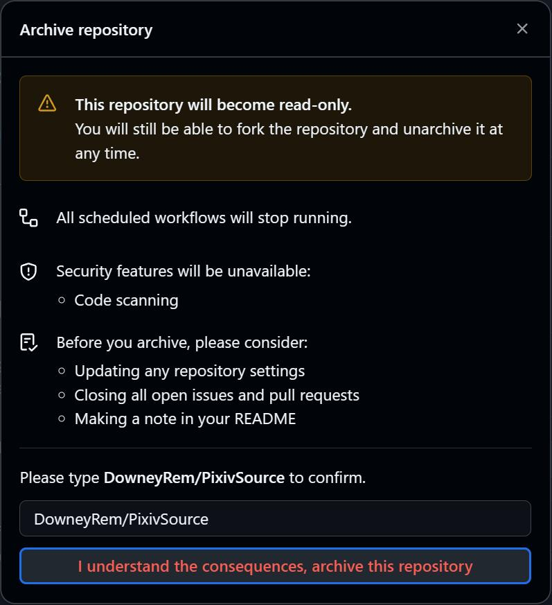
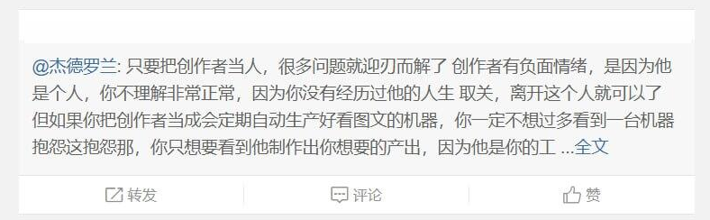

 

# 项目归档声明
### 🅿️ [开源阅读](https://github.com/gedoor/legado) Pixiv 书源
#### ✈️ 频道 [@PixivSource](https://t.me/PixivSource)
#### ☕ [书源项目打赏名单](./Sponsor.md)

## 📂 项目归档：书源仍然可用
> [!TIP] 建议
>
> **2025年12月02日，项目归档**
>
> **2025年12月05日，取消归档，进入消极维护状态**
> - **不承诺有后续更新**
> - **不主动增加新特性**
> - **不主动修复 BUG**

- **书源功能基本完善**
  - **已支持当前主流阅读软件**
  - **已支持 Pixiv 多数功能**
- **短期内无需继续维护**
  - **只要 Pixiv 的 Web API 没有较大变化，书源就能正常使用**
  - **欢迎接盘/Fork**

## 🔜 另有替代
- [Pixiv App API 书源](https://github.com/Luoyacheng/yuedu)
  - **搜索更快，加载更快！快就是王道**
  - **强力推荐**
- [轻小说机翻机器人](https://n.novelia.cc/forum/66a8e77866bff10c16e51d6a)
  - 注册1个月后，可访问 NSFW 内容
- [H 图书馆（hlib.cc）书源](https://github.com/Herokine/legado-source-hlib.cc)
  - 暂未完成，未来可期

## 🙊 无病呻吟

 🙊 无病呻吟1 

- 交流反馈群
  - 未公开。不想完全公开做售后
  - 不对，不能叫售后。我都没收钱，怎么能叫做售后呢？
- 我又不能靠这个赚钱，又获取不到什么成就感，何必自讨苦吃呢？
  - 赚钱部分
    - > 我都用上开源阅读了，我为什么还要花钱？
  - 成就部分
    - 程序类项目就很难获得明显的成就感吧
    - 你要说 Star 数量，那似乎有点过于微不足道了
- 要么经济效益、要么情绪价值
  - 很不巧，刚好两个都没有
  - 所以就是这样一个结果了

 🙊 无病呻吟2 

> 🎵 **BGM：** [風に向かって ～クルザス西部高地:昼](https://music.1363.com/song?id=41672491)

不小心听到了这首歌曲，本来就不太好的心态，大概是彻底炸裂了吧……

> “今天的库尔札斯……好冷啊……”

&emsp;&emsp;刚写好250版本书源的我，像是个250一样在各个群苦苦推广着。

&emsp;&emsp;**我真傻，真的。** 我以为只要我常常更新，持续优化，就一定会有人能够懂得我的这份坚持。

&emsp;&emsp;**我真傻，真的。** 我以为只要我苦苦推广，耐心宣传，就一定会有人能够理发现书源的便捷。

&emsp;&emsp;**我真傻，真的。** 我以为只要我做到上述，假以时日，就一定会有更多人从软件转向书源的。

&emsp;&emsp;我已然成了定期出现的NPC，像是祥林嫂一样，没隔两天就复述着相同的话：

&emsp;&emsp;“书源更新啦，XXX版本，有XX新功能，可以……”

&emsp;&emsp;“如果书源真的帮到了你，可以给我一点打赏……”

&emsp;&emsp;而周遭的人，大概是早已经疲惫、麻木、厌恶了吧？

&emsp;&emsp;或许我也早已成为他们唾弃、厌烦、忽视的对象吧？

&emsp;&emsp;重复的话语会让人麻木，重复的苦难也会让人麻木。

&emsp;&emsp;其实我早就看到了、体会了、了解到了……只是碍于强迫症——一定要有一个功能完善、并且没有 Bug 的书源，才一直没有停下来吧。

&emsp;&emsp;似乎一切又回到之前的那个问题了。就像之前写小说一样、我再次遇到了相同的问题：

&emsp;&emsp;Q：写书源究竟想获取什么？

&emsp;&emsp;A：截止到现在，写书源已经不仅仅是满足自我的使用需求了。

&emsp;&emsp;除了自给自足满足个人所需以外、还有编写代码解决问题的乐趣、还有书源完成后的渴望：渴望被肯定、渴望被认可、渴望被关注。

&emsp;&emsp;或许是，我要的可能是有点多？

&emsp;&emsp;抑或是，强扭的瓜不甜；热脸贴了冷屁股；吾之蜜糖，避之砒霜。

&emsp;&emsp;如果是这样……那就多说无益了。

&emsp;&emsp;（就算我这么说了，我真能做到吗？）

&emsp;&emsp;最后，还是这句话：

>&emsp;&emsp;“今天的库尔札斯……好冷啊……”

## ☕️ [支持开发](./Sponsor.md)
> [!NOTE] 提示
>
> **如果书源帮到了你，欢迎请开发者喝杯咖啡**
>
> **你的鼓励是持续更新的动力～**