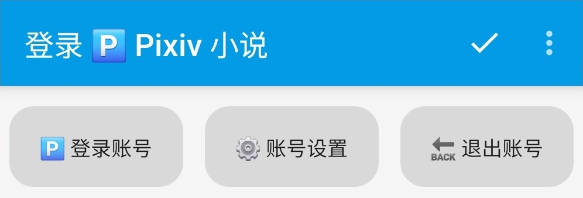
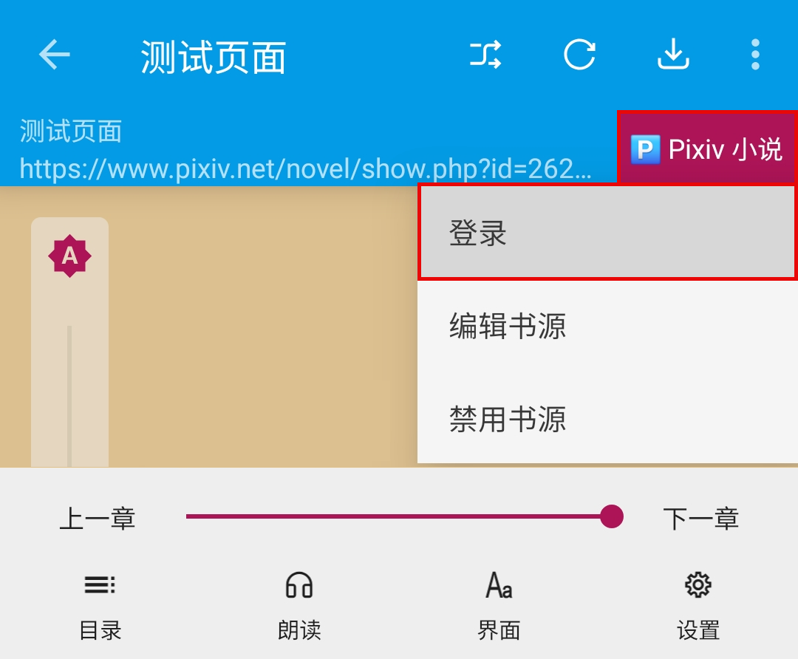
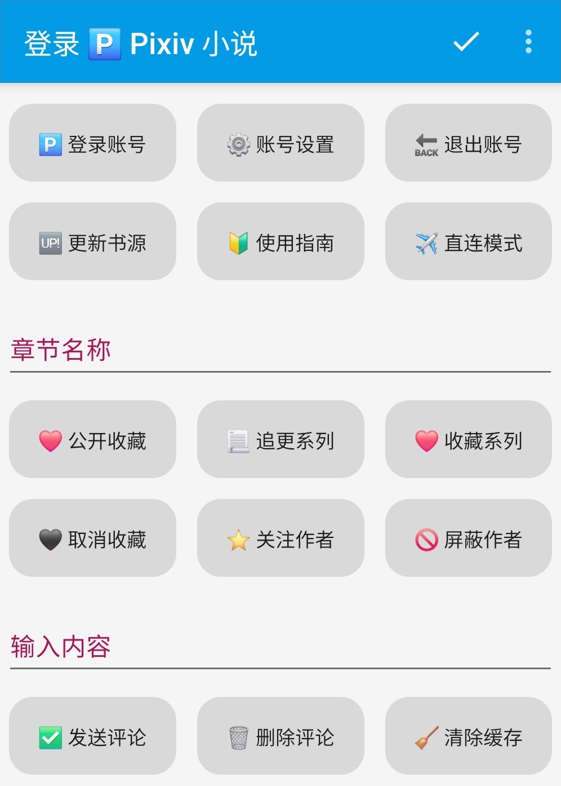
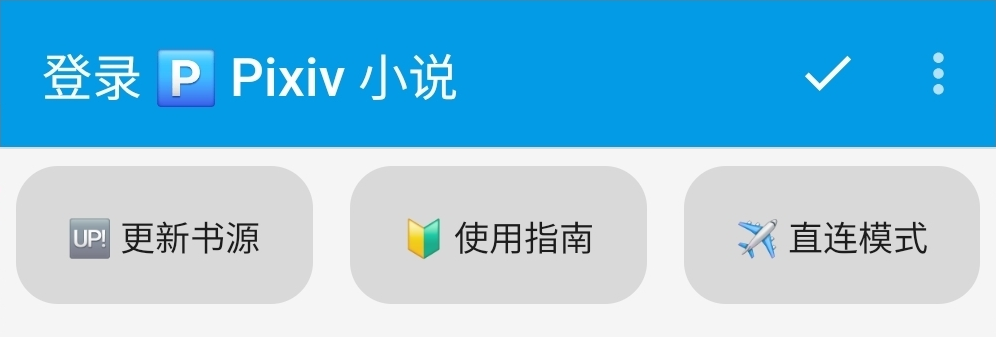
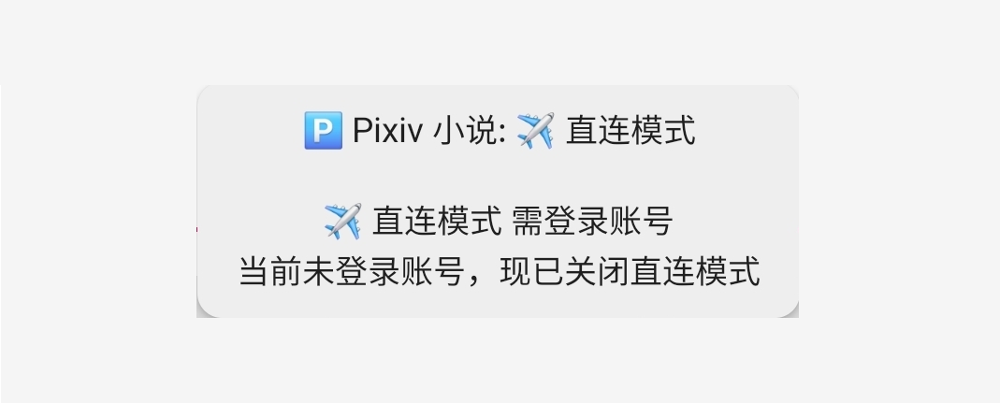
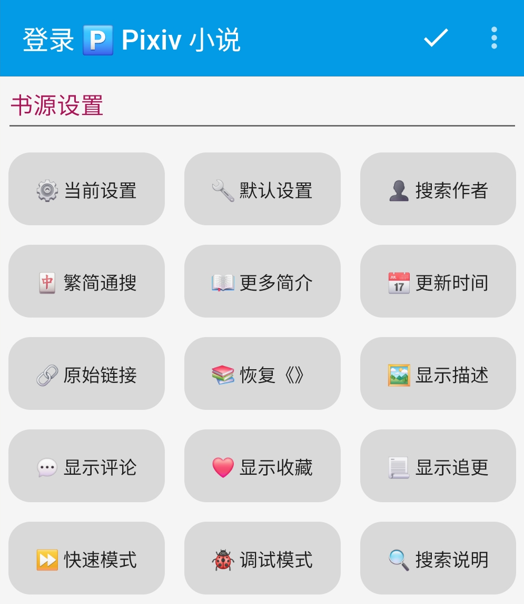

 

# ✨ 臻享阅读 ✨
## 最好的 Pixiv 的小说阅读器
### 🅿️ [开源阅读](https://github.com/gedoor/legado) Pixiv 书源
#### ✈️ 频道 [@PixivSource](https://t.me/PixivSource)
#### ☕ [书源项目打赏名单](Sponsor.md)

> [!TIP]
>
> **熟练使用【开源阅读】的读者可以看这篇指南：**
> [⚡️ 快速开始](QuickStart.md)

## 你是否被下面的问题所困扰？ {#Trouble}
### 官方 APP 的小说阅读体验堪忧 {#OfficialAPPTrouble}

<strong> 👎 阅读体验堪忧 </strong>

- 小说功能缺陷
  - **没有小说书架**
  - **没有首行缩进**
  - **不能保存阅读进度**
  - **拉黑功能并非屏蔽**
- 搜索功能缺陷
  - **默认搜索标签，而非小说名称**
  - **不能直接搜索作者名称，获取其小说**
- 基础功能却需要付费
  - **浏览记录是 Vip 功能**
  - **屏蔽标签是 Vip 功能**
  - **屏蔽作者是 Vip 功能**

### 第三方 APP 的小说阅读体验不佳 {#UnOfficialAPPTrouble}

<strong> 😞 阅读体验不佳 </strong>

- 

 🈚️ 无小说功能 

  - [PixEz Viewer](https://github.com/ultranity/Pix-EzViewer)
  - [Pi Pixiv](https://github.com/darriousliu/PiPixiv)
  

- 

 👎 阅读体验明显不如 Pixiv 

  - [Pixiv Shaft](https://github.com/CeuiLiSA/Pixiv-Shaft) 
  - [Pixiv Artvier](https://github.com/kerrinz/pixiv-artvier) 
  - [Pixes](https://github.com/wgh136/pixes)
  

- 

 😞 阅读体验略逊色于 Pixiv 

  - [PixEz Flutter](https://github.com/Notsfsssf/pixez-flutter)
  - [Pixiv Multi Platform](https://github.com/magic-cucumber/Pixiv-MultiPlatform)
  - [Pixiv Viewer](https://github.com/asadahimeka/pixiv-viewer)
  

> 软件整理自 https://linux.do/t/topic/657910

**迄今为止（2025.12），上述软件的小说阅读体验，依然没有一个超过了 Pixiv**

## 你是否想改善阅读体验呢？ 如果你的回答是“是的” 那么你可能需要：{#Question}
## 开源阅读 + Pixiv 书源 {#RepoIntroduction}
> [!NOTE]
>
> **我们的目标：做最好的 Pixiv 的小说阅读器**
> 
> **经过充分的调研，此目标已在 2025.12 实现**

### ⬇️ 下载阅读 {#DownloadLegado}
> [!IMPORTANT]
>
> 点击链接，下载 **【新共存版】** 安装包并安装软件
>
> https://miaogongzi.lanzout.com/b01rgkhhe

> [!TIP]
>
> **Android 设备：阅读 + Pixiv 书源**
>
> **苹果设备可用：源阅 + Pixiv 书源**
> **，详见：[下载阅读](Download.md)**

## 软件介绍 {#LegadoIntroduction}
像常规阅读软件一样，也有：书架、搜索、发现、我的 等页面
### 📚 书架页面 {#Shelf}
添加小说后如图：

### 🔎 搜索页面 {#Search}
添加书源后如图：

### ⭐️ 发现页面 {#discover}
添加书源后如图：

### 👤 我的页面 {#Mine}
多数阅读软件的我的页面都有登录账号

与常规阅读软件不同，【开源阅读】的我的页面，最上面却是【书源管理】

**【书源管理】和【备份与恢复】这两项非常重要**，稍后讲解

## 概念介绍 {#SourceIntroduction}
### 📖 书源 {#BookSource}
> [!NOTE]
> **【开源阅读】没有账号体系，软件本身并不提供小说资源**
> 
> **提供小说资源的是【书源】，准确来说是书源内部的网站**

**有什么网站的书源，就可以看什么网站的小说**
- 有【起点】书源，就可以看 起点网文
- 有【番茄】书源，就可以看 番茄小说
- 有【Pixiv】书源，就可以看 Pixiv 的小说

### 🌐 订阅源 {#RssSource}
> [!NOTE]
> 
> 「订阅源类似于RSS，甚至可以听音乐看视频」
> 
> **这里提供的订阅源类似于浏览器书签，可以在阅读软件内快速访问相关网站**

### 🚀 导入书源 & 订阅源 {#ImportSources}
- **书源、订阅源的内部数据不同，添加源（网络导入、规则订阅）的时候需要区分**
- 这里使用的是**一键导入，不需要区分二者**
> [!IMPORTANT]
> 
> **点击下方链接，一键导入书源、订阅源**
> 
> 🅿️ [一键导入 Pixiv 书源](https://loyc.xyz/b/cdx.html?src=legado://import/importonline?src=https://cdn.jsdelivr.net/gh/DowneyRem/PixivSource@main/pixiv.json)
>
> 🐲 [一键导入 Pixiv 订阅源](https://loyc.xyz/b/cdx.html?src=legado://import/importonline?src=https://cdn.jsdelivr.net/gh/DowneyRem/PixivSource@main/btsrk.json)
- 一般来说，书源开发者**同时提供书源和订阅源的话，最好都要导入**
- **这样才能保证最佳的使用体验**

## 书源配置 {#BookSourceSet}
### ⚙️ 书源管理 {#BookSourceManagement}
打开书源管理，有书源的话，点击书源菜单后，应该是这样的：

注意**这里的【登录】和【调试】，这两个功能很重要**，我们稍后讲解

### 🅿️ 登录账号 {#LoginAccount}
> [!NOTE]
> 
> **有账号的网站，在书源里登录账号才能阅读相关小说**

#### 1. 开启代理工具
此处略过，请自行学习，**最好开启【全局代理】**

#### 2. 登录 Pixiv 账号
**我的 - 书源管理 - 菜单 - 登录 - 登录账号**

**登录你的账号，登录成功后，点击右上角的对勾**

> [!TIP]
>
> **如果需要验证码，请更换代理，或过段时间再次尝试**
- **登录成功后，就可以使用 Pixiv 书源查看小说了**
- 但还请注意，**此时阅读的配置还没有全部完成**

## 阅读设置 {#LegadoSettings}
### 💾 [备份恢复](WebdavBackup.md) {#WebdavBackup}
> [!IMPORTANT]
>
> **【开源阅读】没有账号体系，不能在登录书源网站的同时恢复数据**
>
> **需要配置 Webdav 服务，才能从云端恢复数据**
> 
> **详见：[备份与恢复](WebdavBackup.md)**

### 🔄 关闭刷新 {#TurnOffAutoRefresh}
> [!IMPORTANT]
> 
> **使用时，请在设置里，关闭自动刷新**
> 
> **否则很容易触发触发请求限制，甚至封号**

**我的 - 其他设置 - 自动刷新**

> [!NOTE]
> 
> **截止到这里，你基本上就拥有了完整的阅读体验了**
> 
> **可以像是使用常规阅读软件一样，使用开源阅读了**

### ☁️ [远程书籍](RemoteBooks.md)（可选） {#RemoteBooks}
> [!TIP]
> 使用支持 Webdav 的网盘，阅读网盘上的书籍
> 
> **详见：[远程书籍](RemoteBooks.md)**

## 书源功能 {#BookSourceFunction}
### 🖼 登陆界面 {#LoginUI}
> [!TIP]
> 
> **书源众多功能均在登陆页面内**

打开登录界面：
- **①我的 - 书源管理 - Pixiv 小说 - 登录**

- **②小说阅读界面 - Pixiv 小说 - 登录**

- 两种方式都可以打开登陆界面

### ✈ 直连模式 {#IPDirect}
> [!NOTE]
> 
> **直连功能参考自 [洛娅橙的阅读仓库](https://github.com/Luoyacheng/yuedu)**
> 
> **其直连功能参考自 [PixEz Flutter](https://github.com/Notsfsssf/pixez-flutter)**

**登录账号后，可在登录界面打开直连模式**

**直连模式，无需代理，即可获取小说**

**🚫 直连模式不可用功能**：
- 搜索作者 
- 原始链接 
- 发现 书签 
- 发现 首页 
- 发现 排行榜

### ⏺ 互动功能 {#InteractiveFunction}

 ⏺ 互动功能 

- ❤️ 公开收藏：公开收藏、取消收藏
- 📃 追更系列：追更系列、取消追更
- **❤️ 收藏系列：公开收藏系列内的每篇小说（可追加收藏）**
-
- **🖤 取消收藏：取消收藏单篇、取消收藏系列内的每篇小说**
- ⭐️ 关注作者：关注作者、取消关注
- **🚫 屏蔽作者：屏蔽作者、取消屏蔽（本地）**
-
- ✅ 发送评论：当前章节下发送评论（手动刷新章节，更新评论）
- 🗑 删除评论：当前章节下删除评论（手动刷新章节，更新评论）
- 🧹 清除缓存：清除当前章节的正文缓存（手动刷新章节，更新正文和评论）

### ⚙️ 书源设置 {#BookSourceSettings}

 ⚙️ 书源设置 

- ⚙️ 当前设置：显示当前设置
- ⚙️ 默认设置：恢复默认设置
- 👤 搜索作者：默认搜索作者
-
- 🀄 繁简通搜：搜索进行繁简转换（搜索作者不转换）
- 📖 更多简介：详情显示更多简介
- 📅 更新时间：目录显示更新时间
-
- 🔗 原始链接：显示原始链接
- 📚 恢复《》：恢复正文内被替换的书名号《》
- 🖼️ 显示描述：章首显示描述
-
- 💬 显示评论：章尾显示评论
- ❤️ 显示收藏：搜索发现 显示/屏蔽 收藏单篇小说
- 📃 显示追更：搜索发现 显示/屏蔽 追更系列小说
-
- ⏩ 快速模式：开启快速模式（关闭**默认搜索作者等**影响搜索速度的功能）
- 🐞 调试模式：开启调试模式
- 🔍 搜索说明：显示搜索说明

## 📖 [畅享阅读](Pixiv.md#AddNovel) {#AddNovel}
- 🔍 搜索小说：书架页面，搜索小说，添加小说到书架
- ⭐️ 发现小说：发现页面，查看小说，添加小说到书架
- 🔗 添加网址：书架页面，通过 **【添加网址】** 添加小说到书架
- 🌐 订阅源：订阅页面，通过 **【订阅源】** 添加小说到书架

## ☕️ [支持开发](Sponsor.md) {#Sponsor}
> [!NOTE]
>
> **如果书源帮到了你，欢迎请开发者喝杯咖啡**
> 
> **你的鼓励是持续更新的动力～**