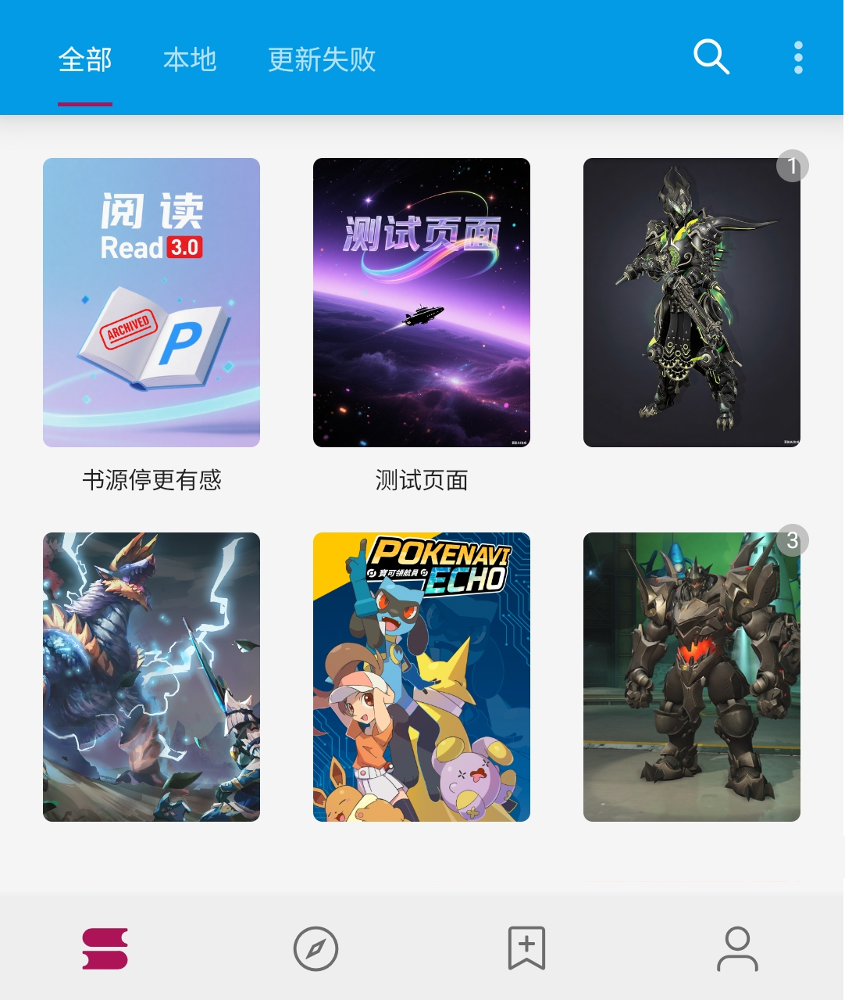
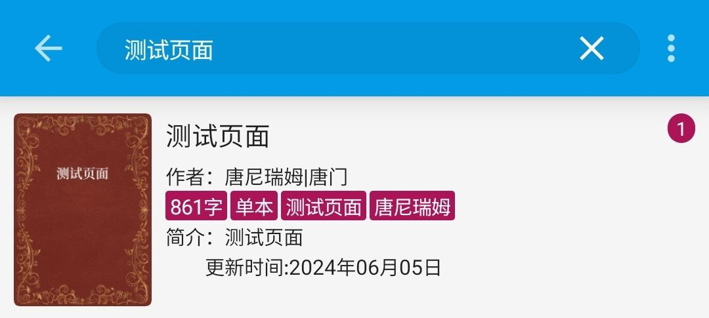
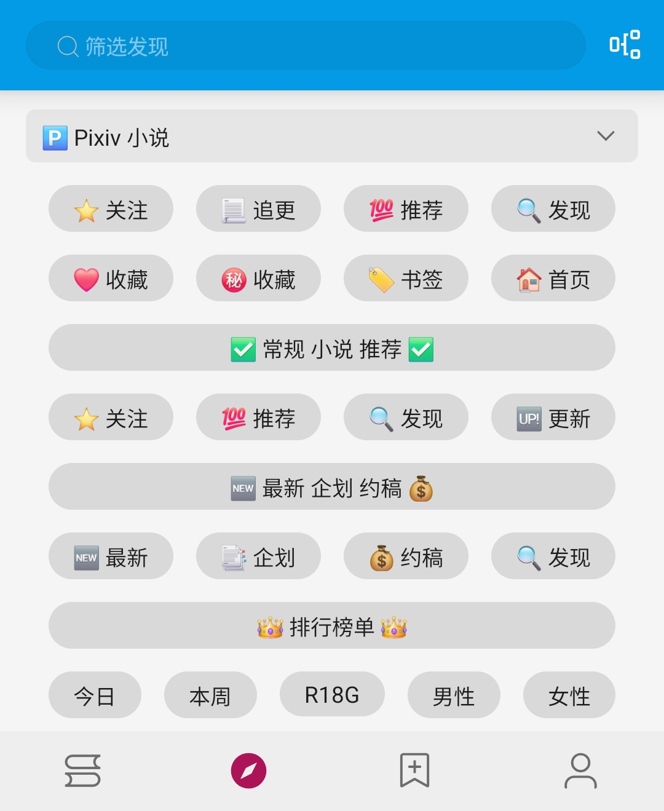
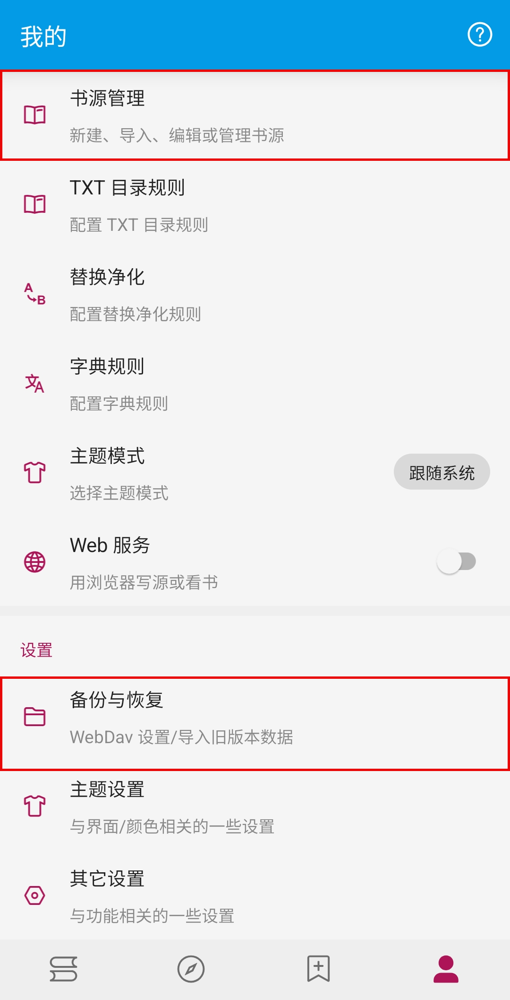
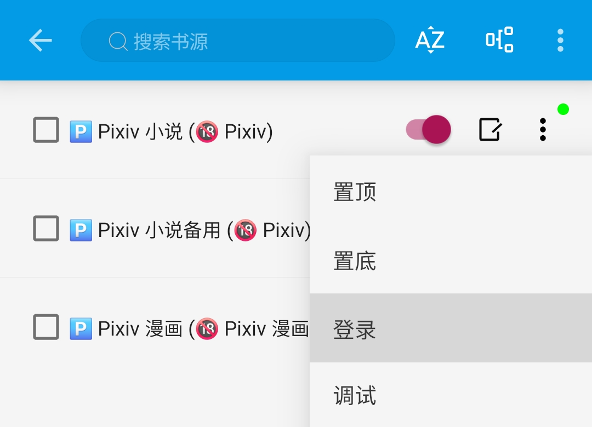
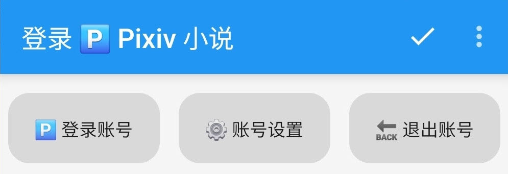
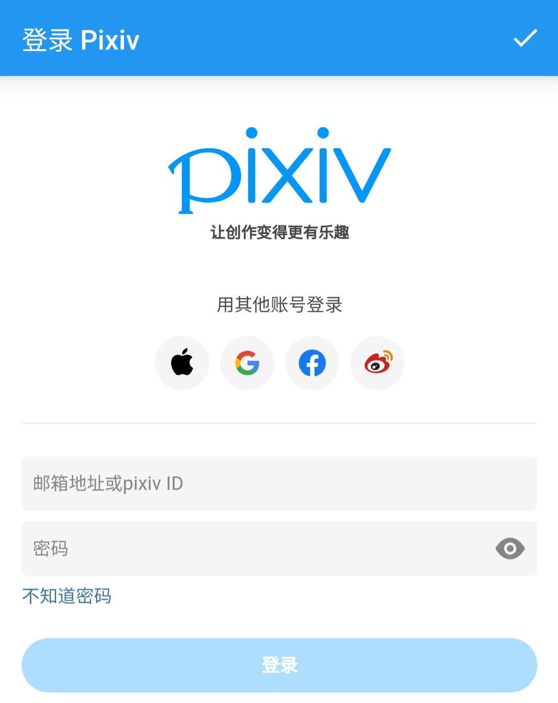
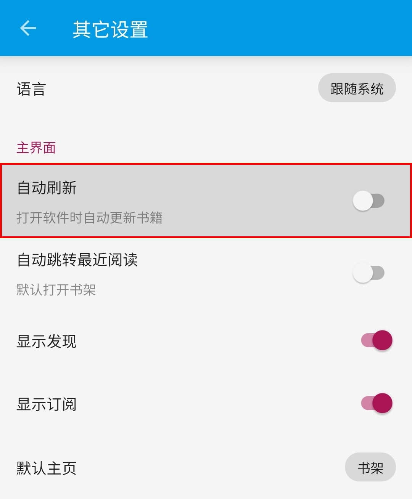

 

# ✨ 臻享阅读 ✨
### 🅿️ [开源阅读](https://github.com/gedoor/legado) Pixiv 书源
#### ✈️ 频道 [@PixivSource](https://t.me/PixivSource)
#### ☕ [书源项目打赏名单](./Sponsor.md)

## 你是否被下面的问题所困扰？
### 官方 APP 的阅读体验堪忧

 👎 阅读体验堪忧 

- 小说功能缺陷
  - 没有小说书架
  - 没有首行缩进
  - 不能保存阅读进度
  - 拉黑功能并非屏蔽
- 搜索功能缺陷
  - 默认搜索标签，而非小说名称
  - 不能直接搜索作者名称，获取其小说
- 基础功能却需要付费
  - 浏览记录是 Vip 功能
  - 屏蔽标签是 Vip 功能
  - 屏蔽作者是 Vip 功能

### 第三方 APP 没有优化小说阅读体验

 🧩 第三方 APP 

- [PixEz Flutter](https://github.com/Notsfsssf/pixez-flutter)
- [Pixiv Shaft](https://github.com/CeuiLiSA/Pixiv-Shaft)
- [Pixiv Viewer](https://github.com/asadahimeka/pixiv-viewer)
- [PixEz Viewer](https://github.com/ultranity/Pix-EzViewer)
- [Pi Pixiv](https://github.com/darriousliu/PiPixiv)
- [Pixiv Multi Platform](https://github.com/magic-cucumber/Pixiv-MultiPlatform)
- [Pixiv Artvier](https://github.com/kerrinz/pixiv-artvier)
- [Pixes](https://github.com/wgh136/pixes)
- [Pixeval](https://github.com/Pixeval/Pixeval)
> 数据源自 https://linux.do/t/topic/657910

迄今为止（2025.12），上述软件依然没有优化过 小说阅读体验

## 你是否想改善你的阅读体验呢？ 如果你的回答是“是”，那么你可能需要：
## 开源阅读 + Pixiv 书源

### 开源阅读软件
> [!IMPORTANT]
>
> 点击链接，下载 **【新共存版】** 安装包并安装软件
>
> https://miaogongzi.lanzout.com/b01rgkhhe

像常规阅读软件一样，也有：书架、搜索、发现、我的 等页面

 🖼 软件界面 

### 📚 书架页面
添加小说后如图：

### 🔎 搜索页面
添加书源后如图：

### 🌟 发现页面
添加书源后如图：

### 👤 我的页面
多数阅读软件的我的页面都有登录账号

与常规阅读软件不同，【开源阅读】的我的页面，最上面却是【书源管理】

## 概念介绍
### 📖 书源
> [!NOTE]
> **【开源阅读】没有账号体系，软件本身并不提供小说资源**
> 
> **提供小说资源的是【书源】**
> **（准确来说是书源内部的网站）**

有什么网站的书源，就可以看什么网站的小说
- 有【起点】书源，就可以看 起点网文
- 有【番茄】书源，就可以看 番茄小说
- 有【Pixiv】书源，就可以看 Pixiv 的小说

### 🌐 订阅源
既然提到了书源，也顺便说一下订阅源
> [!NOTE]
> 订阅源类似于RSS，甚至可以听音乐看视频
- 书源、订阅源的内部数据不同，添加源（网络导入、规则订阅）的时候需要区分一下
- 这里使用的是一键导入，不需要区分

> [!IMPORTANT]
>
> 🅿️ [一键导入 Pixiv 书源](https://loyc.xyz/b/cdx.html?src=legado://import/importonline?src=https://cdn.jsdelivr.net/gh/DowneyRem/PixivSource@main/pixiv.json)
>
> 🐲 [一键导入 Pixiv 订阅源](https://loyc.xyz/b/cdx.html?src=legado://import/importonline?src=https://cdn.jsdelivr.net/gh/DowneyRem/PixivSource@main/btsrk.json)
- 一般来说，书源开发者同时提供书源和订阅源的话，最好都要导入
- 这样才能保证最佳的使用体验

## 书源配置
### ⚙️ 书源管理
打开书源管理，有书源的话，点击书源菜单后，应该是这样的：

注意这里的【登录】和【调试】，这两个功能很重要

### 🅿️ 登录账号
> [!NOTE]
>
> **Pixiv 及正版付费书源，需要登录账号才能阅读相关小说**

#### 1. 开启代理工具
此处略过，请自行学习，**最好开启【全局代理】**

#### 2. 登录 Pixiv 账号
**我的 - 书源管理 - 菜单 - 登录 - 登录账号**

**登录你的账号，登录成功后，点击右上角的对勾**

> [!TIP]
>
> **如果需要验证码，请更换代理，或过段时间再次尝试**
- 登录成功后，就可以使用 Pixiv 书源查看小说了

## 阅读设置
### 💾 [备份与恢复](WebdavBackup.md)
> [!IMPORTANT]
>
> **【开源阅读】没有账号体系，不能在登录书源网站的同时恢复数据**
>
> **需要配置 Webdav 服务，才能从云端恢复数据**
> 
> **详见：[备份与恢复](WebdavBackup.md)**

### 🔄 关闭自动刷新
> [!IMPORTANT]
> **使用时，请在设置里，关闭自动刷新**
> 
> **否则很容易触发触发请求限制，甚至封号**

我的 - 其他设置 - 自动刷新

> [!NOTE]
>
> **截止到这里，你基本上就拥有了完整的阅读体验了**

### ☁️ [远程书籍](RemoteBooks.md)（可选）
> [!TIP]
> 使用支持 Webdav 网盘，阅读网盘上的书籍
> 
> **详见：[远程书籍](RemoteBooks.md)**

## 书源功能
