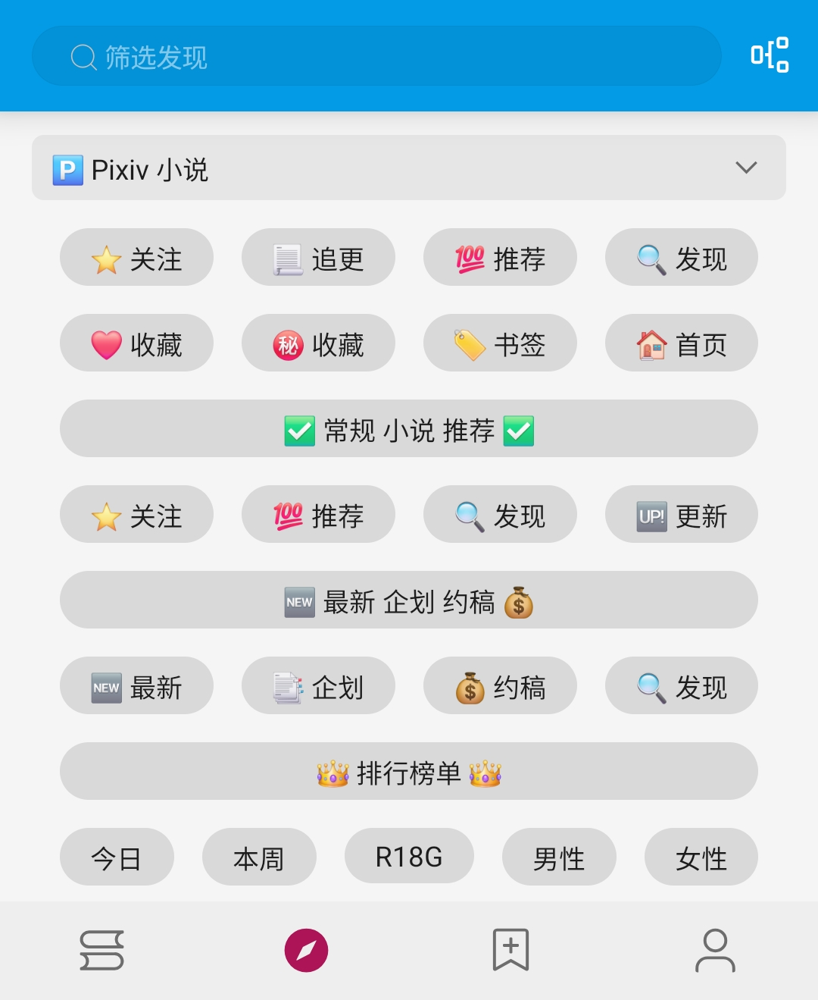
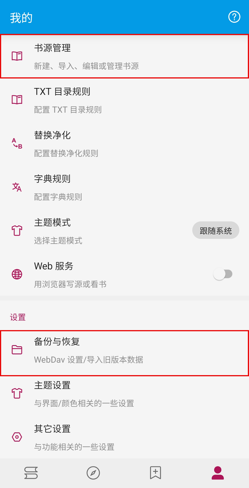
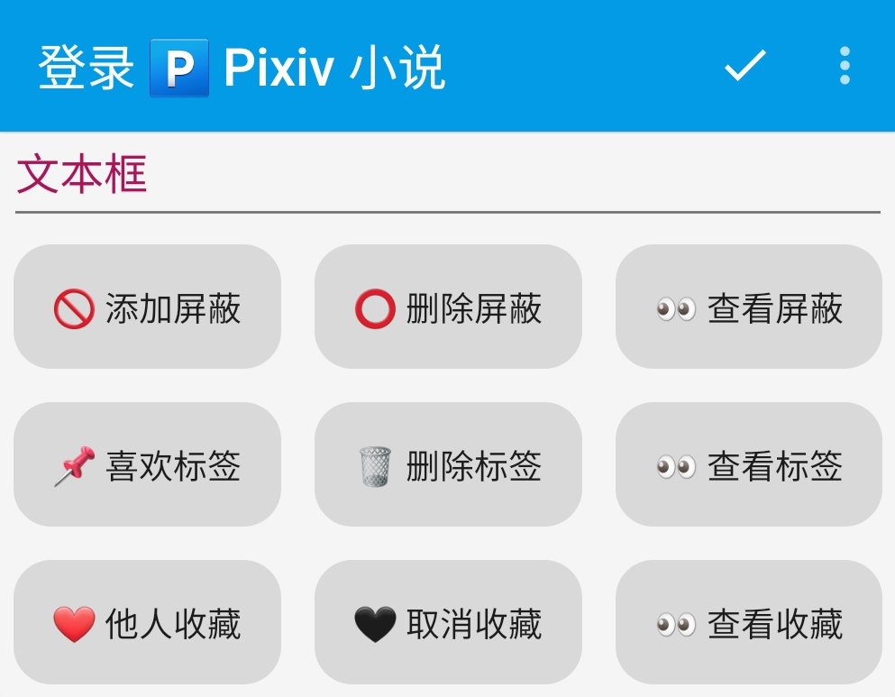

 

# ✨ 臻享阅读 ✨
## 最好的 Pixiv 第三方小说阅读器
### 🅿️ [开源阅读](https://github.com/Luoyacheng/legado) + Pixiv 书源
#### ✈️ 频道 [@PixivSource](https://t.me/PixivSource)
#### ☕ [书源项目打赏名单](Sponsor.md)

> [!WARNING]
>
> ⚠️ **你正在 GitHub 上浏览此文档， Github 文档可能不完整
> [网页版](https://pixivsource.pages.dev/BetterExperience)
> 内容更全面，排版更精美**

> [!TIP]
> 
> **面向新手的完整配置指南，彻底解决 Pixiv 官方软件的痛点！**
> 
> **另有：极简配置指南：**
> [⚡️ 快速开始](QuickStart.md)
> 
> **Pixiv 书源 全部功能 详见：**
> [🅿️ Pixiv 书源 功能手册](Pixiv.md)

## 你是否被下面的问题所困扰？ {#Trouble}
### 官方 APP 的小说阅读体验堪忧 {#OfficialAPPTrouble}

<strong> 👎 阅读体验堪忧 </strong>

- 小说功能缺陷
  - **没有小说书架**
  - **没有首行缩进**
  - **不能保存阅读进度**
  - **拉黑功能并非屏蔽**
- 搜索功能缺陷
  - **默认搜索标签，而非小说名称**
  - **不能直接搜索作者名称，获取其小说**
- 基础功能却需要付费
  - **浏览记录是 Vip 功能**
  - **屏蔽标签是 Vip 功能**
  - **屏蔽作者是 Vip 功能**

### 第三方 APP 的小说阅读体验不佳 {#UnOfficialAPPTrouble}

<strong> 😞 阅读体验不佳 </strong>

- 

 🈚️ 无小说功能 

  - [PixEz Viewer](https://github.com/ultranity/Pix-EzViewer)
  - [Pi Pixiv](https://github.com/darriousliu/PiPixiv)
  

- 

 👎 阅读体验明显不如 Pixiv 

  - [Pixiv Shaft](https://github.com/CeuiLiSA/Pixiv-Shaft) 
  - [Pixiv Artvier](https://github.com/kerrinz/pixiv-artvier) 
  - [Pixes](https://github.com/wgh136/pixes)
  

- 

 😞 阅读体验略逊色于 Pixiv 

  - [PixEz Flutter](https://github.com/Notsfsssf/pixez-flutter)
  - [Pixiv Multi Platform](https://github.com/magic-cucumber/Pixiv-MultiPlatform)
  - [Pixiv Viewer](https://github.com/asadahimeka/pixiv-viewer)
  

> 软件整理自 https://linux.do/t/topic/657910

**迄今为止（2025.12），上述软件的小说阅读体验，依然没有一个超过了 Pixiv**

## 你是否想改善阅读体验呢？ 如果你的回答是“是的” 那么你可能需要：{#Question}
## 开源阅读 + Pixiv 书源 {#RepoIntroduction}
> [!NOTE]
>
> **我们的目标：做最好的 Pixiv 的小说阅读器**
> 
> **经过充分的调研，此目标已在 2025.12 实现**

### ⬇️ 下载阅读 {#DownloadLegado}
> [!IMPORTANT] 重要
>
> 点击链接，下载 **【阅读 Plus】** 安装包并安装软件
>
> https://gitee.com/lyc486/legado/releases/download/3.26.030717/legado_%E6%AD%A3%E5%BC%8F%E7%89%88_3.26.03071721_releaseS.apk

> [!TIP]
>
> **Android 设备：阅读 + Pixiv 书源**
>
> **苹果设备可用：源阅 + Pixiv 书源**
> **，详见：[下载阅读](Download.md#AppleiOS)**

## 软件介绍 {#LegadoIntroduction}
像常规阅读软件一样，也有：书架、搜索、发现、我的 等页面
### 📚 书架页面 {#Shelf}
添加小说后如图：

### 🔎 搜索页面 {#Search}
添加书源后如图：

### ⭐️ 发现页面 {#discover}
添加书源后如图：

### 👤 我的页面 {#Mine}
多数阅读软件的我的页面都有登录账号

与常规阅读软件不同，【开源阅读】的我的页面，最上面却是【书源管理】

> [!IMPORTANT] 重要
> **设置中的这两项非常重要**，稍后讲解：
>  - **【书源管理】** 查看 [书源管理](#BookSourceSet)
>  - **【备份与恢复】** 查看 [备份与恢复](#WebdavBackup)

## 概念介绍 {#SourceIntroduction}
### 📖 书源 {#BookSource}
> [!NOTE]
> **【开源阅读】没有账号体系，软件本身并不提供小说资源**
> 
> **提供小说资源的是【书源】，准确来说是书源内部的网站**
> 
> **书源是指导阅读浏览器，向书源内部网站请求数据的一套方法**

**有什么网站的书源，就可以看什么网站的小说**
- 有【起点】书源，就可以看 起点网文
- 有【番茄】书源，就可以看 番茄小说
- 有【Pixiv】书源，就可以看 Pixiv 小说

### 🌐 订阅源 {#RssSource}
> [!NOTE]
> 
> 「订阅源类似于RSS，甚至可以听音乐看视频」
> 
> **这里提供的订阅源类似于浏览器书签，可以在阅读软件（订阅界面）内快速访问相关网站**

### 🚀 导入书源 & 订阅源 {#ImportSources}
- **书源、订阅源的内部数据不同，添加源（网络导入、规则订阅）的时候需要区分**
- 这里使用的是**一键导入，不需要区分二者**

> [!IMPORTANT] 重要
> 
> **点击下方链接，一键导入书源、订阅源**
> 
> 🅿️ [一键导入 Pixiv 书源](https://pixivsource.pages.dev/Import?src=https://cdn.jsdelivr.net/gh/DowneyRem/PixivSource@main/pixiv.json)
>
> 🐲 [一键导入 Pixiv 订阅源](https://pixivsource.pages.dev/Import?src=https://cdn.jsdelivr.net/gh/DowneyRem/PixivSource@main/btsrk.json)
- 一般来说，书源开发者**同时提供书源和订阅源的话，最好都要导入**
- **这样才能保证最佳的使用体验**

<!--@include: CommonPixiv.md-->

## 书源功能 {#BookSourceFunction}
> [!NOTE]
>
> **书源众多功能均在登陆页面内，进入登录页面有以下两种方式：**
>
> **⏺ 互动功能 => 书架 - 阅读界面 - Pixiv 小说 - 登录**
>
> **⚙️ 书源设置 => 我的 - 书源管理 - Pixiv 小说 - 登录**

### ⏺ 互动功能 {#InteractiveFunction}
> [!TIP]
>
> **⏺ 互动功能 => 书架 - 阅读界面 - Pixiv 小说 - 登录**

此处打开登录界面，可以显示 **互动功能**

- **❤️ 收藏本章：添加公开收藏、切换私密收藏**
- **📃 追更系列：追更系列、取消追更**
- **❤️ 收藏系列：公开收藏系列内的每篇小说（可追加）**
-
- **🖤 取消收藏：短按取消收藏本章、长按取消收藏系列**
- **⭐️ 关注作者：关注作者（按钮 & 浏览器）、取消关注**
- **🚫 屏蔽作者：屏蔽作者、取消屏蔽（本地）**
-
- **✅ 发送评论：当前章节下发送评论（自动拆分超长评论）**
- **🗑 删除评论：当前章节下删除评论（支持批量删除评论）**
- **🔄 刷新本章：刷新章节正文（以及评论）**

### ▶️ 自定功能 {#Customization}
> [!TIP]
>
> **▶️ 自定功能 => 书架 - 阅读界面 - Pixiv 小说 - 登录**

**屏蔽功能（本地）：**
- **🚫 屏蔽关键词**
  - 🚫 添加屏蔽、⭕️ 取消屏蔽
  - 👀 查看屏蔽（切换：屏蔽标签、屏蔽描述、屏蔽作者）
  - 详见：[屏蔽功能](Pixiv.md#CustomizationBan)
- **🚫 屏蔽作者（互动功能，见上方）**
  - 🚫 添加屏蔽、⭕️ 取消屏蔽
- **🚫 隐藏小说（书源设置，见下方）**
  - ❤️ 隐藏收藏、📃 隐藏追更

**自定义发现（本地）：**
- **📌 添加喜欢标签**
  - 📌 添加标签、🗑️ 删除标签、👀 查看标签
- **❤️ 关注他人收藏**
  - ❤️ 添加关注、🖤 取消关注、👀 查看关注
- 详见：[发现功能](Pixiv.md#CustomizationDiscover)

### 👀 显示设置按钮 {#ShowSettings}
> [!TIP]
>
> **👀 显示设置按钮 => 我的 - 书源管理 - Pixiv 小说 - 登录**
>
> **️👀 显示设置按钮 => 书架 - 阅读界面 - Pixiv 小说 - 登录**

此处打开登录界面，可以 **显示/隐藏 书源设置按钮、发现设置按钮**

点击【👀 书源设置】【👀 发现设置】即可 **显示/隐藏 相关设置按钮**
- **书源管理** 的两设置按钮 **默认显示**  
- **阅读界面** 的两设置按钮 **默认隐藏**

### ⚙️ 书源设置 {#BookSourceSettings}
> [!TIP]
>
> **⚙️ 书源设置 => 我的 - 书源管理 - Pixiv 小说 - 登录**

此处的**按钮图标，基本上会和实际的设置同步**

- ⚙️ 当前设置：显示当前设置
- 🔧 默认设置：恢复默认设置
- 👤 搜索作者：切换搜索关键词、模糊搜索作者
-
- 🀄 繁简通搜：搜索进行繁简转换（搜索标签、搜索作者不转换）
- 📖 更多简介：详情显示更多简介
- 📅 更新时间：目录显示更新时间
-
- 🔗 原始链接：显示原始链接
- 📚 恢复《》：恢复正文内被替换的书名号《》
- 🖼️ 显示描述：章首显示描述
-
- 💬 显示评论：章尾显示评论
- ❤️ 隐藏收藏：搜索发现 显示/隐藏 收藏单篇小说
- 📃 隐藏追更：搜索发现 显示/隐藏 追更系列小说
-
- ⏩ 快速模式：开启快速模式（关闭影响搜索速度的功能）
- 🐞 调试模式：开启调试模式
- 🔍 搜索说明：显示搜索说明

### 🔍 发现设置 {#DiscoverSettings}
> [!TIP]
>
> **🔍 发现设置 => 我的 - 书源管理 - Pixiv 小说 - 登录**

- 🔍 当前发现：显示当前发现设置
- ⏺️ 其他按钮：发现 显示/隐藏 对应功能
- 🐺 兽人小说：发现 显示/隐藏 兽人小说；优化兽人小说搜索作者

## 📖 畅享阅读
- 🔍 [搜索小说](Pixiv.md#SearchNovel)：书架页面，搜索小说，添加小说到书架
- ⭐️ [发现小说](Pixiv.md#DiscoverNovel)：发现页面，查看小说，添加小说到书架
- 🔗 [添加网址](Pixiv.md#AddUrl)：书架页面，通过 **【添加网址】** 添加小说到书架
- 🌐 [订阅源](Pixiv.md#RssSource)：订阅页面，通过 **【订阅源】** 添加小说到书架

<!--@include: CommonSuffix.md-->

