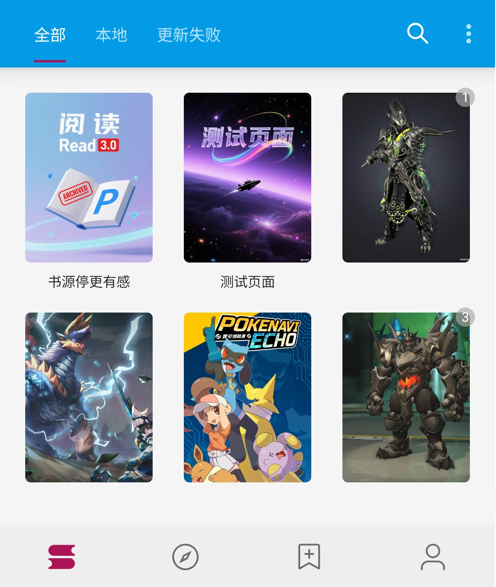
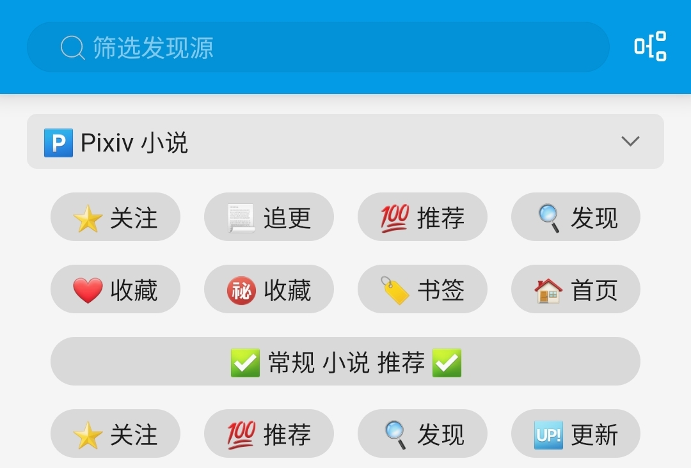
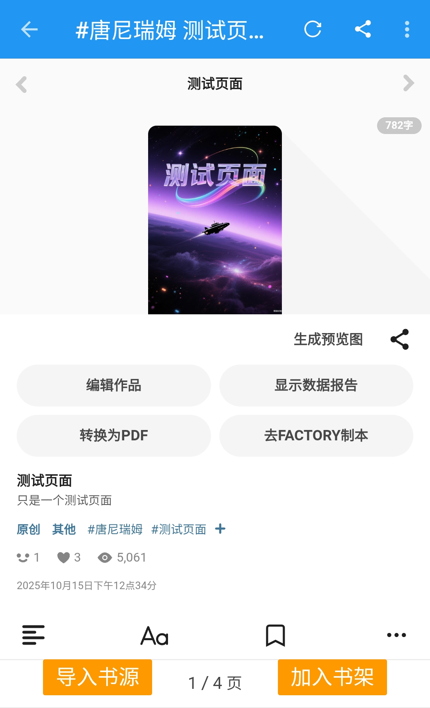

## 📖 添加小说 {#AddNovels}
> [!TIP]
> ▶️ 全部功能详见 [Pixiv 书源 功能手册](Pixiv.md)

### 🔍 [搜索小说](Pixiv.md#SearchNovel) {#SearchNovel}
> [!NOTE]
>
> **书架页面 - 放大镜 - 输入关键词 - 搜索小说 - 添加小说到书架**
> 
> 同时搜索：**Pixiv 网站上小说、本地书架上的小说**

> [!TIP]
> ✅ 默认同时搜索： **小说名称、系列小说名称、标签**
>
> 🀄️ 繁简通搜 ✅ 默认开启：输入 `校园` 时，**同时搜索 `校园`、`校園`**
>
> 更多搜索方法详见 [搜索小说](Pixiv.md#SearchNovel)


打开书架页面，点击搜索按钮 🔍


输入：`测试页面`，点击回车，进行搜索


点击搜索结果，进入小说详情页面


点击【放入书架】，添加小说到书架


### ⭐️ [发现小说](Pixiv.md#DiscoverNovel) {#DiscoverNovel}
> [!NOTE]
>
> **发现页面 - 点击“Pixiv 小说” - 点击按钮 - 添加小说到书架**

> [!TIP]
>
> Pixiv 有诸多推荐小说的功能，这些功能均在**发现页面**，
> 详见 [发现小说](Pixiv.md#DiscoverNovel)



打开发现页面，点击上方的发现按钮，可以进入小说列表


点击发现结果，进入小说详情页面


点击【放入书架】，添加小说到书架


### 🔗 [添加网址](Pixiv.md#AddUrl) {#AddUrl}
> [!NOTE]
>
> **书架 - 菜单 - 添加网址 - 粘贴小说链接 - 添加小说到书架**

> [!TIP]
>
> **当你收到 Pixiv 的链接时，可以通过添加网址，将其添加到书架**
>
> **可以同时添加多个小说的链接，支持：**
> - **Pixiv 单篇小说链接**
> - **Pixiv 系列小说链接**
> - **Pixiv 作者链接（添加近期1本小说）**
    > 更多详见 [添加网址](Pixiv.md#AddUrl)


```
https://www.pixiv.net/novel/show.php?id=26200191
```
复制上面的 Pixiv 链接，点击书架右上角菜单


粘贴链接，点击确定，添加小说到书架


> [!WARNING]
>
> **无法添加**：Pixiv App 小说分享链接 **（删掉#号即可正常添加）**
```
测试页面 | 唐尼瑞姆 #pixiv https://www.pixiv.net/novel/show.php?id=26200191
```


### 🌐 [订阅源](Pixiv.md#RssSource) {#RssSource}
> [!NOTE]
>
> **订阅 - Pixiv - 打开小说正文/系列小说目录 - 添加小说到书架**

> [!TIP]
>
> 如果你不习惯使用阅读软件，可以**在这里打开 Pixiv 网页版**
>
> **并通过【加入书架】按钮，添加小说到书架**


打开订阅页面，点击 Pixiv ，打开 Pixiv 网站


1️⃣ 打开【小说正文】或【系列小说目录】



2️⃣ 点击【加入书架】按钮，进入小说详情页面


点击【放入书架】，添加小说到书架