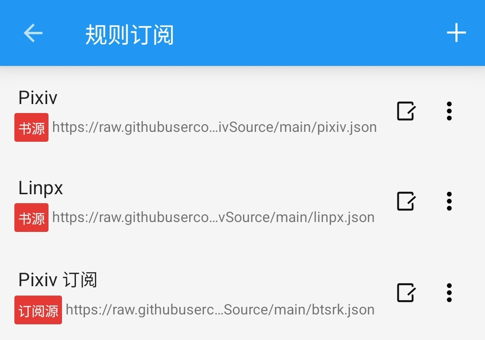

### 🚀 A.一键导入【最简单】 {#OneClick}
> [!NOTE]
>
> **一键导入【操作简便】，后续需要【手动更新】书源**
>
>　**点击链接，一键导入 书源、订阅源**

<div v-if="route.path === 'QuickStart'">

| 源名称    | jsDelivr | Github |
|--------| -------- | ------ |
| 🅿️ Pixiv 书源 | [一键导入](https://pixivsource.pages.dev/Import?src=https://cdn.jsdelivr.net/gh/DowneyRem/PixivSource@main/pixiv.json) | [一键导入](https://pixivsource.pages.dev/Import?src=https://raw.githubusercontent.com/DowneyRem/PixivSource/main/pixiv.json) |
| 🦊 Linpx 书源 | [一键导入](https://pixivsource.pages.dev/Import?src=https://cdn.jsdelivr.net/gh/DowneyRem/PixivSource@main/linpx.json) | [一键导入](https://pixivsource.pages.dev/Import?src=https://raw.githubusercontent.com/DowneyRem/PixivSource/main/linpx.json) |
| 🐲 BTSRK 订阅源 | [一键导入](https://pixivsource.pages.dev/Import?src=https://cdn.jsdelivr.net/gh/DowneyRem/PixivSource@main/btsrk.json) | [一键导入](https://pixivsource.pages.dev/Import?src=https://raw.githubusercontent.com/DowneyRem/PixivSource/main/btsrk.json) |
</div>


<details><summary><strong> 🚀 一键导入　详细操作 </strong></summary>

#### 1.点击上述链接，跳转阅读


#### 2.导入并启用书源

</details>

<div v-if="route.path.startsWith('Import')">
<details><summary><strong> ⚙️ 一键导入　网站设置 </strong></summary>
  
  > [!NOTE]
  > 官方API：https://github.com/gedoor/legado#api-
  ```
  可通过url唤起阅读进行一键导入,url格式: legado://import/{path}?src={url}
  path类型: bookSource,rssSource,replaceRule,textTocRule,httpTTS,theme,readConfig,addToBookshelf
  path类型解释: 书源,订阅源,替换规则,本地txt小说目录规则,在线朗读引擎,主题,阅读排版,添加到书架
  legado://import/addToBookshelf?src={url}
  ```
  
- 一键导入的书源链接：
    - `yuedu://booksource/importonline?src=https://raw.githubusercontent.com/DowneyRem/PixivSource/main/pixiv.json`
    - `legado://import/bookSource?src=https://raw.githubusercontent.com/DowneyRem/PixivSource/main/pixiv.json`
  
  - 一键导入的订阅源链接：
      - `yuedu://rsssource/importonline?src=https://raw.githubusercontent.com/DowneyRem/PixivSource/main/btsrk.json`
      - `legado://import/rsssource?src=https://raw.githubusercontent.com/DowneyRem/PixivSource/main/btsrk.json`

</details>
</div>


### 🔗 B.规则订阅【易更新】 {#Subscription}
> [!NOTE]
> **规则订阅【更新方便】，后续可以【自动更新】书源**
> 
>　**订阅 - 规则订阅 - 添加 - 复制链接、粘贴 - 添加订阅**

<div v-if="route.path === 'QuickStart'">

| 源名称 | jsDelivr | Github |
| ----- | -------- | ------ |
| 🅿️ Pixiv 书源   | [订阅链接](https://cdn.jsdelivr.net/gh/DowneyRem/PixivSource@main/pixiv.json) | [订阅链接](https://raw.githubusercontent.com/DowneyRem/PixivSource/main/pixiv.json) |
| 🦊 Linpx 书源   | [订阅链接](https://cdn.jsdelivr.net/gh/DowneyRem/PixivSource@main/linpx.json) | [订阅链接](https://raw.githubusercontent.com/DowneyRem/PixivSource/main/linpx.json) |
| 🐲 BTSRK 订阅源 | [订阅链接](https://cdn.jsdelivr.net/gh/DowneyRem/PixivSource@main/btsrk.json) | [订阅链接](https://raw.githubusercontent.com/DowneyRem/PixivSource/main/btsrk.json) |
</div>

<details><summary><strong> 🔗 规则订阅　详细操作 </strong></summary>

#### 1. 打开【订阅】页面，点击【规则订阅】


#### 2. 点击加号，粘贴链接，保存订阅


#### 3. 点击相应订阅规则，导入并启用/更新书源


**首次点击【订阅规则】 即可导入**


**导入之后，再次点击则会检查更新**
</details>

