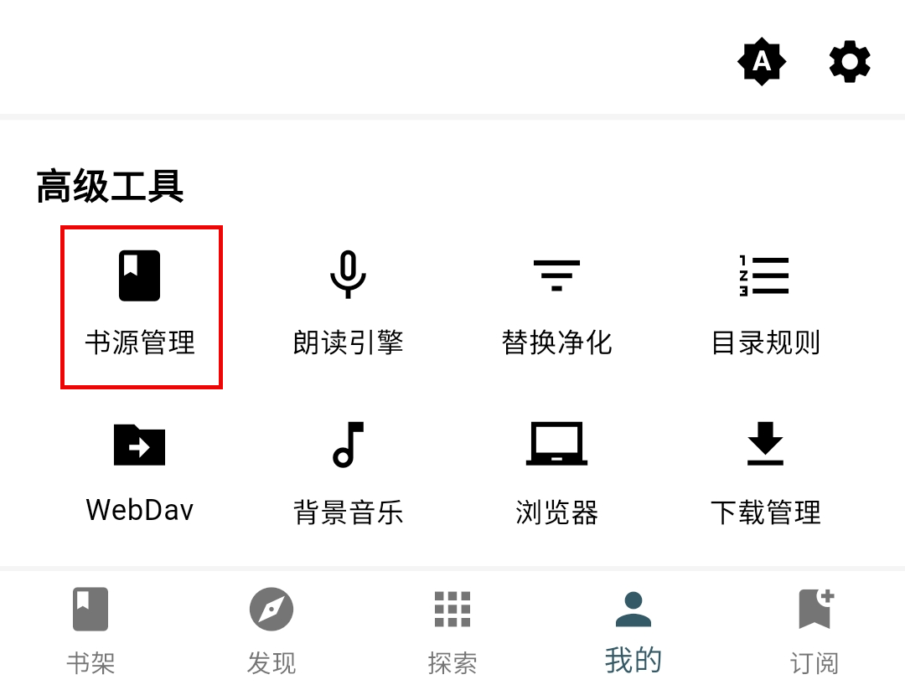
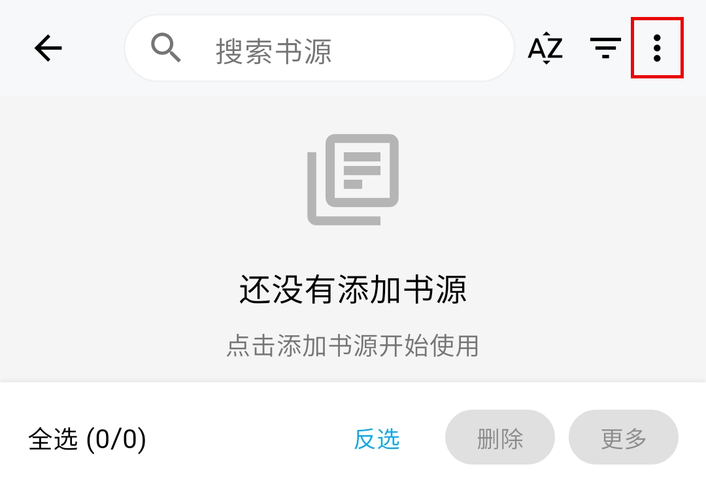
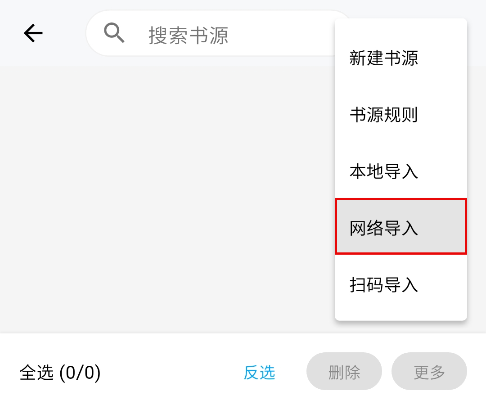
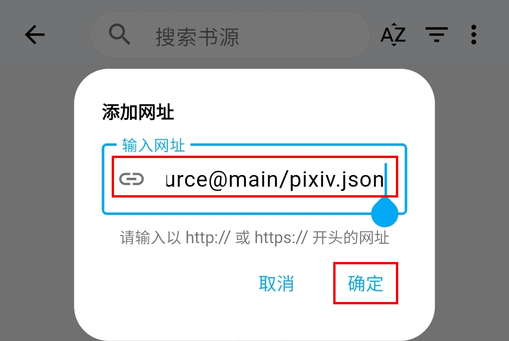
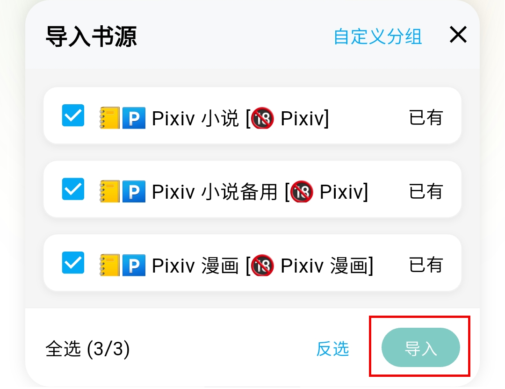
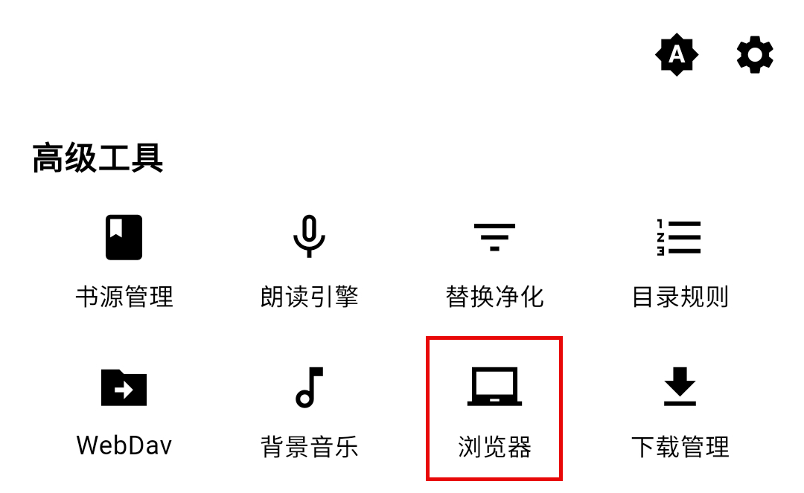
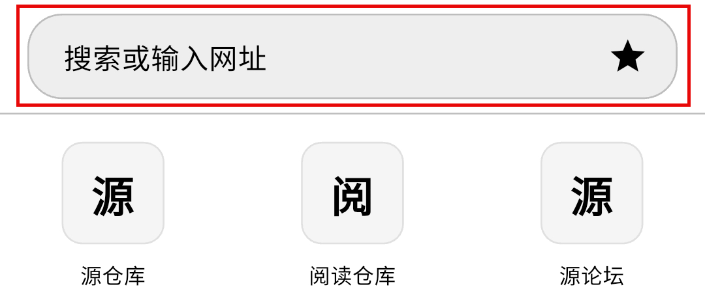
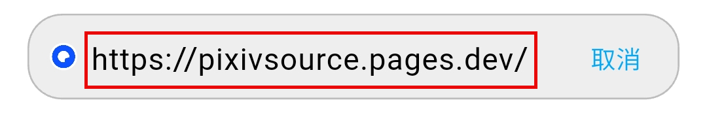
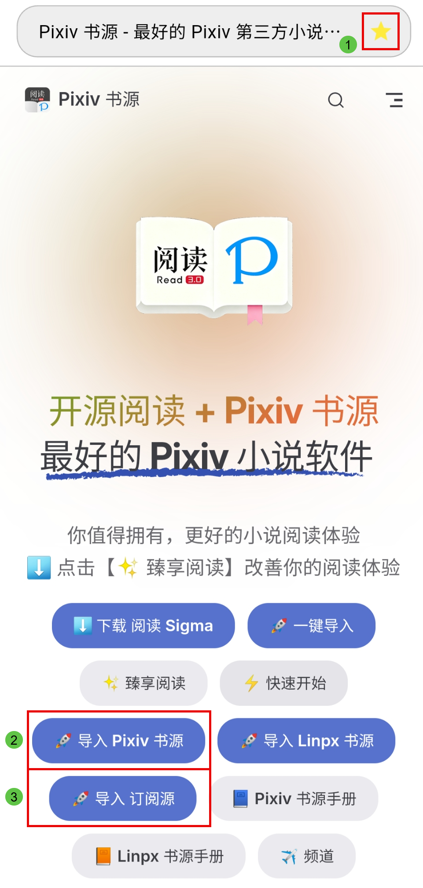
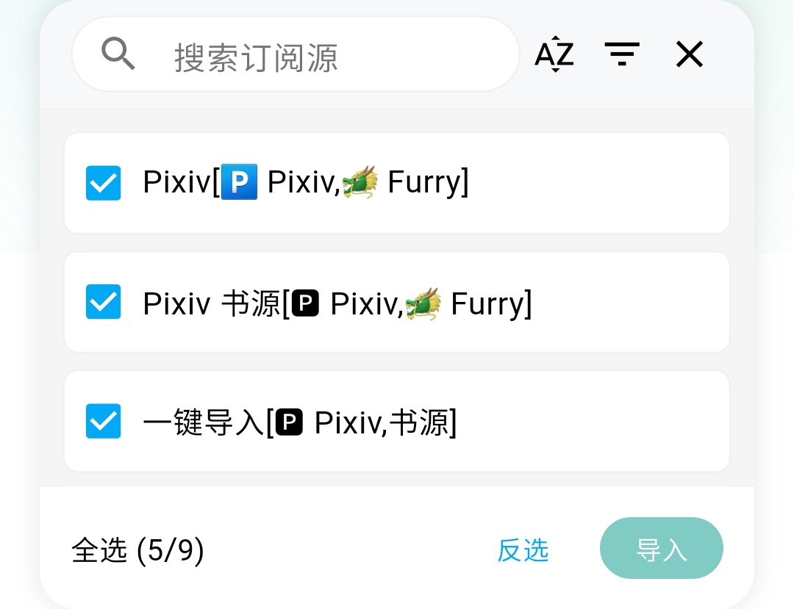

### 🔗 A.网络导入 {#Internet2}
> [!IMPORTANT]
>
> **我的 - 书源管理 - 菜单 - 网络导入**


<details><summary><strong> 🔗 网络导入　详细操作</strong></summary>

#### 0.先复制下面的网址
```
https://cdn.jsdelivr.net/gh/DowneyRem/PixivSource@main/pixiv.json
```

#### 1.打开轻悦时光，点击【我的】页面，点击【书源管理】



#### 2.点击右上角菜单



#### 3.点击【网络导入】



#### 4.粘贴书源链接，点击【确定】



#### 5.点击【导入】，即可导入 Pixiv 书源


</details>


### 🌐 B.浏览器导入 {#Browser}
> [!IMPORTANT]
>
> **我的 - 浏览器 - 搜索"Pixiv 书源"，进入官网，点击"导入书源"**


<details><summary><strong> 🌐 浏览器导入　详细操作</strong></summary>

#### 0.先复制下面的网址
```
https://pixivsource.pages.dev
```

#### 1.打开轻悦时光，点击【我的】页面，点击【浏览器】



#### 2.点击网址栏，粘贴网址并访问





#### 3.进入 Pixiv 书源网站，点击 ⭐️ 即可收藏当前网站



#### 4.点击【导入 Pixiv 书源】，即可导入 Pixiv 书源


#### 5.点击【导入 订阅源】，即可导入 Pixiv 书源


</details>