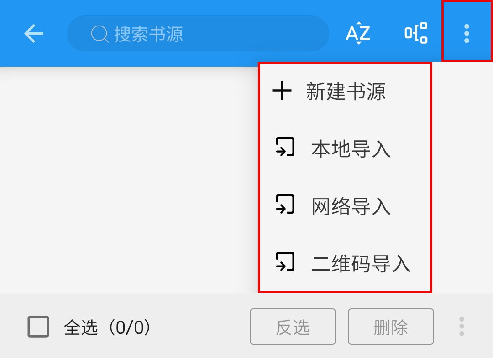

## 软件介绍 {#LegadoIntroduction}
### 📖 开源阅读 {#Legado}
阅读指 [**Legado / 开源阅读**](https://github.com/Luoyacheng/legado-E) 这一开源阅读软件

> [!IMPORTANT]
>
> **【开源阅读】是一个特殊的浏览器，通过特定规则【书源】或【订阅源】访问网页，并重新排版**
>
> **【开源阅读】软件不提供任何资源。需要搭配【书源】或【订阅源】共同使用。**
>
> 转自：[**阅读常见问题解答**](https://mp.weixin.qq.com/s/5EO-TuqYfDrK-bFk78vd3g)

### 📚 书源 {#BookSourceConcept}
> [!IMPORTANT]
>
> **提供小说资源的是【书源】，准确来说是【书源内部的网站】**
>
> **书源是指导阅读浏览器，向书源内部网站请求数据、解析数据的一套规则方法**

**有什么网站的书源，就可以看什么网站的小说**
- 有【起点】书源，就可以看 起点网文
- 有【番茄】书源，就可以看 番茄小说
- 有【Pixiv】书源，就可以看 Pixiv 小说

### 🌐 订阅源 {#RssSourceConcept}
> [!NOTE]
>
> 「订阅源类似于 RSS 订阅，甚至可以听音乐看视频」
> 转自：[**4个基本名词解释**](https://www.yuque.com/legado/wiki/yg97rc)

> [!TIP]
>
> **这里提供的订阅源类似于浏览器书签，**
> **这样可以在阅读软件（订阅界面）内快速访问相关网站**

## 软件界面 {#LegadoUI}
像常规阅读软件一样，开源阅读 也有：书架、搜索、发现、我的 等页面

### 📚 书架页面 {#ShelfPage}
添加小说后如图：

### 🔎 搜索页面 {#SearchPage}
添加书源后如图：

### ⭐️ 发现页面 {#DiscoverPage}
添加书源后如图：

### 📪 订阅页面 {#SubscribePage}
添加订阅源后如图：

### 👤 我的页面 {#MyPage}
多数阅读软件的我的页面都有登录账号

与常规阅读软件不同，【开源阅读】的我的页面，没有【登录账号】，有的是【书源管理】

> [!IMPORTANT]
>
> **设置中的这两项非常重要**，稍后讲解：
>  - **【书源管理】** 查看 [书源管理](#BookSourceManage)
>  - **【备份与恢复】** 查看 [备份与恢复](#WebdavBackup)

### ⚙️ 书源管理 {#BookSourceManage}
**书源管理：（导入）添加、修改、删除书源**

> [!TIP]
> 
> 我们刚刚使用的是 **一键导入** 添加的书源 
> 
> 这里的 **【本地导入】【网络导入】同样可以添加书源**，详见：
> [导入书源](ImportBookSource.md)
