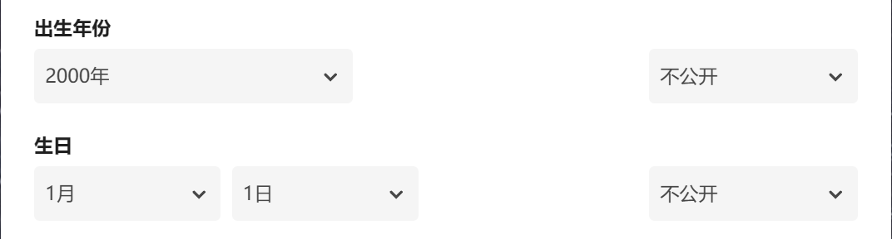
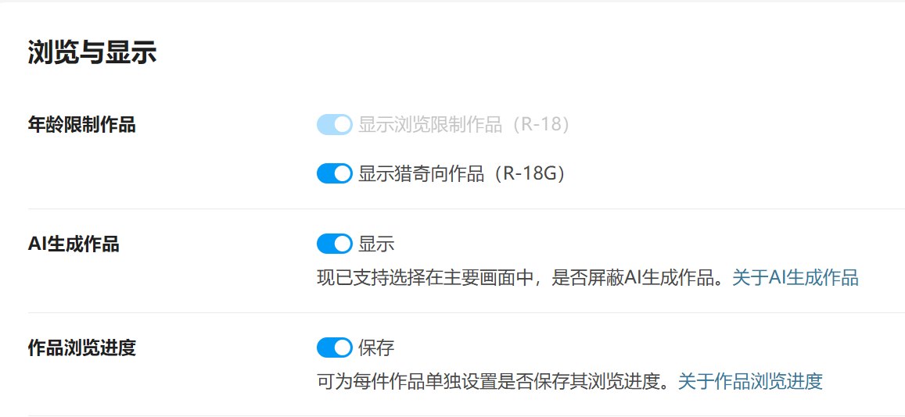
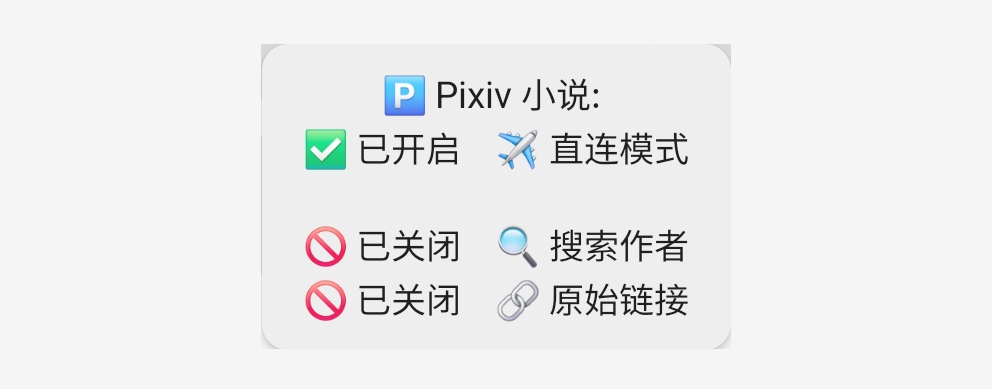

## 书源配置 {#BookSourceSet}

<!--@include: CommonLoginPixiv.md-->

### 🔞 浏览范围（可选）{R18Settings}
> [!TIP]
> ##### 如果你已经开启了 R18 设置，则可以跳过这一步

<strong>📆 编辑出生年份 </strong>

**再次点击登录，滑动屏幕，点击头像，再次点击头像，编辑个人资料**

[Pixiv 个人资料](https://www.pixiv.net/settings/profile) - 编辑个人资料 - 出生年份

出生年份改到：**2000年或2000年之前**，确保你的年龄在20岁及以上

<strong> 🔞 修改 Pixiv 浏览范围 </strong>

**我的-书源管理-点击 Pixiv 书源右侧三点菜单-登录-账号设置**

[Pixiv 设置](https://www.pixiv.net/settings/viewing) - 浏览与显示 - 年龄限制作品

根据自己情况选择显示：R18 作品 与 R18G 作品

不知道二者区别的可以查看这篇文档 [作品评级是什么？](https://www.pixiv.help/hc/zh-cn/articles/39125149371289-%E4%BD%9C%E5%93%81%E8%AF%84%E7%BA%A7%E6%98%AF%E4%BB%80%E4%B9%88)

### ✈️ 直连模式（可选） {#IPDirect}
> [!TIP]
> 
> **完成【登录账号】后，可在登录界面开启【直连模式】**
> 
> **开启【直连模式】后，无需代理，即可阅读小说**
>
> **✈️ 直连模式 => 我的 - 书源管理 - Pixiv 小说 - 登录**

> [!TIP]
> 
> **切换直连模式后，搜索、发现会自动启用直连链接**

> [!IMPORTANT]
> **🚫 直连模式下，以下功能不可用：**
>  - **搜索：搜索作者**
>  - **发现：书签、首页、排行榜**
>  - **目录：显示原始链接**

> [!NOTE]
>
> **直连功能参考自 [洛娅橙的阅读仓库](https://github.com/Luoyacheng/yuedu)**
>
> **其直连功能参考自 [PixEz Flutter](https://github.com/Notsfsssf/pixez-flutter)**

