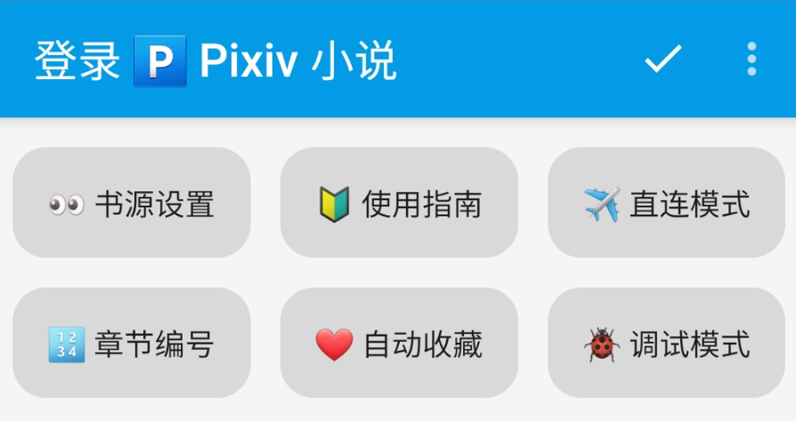
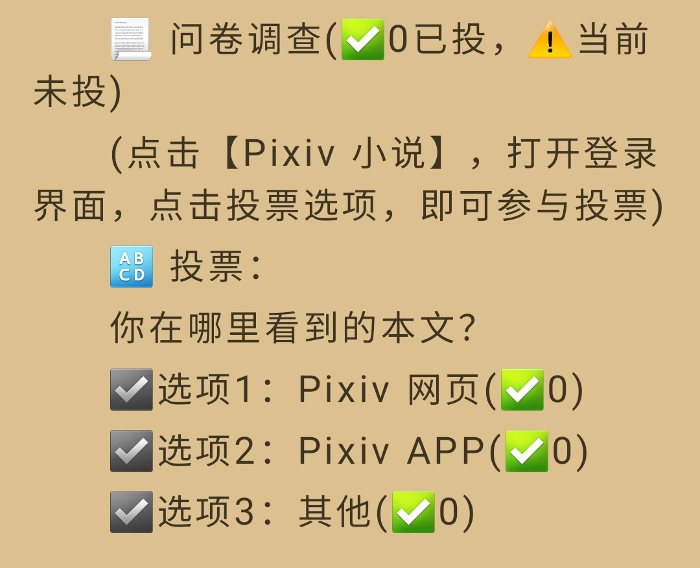
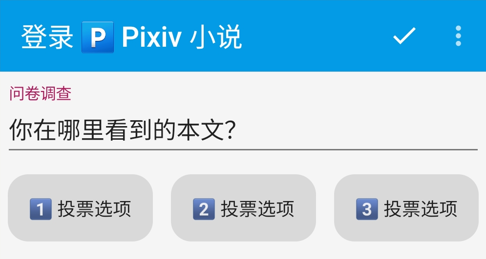
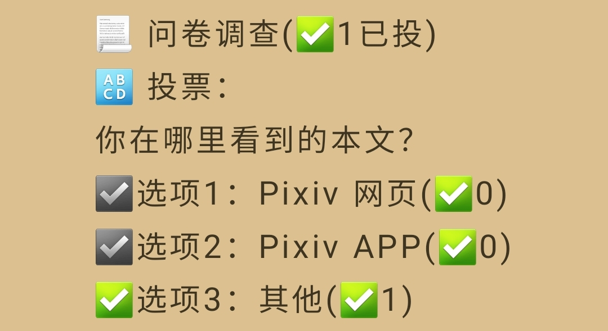

## 书源设置 {#Settings}
> [!IMPORTANT]
>
> **书源众多功能均在登陆页面内，进入登录页面有以下两种方式：**
>
> **⏺ 互动功能 => 书架 - 阅读界面 - Pixiv 小说 - 登录**
>
> **⚙️ 书源设置 => 我的 - 书源管理 - Pixiv 小说 - 登录**

### ▶️ 基础功能 {#SettingsBase}
> [!NOTE]
>
> **⚙️ 书源设置 => 我的 - 书源管理 - Pixiv 小说 - 登录**

> [!IMPORTANT]
>
> **⚠️ 登录账号/退出账号 都要使用按钮**

- **🅿️ 登录账号：登录 Pixiv 账号，并记录账号信息**
- ⚙️ 账号设置：设置 Pixiv 账号的浏览范围
- **🔙 退出账号：退出 Pixiv 账号，并清理账号信息缓存**
-
- **🆙 更新书源：更新书源/更新订阅**
- 🔰 使用指南：打开 书源使用文档(本页)
- 🐞 反馈问题：打开 Github Issues
-
- **👀 书源设置：显示/隐藏 书源设置按钮**
- **👀 发现设置：显示/隐藏 发现设置按钮**
- **✈️ 直连模式：直连模式（需登录账号）**

### ⚙️ 书源设置 {#BookSourceSettings}
> [!TIP]
>
> **⚙️ 书源设置 => 我的 - 书源管理 - Pixiv 小说 - 登录**

此处的**按钮图标，基本上会和实际的设置同步**

- 💾 备份恢复：导入、导出数据
- ⚙️ 当前设置：显示当前设置
- 🔧 默认设置：恢复默认设置
-
- 👤 搜索作者：切换搜索关键词、模糊搜索作者
- 🀄 繁简通搜：搜索进行繁简转换（搜索作者、标签不转换）
- 📖 更多简介：详情显示更多简介
-
- 🔢 章节序号：目录添加章节序号
- 📅 更新时间：目录显示更新时间
- 🔗 原始链接：目录显示原始链接
-
- 🖼️ 显示描述：章首显示描述
- 🖼️ 显示插图：正文显示图片
- ✅ 显示投票：正文显示投票信息，登录界面显示投票按钮
-
- 💬 显示评论：章尾显示评论
- 📚 恢复《》：恢复正文内被替换的书名号《》
- ️❤️ 自动收藏：添加书籍时，单篇自动收藏，系列自动追更
- 
- 🖤 自动取消：删除书籍时，单篇取消收藏，系列取消追更
- ❤️ 隐藏收藏：搜索发现 显示/隐藏 收藏单篇小说
- 📃 隐藏追更：搜索发现 显示/隐藏 追更系列小说
- 
- ⏩ 快速模式：开启快速模式（关闭影响搜索速度的功能）
- 🐞 调试模式：开启调试模式
- ✈️ 直连模式：开启直连模式（需登录账号）
-
- **以下功能暂未实装：**
- **⏳ 图片解析：切换图片解析网站，获取 Pixiv 图片直链**
- **🔗 图片链接：切换图片下载网站，Pixiv 图片直链 => 站方图片直链**
- **↔️ 图片大小：切换图片尺寸大小，加快加载速度**

### 🔍 发现设置 {#DiscoverSettings}
> [!TIP]
>
> **🔍 发现设置 => 我的 - 书源管理 - Pixiv 小说 - 登录**

- 🔍 当前发现：显示当前发现设置
- ⏺️ 其他按钮：发现 显示/隐藏 对应功能
- 🐺 兽人作者：优化搜索兽人小说作者的速度

## 互动功能 {#Interact}
> [!IMPORTANT]
>
> **书源众多功能均在登陆页面内，进入登录页面有以下两种方式：**
>
> **⏺ 互动功能 => 书架 - 阅读界面 - Pixiv 小说 - 登录**
>
> **⚙️ 书源设置 => 我的 - 书源管理 - Pixiv 小说 - 登录**

### ⚙️ 快捷设置 {#SettingsHotkey}
> [!NOTE]
>
> **⏺ 互动功能 => 书架 - 小说阅读界面 - Pixiv 小说 - 登录**

- **👀 书源设置：显示/隐藏 书源设置按钮**
- **🔰 使用指南：打开 书源使用文档(本页)**
- **✈️ 直连模式：开启直连模式（需登录账号）**
- 
- **🔢 章节序号：目录添加章节序号**
- **️❤️ 自动收藏：添加书籍时，单篇自动收藏，系列自动追更**
- **🐞 调试模式：开启调试模式**

### ⏺️ 互动功能 {#InteractiveFunction}
> [!NOTE]
>
> **⏺ 互动功能 => 书架 - 小说阅读界面 - Pixiv 小说 - 登录**

- **❤️ 收藏本章：添加公开收藏、切换私密收藏**
- **📃 追更系列：追更系列、取消追更**
- **❤️ 收藏系列：公开收藏系列内的每篇小说（可追加）**
-
- **🖤 取消收藏：短按取消收藏本章、长按取消收藏系列**
- **⭐️ 关注作者：关注作者（按钮 & 浏览器）、取消关注**
- **🚫 屏蔽作者：屏蔽作者、取消屏蔽（本地）**
-
- **✅ 发送评论：当前章节下发送评论（自动拆分超长评论）**
- **🗑 删除评论：当前章节下删除评论（支持批量删除评论）**
- **🔄 刷新本章：刷新章节正文（以及评论）**

### ✅ 投票功能 {#Poll}
> [!NOTE]
>
> **✅ 投票功能 => 书架 - 小说阅读界面 - Pixiv 小说 - 登录**
>
> **仅限有 问卷调查 的小说，需要开启 ✅ 显示投票 的设置**

**满足上述条件时，正文末尾则会有如下提示：**

**此时打开登录界面，点击对应按钮，即可进行投票：**

**投票后，则不再显示投票提示和投票按钮；并用 ✅ 标记当前所选选项**

## 屏蔽功能 {#Block}
### 🚫 屏蔽作者 {#BlockAuthor}
> [!NOTE]
>
> **⏺ 互动功能 => 书架 - 小说阅读界面 - Pixiv 小说 - 登录**
>
> **🚫 屏蔽作者：屏蔽作者、取消屏蔽（本地）**

> [!TIP]
>
> **1️⃣ 点击按钮【🚫 屏蔽作者】，屏蔽当前小说的作者**
>
> **2️⃣ 文本框输入作者ID，点击按钮【🚫 屏蔽作者】，屏蔽指定作者**

### 🚫 屏蔽标签 & 屏蔽描述 {#BlockWords}
> [!NOTE]
>
> **⏺ 互动功能 => 书架 - 小说阅读界面 - Pixiv 小说 - 登录**

- 1️⃣ 在登录页面的【文本框】输入屏蔽内容（无需添加`#`），点击【添加屏蔽】，添加至【标签屏蔽列表】或【描述屏蔽列表】

- 2️⃣ 添加屏蔽内容时，会提示具体的屏蔽列表

- 3️⃣ 点击【查看屏蔽】按钮，会切换屏蔽列表，并显示屏蔽内容

### 🚫 隐藏收藏 & 隐藏追更 {#HideNovels}
> [!TIP]
>
> **⚙️ 书源设置 => 我的 - 书源管理 - Pixiv 小说 - 登录**

- ❤️ 隐藏收藏：搜索发现 显示/隐藏 收藏单篇小说
- 📃 隐藏追更：搜索发现 显示/隐藏 追更系列小说

## 自定义发现 {#CustomizationDiscover}
### 📌 喜欢标签 {#LikeTags}
> [!NOTE]
>
> **⏺ 互动功能 => 书架 - 小说阅读界面 - Pixiv 小说 - 登录**

- 1️⃣ 在登录页面的【文本框】输入标签（无需添加`#`），点击【喜欢标签】，添加至 发现页面的【喜欢标签】列表

- 2️⃣ 打开发现页面，点击按钮，查看内容

- ▶️ 如未更新，请手动更新发现：发现 - 长按"Pixiv" - 刷新

### ❤️ 他人收藏 {#LikeAuthors}
> [!NOTE]
>
> **⏺ 互动功能 => 书架 - 小说阅读界面 - Pixiv 小说 - 登录**

- 1️⃣ 在登录页面的【文本框】输入作者ID（数字），点击【他人收藏】，添加至 发现页面的【他人收藏】列表

- 输入作者/用户ID，则会添加【指定作者/用户】
  
- 若未输入作者/用户ID，则会添加【当前小说的作者】

- 2️⃣ 打开发现页面，点击按钮，查看内容

- ▶️ 如未更新，请手动更新发现：发现 - 长按"Pixiv" - 刷新

