<div align="center">

<br>

# FurryNovel 书源使用指南
### 🐯 [开源阅读](https://github.com/gedoor/legado) FurryNovel 书源
#### ✈️ 频道 [@PixivSource](https://t.me/PixivSource)
#### ☕ [书源项目打赏名单](./Sponsor.md)
</div>

### [兽人控小说站](https://www.furrynovel.com) 收录了 Pixiv, Bilibili 的大部分兽人小说

## 本书源使用前提
1. 使用阅读 3.0 版本
2. ⚠️ 部分区域需要代理（建议先准备好）
3. 导入 兽人控小说站 的书源、订阅源


## 一、下载并安装阅读 {#DownloadApp}
### 1.下载阅读 3.0 版本
<details><summary> ⬇️ 下载阅读 </summary>

> [!IMPORTANT]
> 点击链接，下载 **【新共存版】** 安装包并安装软件
>
> https://miaogongzi.lanzout.com/b01rgkhhe
>
> 最新下载链接请查看 [下载阅读](./Download.md)


### 2.了解阅读功能与用法
> 请查看[阅读是什么软件？阅读简介](./ReadMe.md)
</details>


## 二、导入书源 & 订阅源 {#ImportSource}
- 🐯 [一键导入 兽人控小说站 书源](https://loyc.xyz/b/cdx.html?src=legado://import/importonline?src=https://cdn.jsdelivr.net/gh/DowneyRem/PixivSource@main/linpx.json)
- 🐲 [一键导入 兽人控小说站 订阅源](https://loyc.xyz/b/cdx.html?src=legado://import/importonline?src=https://cdn.jsdelivr.net/gh/DowneyRem/PixivSource@main/linpx.json)


<details><summary> ➕ 导入书源 & 订阅源（旧） </summary>

### 1.导入 兽人控小说站 书源
<details><summary> ➕ 导入书源 </summary>

复制下方【免代理】书源链接
```
https://cdn.jsdelivr.net/gh/DowneyRem/PixivSource@main/linpx.json
```
#### 1.1 打开【订阅】页面，点击【规则订阅】


#### 1.2 点击加号，粘贴链接，保存订阅
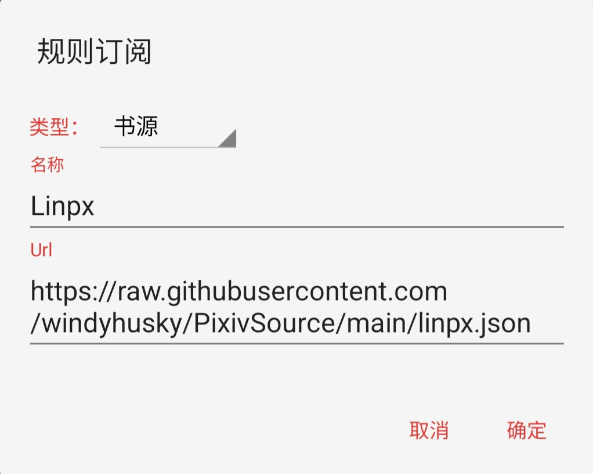


#### 1.3 点击相应订阅规则，导入并启用/更新书源


**首次点击【订阅规则】 即可导入**

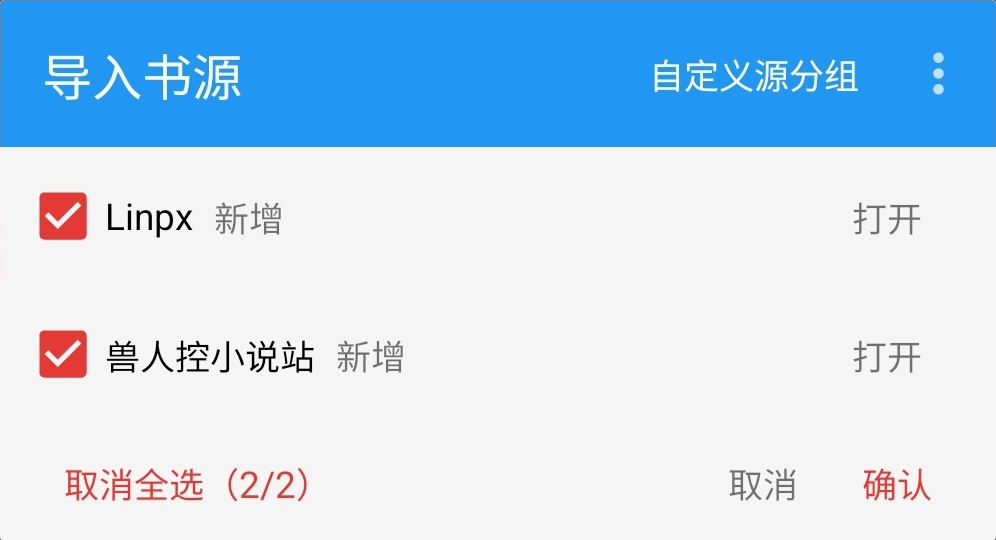

**导入之后，再次点击则会检查更新**

> 更多导入方法请查看[如何获取书源？导入书源？](./ImportBookSource.md)
</details>


### 2.导入 兽人控小说站 订阅源
<details><summary> ➕ 导入订阅源 </summary>

复制下方【免代理】订阅源链接
```
https://cdn.jsdelivr.net/gh/DowneyRem/PixivSource@main/btsrk.json
```
#### 2.1 打开【订阅】页面，点击【规则订阅】


#### 2.2 点击加号，更改规则类型，粘贴链接，保存订阅
**注意这里要把【书源】改成【订阅源】**

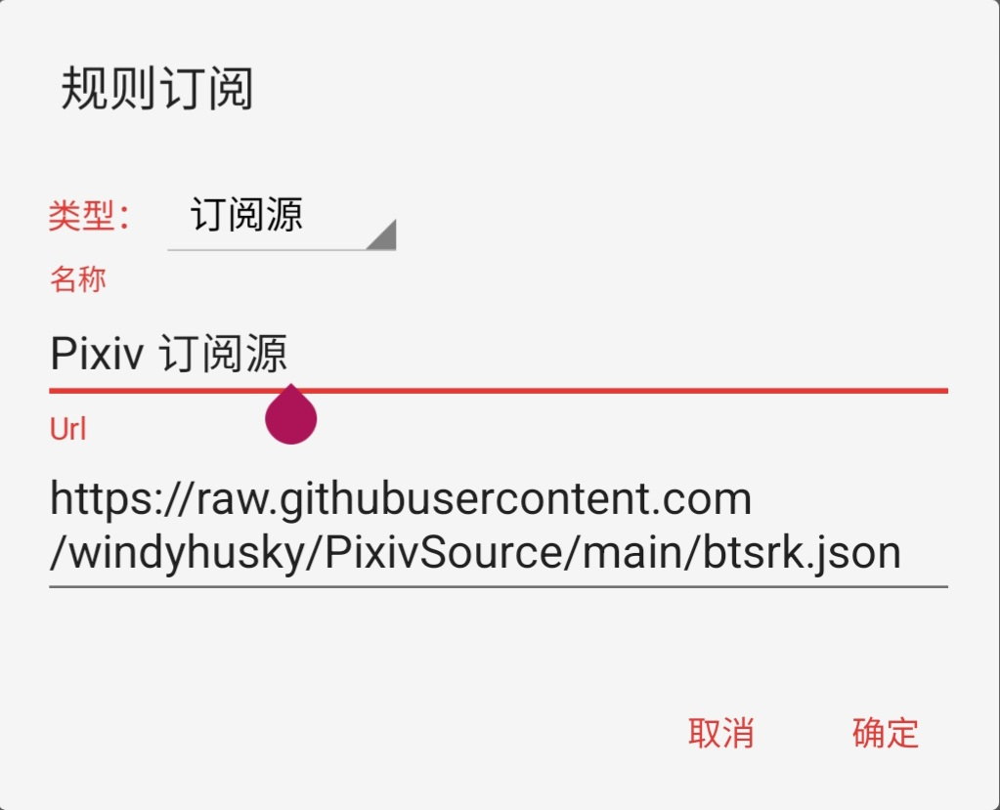


#### 2.3 点击相应订阅规则，导入并启用/更新书源


**首次点击【订阅规则】 即可导入**

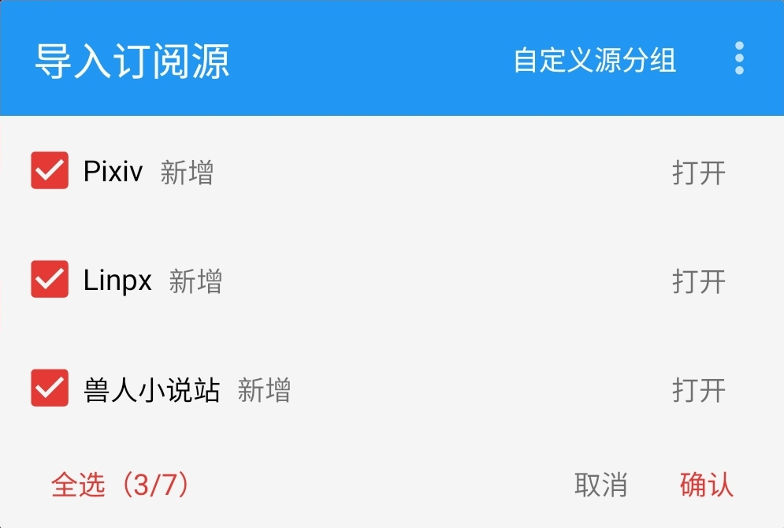

**导入之后，再次点击则会检查更新**

> 更多导入方法请查看[如何导入订阅源](./ImportRssSource.md)
</details>
</details>


## 三、确保网站可以访问 {#CheckAccess}
<details><summary> ☑️ 检查网站能否访问 </summary>

订阅 - 点击 Linpx / 兽人控小说站 - 打开网站
- 如果可以直接打开，那么一切大功告成！
  - **多数网络下，Linpx & 兽人控小说站 无需代理即可访问**
  - Linpx & 兽人控小说站 没有账号体系，**无需登录即可使用**，不必做过多的操作

- 如果 **无法直接打开** 则可以：
  - 切换至其他网络（**更换网络运营商、使用流量或 WIFI**）后再尝试
  - 开启代理后再尝试
</details>


## 四、添加小说，尽情使用 {#add-novel}
### 1.阅读内部搜索
<details><summary> 🔎 搜索小说 </summary>

✅ 支持搜索：小说名称、系列小说名称、作者名称、小说标签


</details>


### 2.发现更多小说
<details><summary> ⭐️ 发现小说 </summary>

发现：热门小说、最新小说、随便来点

- <details><summary> ⭐️ 发现小说 </summary>
  
  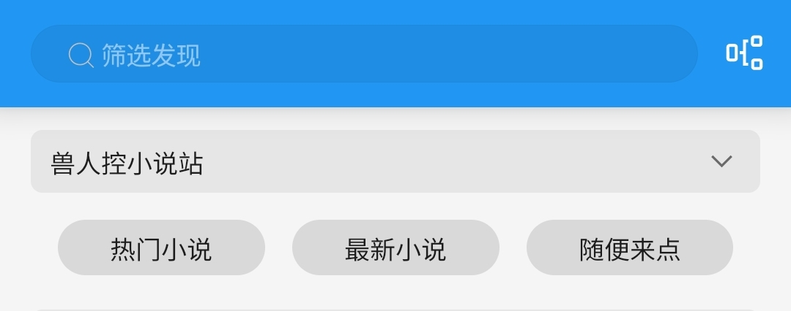
  </details>

- <details><summary> ⏬ 筛选发现 </summary>

  发现 - 长按 **"兽人小说站"** - 编辑 - 右上角菜单 - 设置源变量
  
  
  
  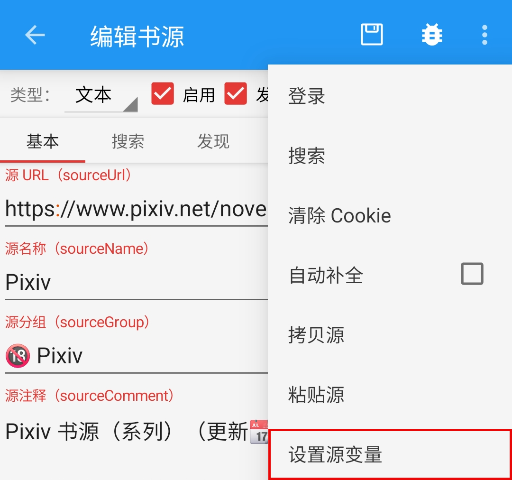
  
  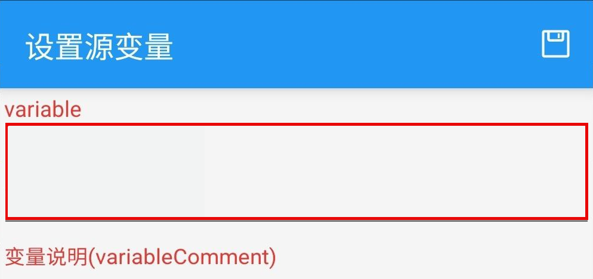
  
  设置源变量：输入标签，保存
  ```
  龙
  ```
  发现 - 长按 **"兽人小说站"** - 刷新 - 查看筛选后的小说
  
  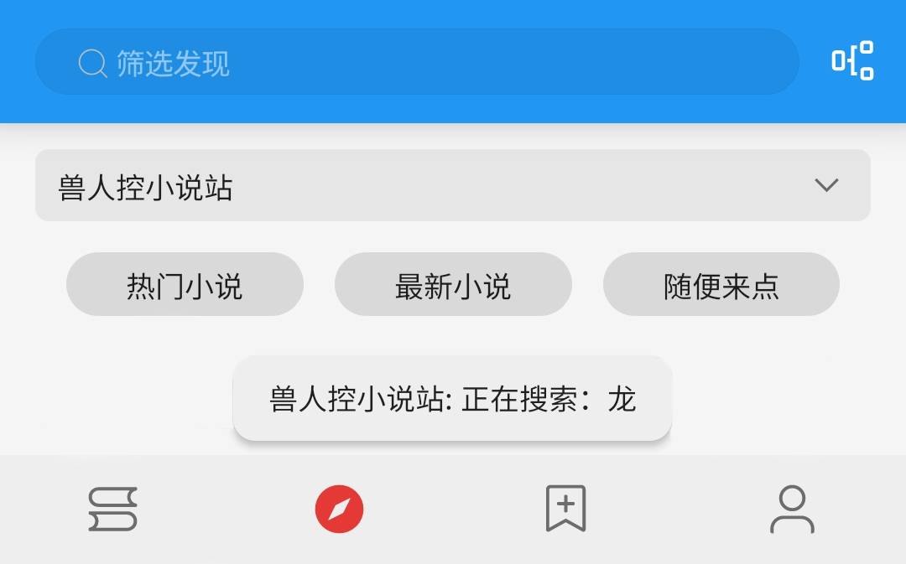
  </details>
</details>


### 3.添加网址 {#AddUrl}
<details><summary> 🔗 添加网址 </summary>

- 书架 - 菜单 - 添加网址 - 粘贴小说链接
- 可以同时添加多个小说的链接

- <details><summary> 🔗 操作流程 </summary>

  ### 3.1 操作流程
  
  
  
  </details>

- <details><summary> 🔗 支持链接 </summary>

  ### 3.1 支持 兽人控小说站 链接：
  - 兽人控小说站 目录链接
  ```
  https://furrynovel.com/zh/novel/8312
  ```
  - 兽人控小说站 章节链接
  ```
  https://furrynovel.com/zh/novel/8312/chapter/33116
  ```
  - 兽人控小说站 API链接
  ```
  https://api.furrynovel.com/api/zh/novel/8312
  ```
  </details>
</details>


### 4.订阅源
<details><summary> 🏠 订阅源 </summary>

- <details><summary> ⬇️ 导入书源 </summary>

  

  - 点击按钮，导入书源；再次点击，则可更新书源
  - 此处使用的是 Jsdelivr CDN ，更新有延迟

  
  </details>

- <details><summary> 🔍 站内搜索 </summary>

  #### 4.1 替代阅读搜索
  受阅读设计的限制，阅读内部搜索不可能完全支持 Linpx 的功能。网站的搜索功能更加全面。

  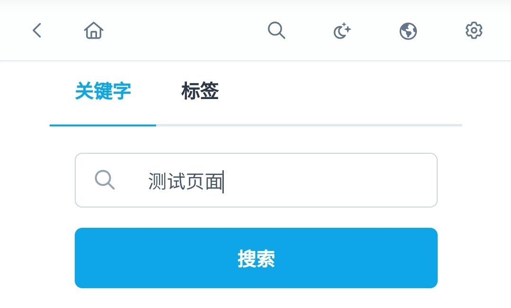
  </details>

- <details><summary> ⭐️ 站内发现 </summary>

  #### 4.2 替代阅读发现
  阅读内部浏览器打开 Pixiv，即可使用 Pixiv 书源未完成的功能，如排行榜等功能
  
  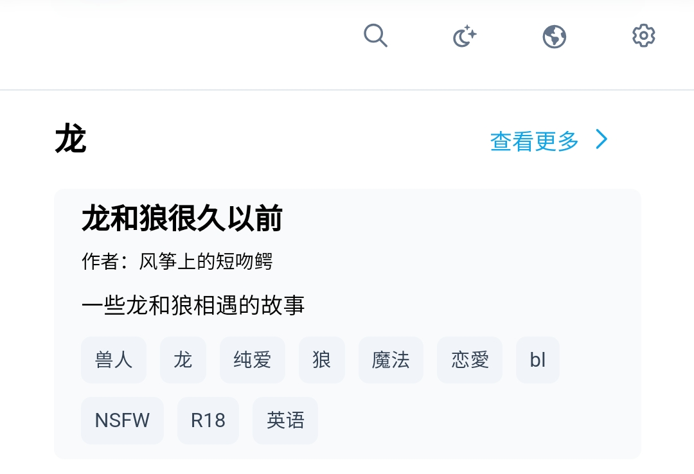
  </details>

- <details><summary> ➕ 添加小说 </summary>

  #### 4.3 添加小说至书架
  在阅读内部浏览器内打开 兽人控小说站 小说页面，点击【添加到书架】按钮即可添加小说到书架
  
  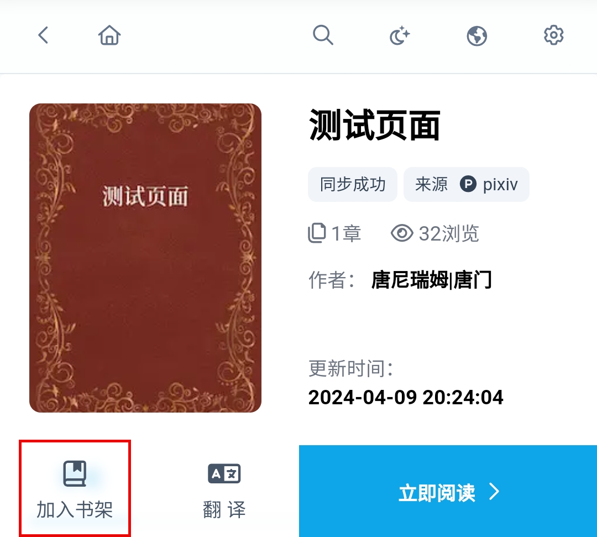
  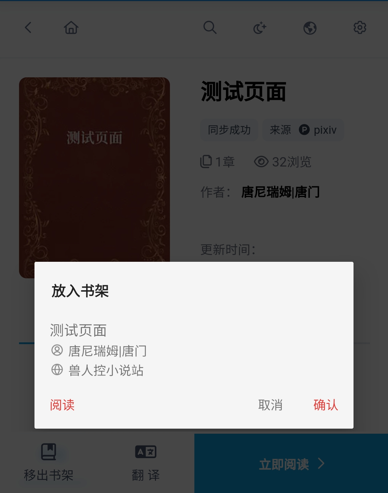
  </details>
</details>


## 五、故障排查 {#troubleshoot}
> 详见：[故障排查与处理](./TroubleShoot.md)
<details><summary> 🐞 故障排查 </summary>

- <details><summary> 🐞 无法使用 </summary>

  ### 1.确定书源可以正常使用
  - 书架页面，搜索 `测试页面` 测试书源能否正常使用
  - **⓪检查 兽人控小说站 书源是否导入**
  - **①检查 兽人控小说站 书源是否启用**
  - **②检查代理是否可用**
  - **③检查阅读是否走了代理**
  - **④检查网络是否可用**

  **如果上述均无问题，但依然没有搜索结果，那就是书源需要更新了**
  </details>

- <details><summary> 🐞 图片无法显示 </summary>

  ### 2.图片无法正常显示
  #### 解决措施：关闭替换净化
  
  </details>
</details>


## ❤️ [支持开发](./Sponsor.md)
> [!NOTE]
> 如果书源和教程帮到了你，欢迎给开发者一点打赏。你的鼓励是持续更新的动力～

## 本教程由兽人阅读频道 [@FurryReading](https://t.me/FurryReading) 提供
