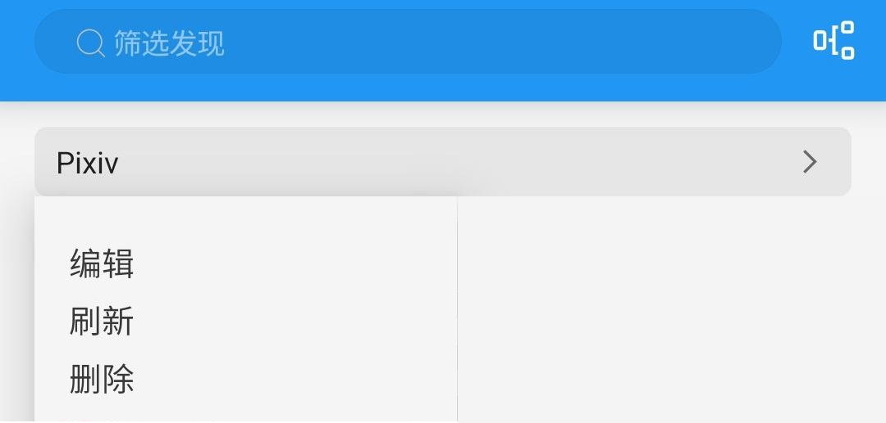
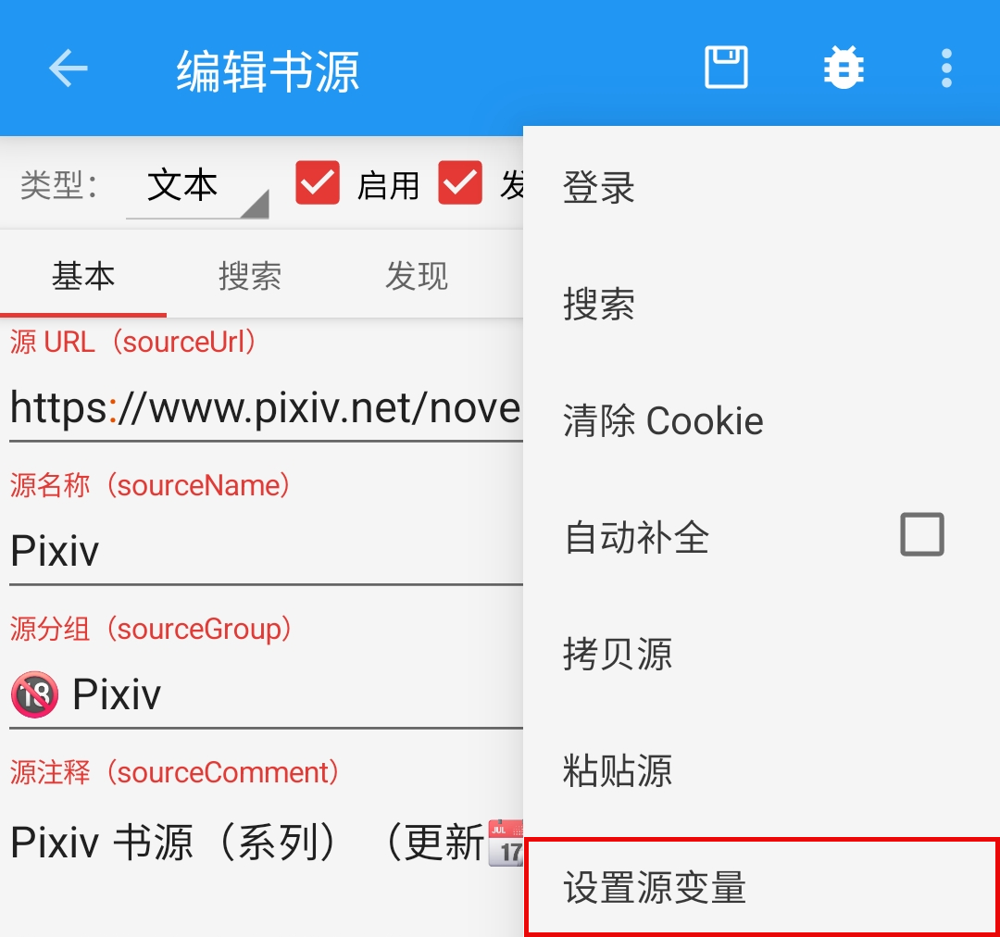
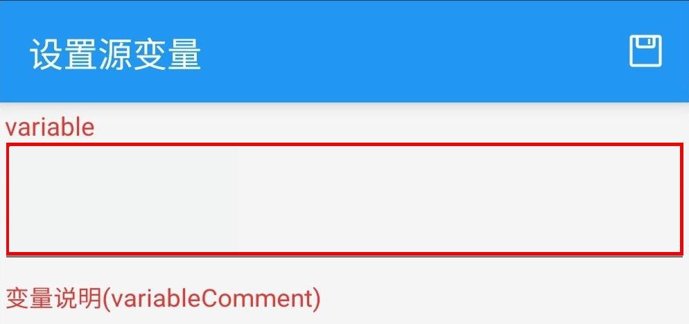
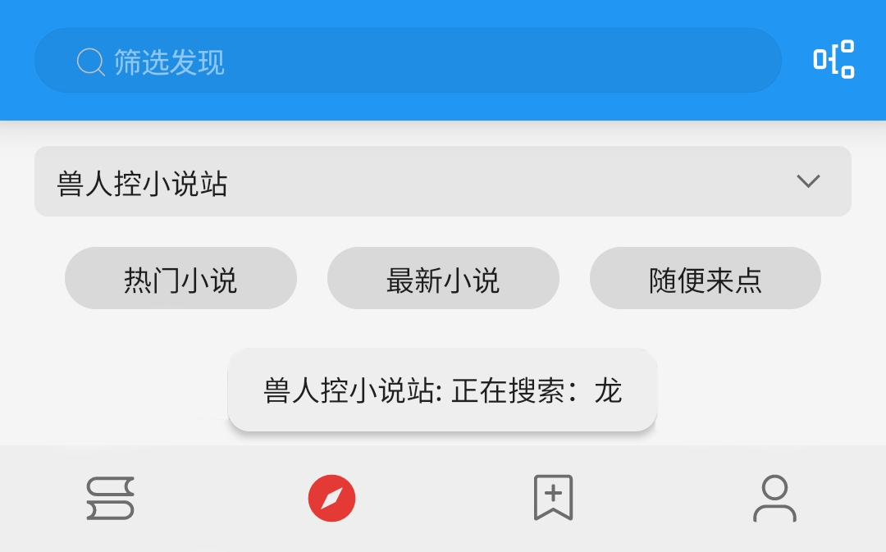
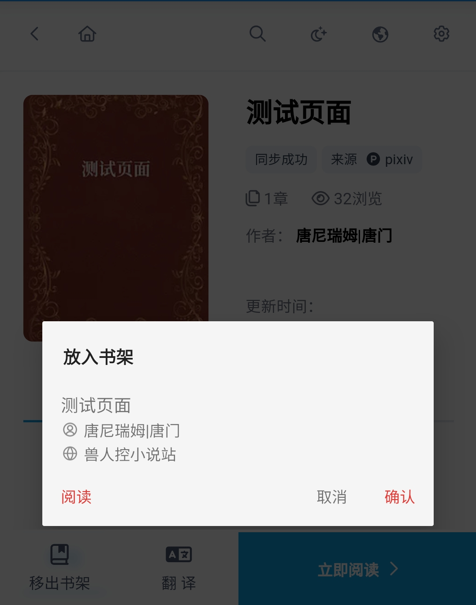
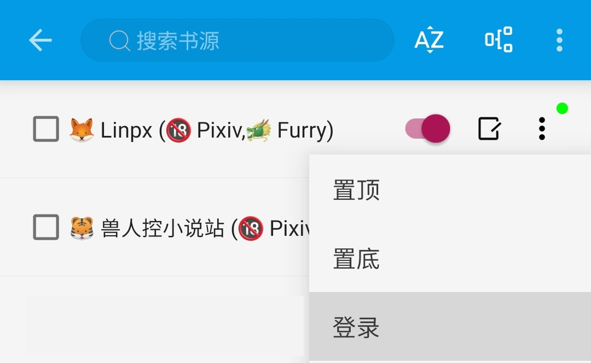
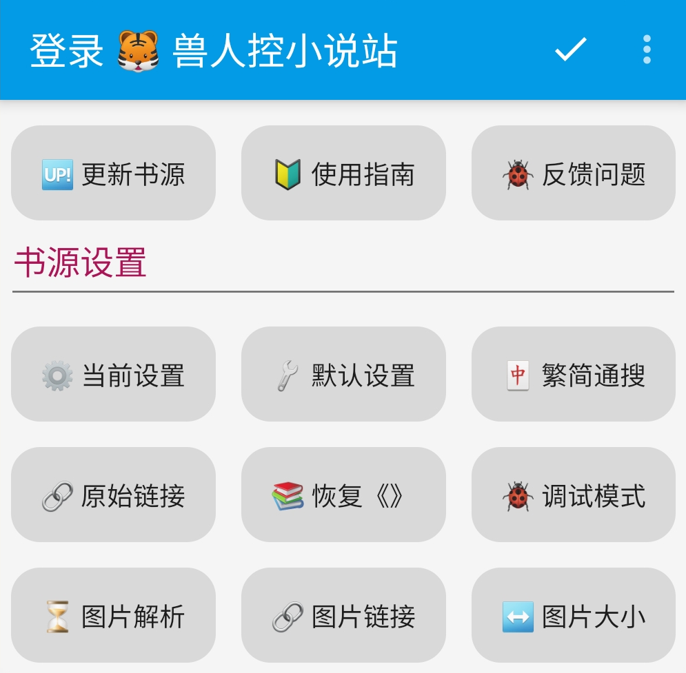
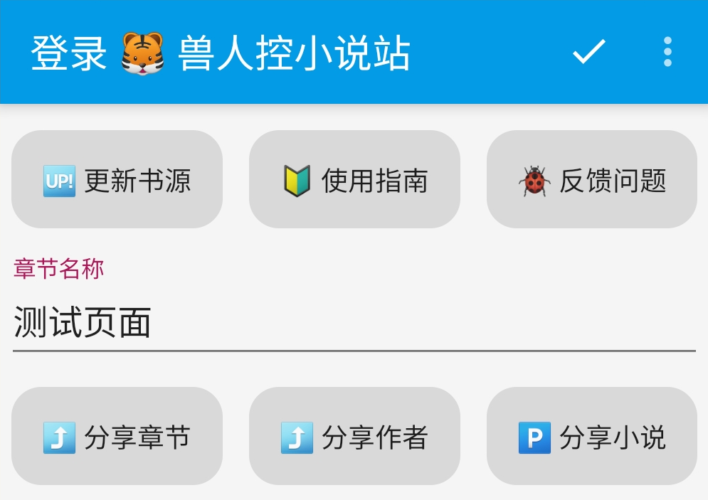

<script setup>
import { computed } from "vue";
import { useData } from "vitepress";

const { page } = useData();
const pagePath = computed(() => page.value.relativePath.replace(/\.md$/, ""));
</script>


<div align="center">

<br>

# FurryNovel 书源 功能手册
### 🐯 [开源阅读](https://github.com/Luoyacheng/legado) FurryNovel 书源
#### ✈️ 频道 [@PixivSource](https://t.me/PixivSource)
#### ☕ [书源项目打赏名单](./Sponsor.md)
</div>


> [!WARNING]
>
> ⚠️ **你正在 GitHub 上浏览此文档， Github 文档可能不完整
> [网页版](https://pixivsource.pages.dev/FurryNovel)
> 内容更全面，排版更精美** 


> [!TIP]
> **🐯 FurryNovel 书源 全功能使用手册**
>
> **另有：新手配置指南：**
> [✨臻享阅读](BetterExperience.md)；
> **极简配置指南：**
> [⚡️ 快速开始](QuickStart.md)；
> 
> **另有：**
> [🅿️ Pixiv 书源 功能手册](Pixiv.md)；
> [🦊 Linpx 书源 功能手册](Linpx.md)


## [兽人控小说站](https://www.furrynovel.com) 收录了 Pixiv, Bilibili 的大部分兽人小说

> [!NOTE]
> **🐯 FurryNovel 书源 新手配置指南，详见：**
> [⚡️ 快速开始](QuickStart.md)，
> **重复内容不再赘述**
>
> **快速跳转：
> 🔍 [搜索小说](#)；
> ⭐️ [发现小说](#DiscoverNovel)；
> 🔗 [添加网址](#AddUrl)；
> 🌐 [订阅源](#RssSource)；
> ⚙️ [️设置功能](#Settings)；
> ⏺ [互动功能](#Interact)**


<div v-if="false">
<!--@include: CommonDownload.md-->

<!--@include: CommonImport.md-->

## 书源配置 {#BookSourceSet}
<!--@include: CommonLoginLinpx.md-->

<!--@include: CommonLegado.md-->
</div>


## 近期更新 {#Latest}
<DownloadCard/>


## 搜索小说 {#SearchNovel}
> [!NOTE]
>
> **书架页面 - 放大镜 - 输入关键词 - 搜索小说**


### 🔎 搜索小说
> [!TIP]
> **✅ 支持搜索：小说名称、系列小说名称、作者名称、小说标签**


### 🀄️ 繁简通搜
> [!TIP]
> **【默认搜索】进行繁简转换，同时返回繁体简体小说内容，可在书源设置中关闭**
>
> 【搜索作者 `@作者名称`】时，不转换
>
> 【搜索标签 `#标签名称`】时，不转换
>
> 返回小说内容不转换


### 👤 搜索作者
> [!TIP]
> **兼容搜索格式：`@作者名称`**
> 
> 受站方搜索功能限制，当前仅兼容 @作者 / #标签 输入格式，不支持实际作者专搜/标签专搜

# 


### #️⃣ 标签专搜
> [!TIP]
> **兼容搜索格式：`@作者名称`，并无实际功能**
>
> 受站方搜索功能限制，当前仅兼容 @作者 / #标签 输入格式，不支持实际作者专搜/标签专搜

# 


## 发现小说 {#DiscoverNovel}
> [!NOTE]
>
> **发现页面 - 点击“兽人控小说站” - 点击按钮**


### ⭐️ 常规小说


### ⏬ 筛选发现
1️⃣ 发现 - 长按 **"兽人小说站"** - 编辑 - 右上角菜单 - 设置源变量







2️⃣ 设置源变量：输入标签`龙`，保存

3️⃣ 发现 - 长按 **"兽人小说站"** - 刷新 - 查看筛选后的小说




### 🆙 更新书源
> [!NOTE]
>
> **点击按钮【🆙 更新】进入书源更新界面**


> [!TIP]
>  - Jsdelivr CDN 更新有延迟
>  - Github 更新需代理
>  - Codeberg 更新免代理


## 添加网址 {#AddUrl}
### 🔗 添加网址
> [!NOTE]
>
> **书架 - 菜单 - 添加网址 - 粘贴小说链接**
>
> **可以同时添加多个小说的链接**


### ⏺️ 实际操作


### 🔗 支持链接
支持 兽人控小说站 多个格式的网址链接：
- 兽人控小说站 目录链接
```
https://furrynovel.com/zh/novel/8312
```
- 兽人控小说站 章节链接
```
https://furrynovel.com/zh/novel/8312/chapter/33116
```

## 订阅源 {#RssSource}
> [!NOTE]
>
> 订阅界面，打开 兽人控小说站 订阅源


### ⬇️ 导入书源


- 点击按钮，导入书源；再次点击，则可更新书源
- 此处使用的是 Jsdelivr CDN ，更新有延迟


### 🔍 站内搜索
受阅读设计的限制，阅读内部搜索不可能完全支持 兽人控小说站 的功能。网站的搜索功能更加全面。


### ⭐️ 站内发现
阅读内部浏览器打开 兽人控小说站，即可使用 书源未完成的功能


### ➕ 添加小说
在阅读内部浏览器内打开 兽人控小说站 小说页面，点击【添加到书架】按钮即可添加小说到书架





## 设置功能 {#Settings}
> [!NOTE]
>
> **⚙️ 书源设置 => 我的 - 书源管理 - 兽人控小说站 - 登录**




### ▶️ 基础功能
> [!NOTE]
>
> **⚙️ 书源设置 => 我的 - 书源管理 - 兽人控小说站 - 登录**


- **🆙 更新书源：更新书源/更新订阅**
- 🔰 使用指南：打开 Github 文档(本页)
- 🐞 反馈问题：打开 Github Issues


### ⚙️ 书源设置
> [!NOTE]
>
> **⚙️ 书源设置 => 我的 - 书源管理 - 兽人控小说站 - 登录**


- ⚙️ 当前设置：显示当前设置
- 🔧 默认设置：恢复默认设置
- 👤 搜索作者：默认搜索，开启\关闭 搜索作者
-
- 🀄 繁简通搜：搜索进行繁简转换（搜索作者、标签不转换）
- 📖 更多简介：详情显示更多简介
- 🔗 原始链接：显示原始链接
-
- 📚 恢复《》：恢复正文内被替换的书名号《》
- 🖼️ 显示描述：章首显示描述
- 🐞 调试模式：开启调试模式
-
- **⏳ 图片解析：选择解析图片网站，获取 Pixiv 图片直链**
- **🔗 图片链接：选择下载图片网站，Pixiv 图片直链 => 站方图片链接**
- ↔️ 图片大小：切换图片大小，加快加载速度


## 互动功能 {#Interact}
### ⏺ 互动功能
> [!NOTE]
>
> **⏺ 互动功能 => 书架 - 小说阅读界面 - 兽人控小说站 - 登录**



- ⤴️ 分享章节：复制当前小说 兽人控小说站 链接
- ⤴️ 分享作者：复制当前作者 兽人控小说站 链接
- 🅿️ 分享小说：复制当前小说 Pixiv 链接


<!--@include: CommonSuffix.md-->

