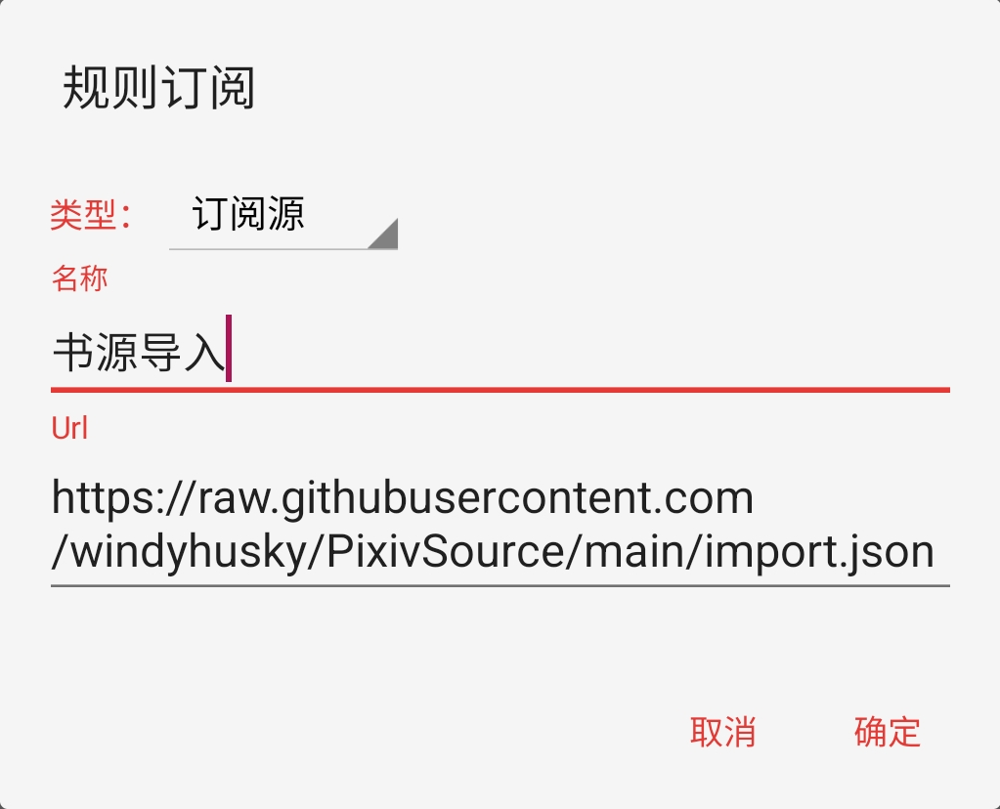
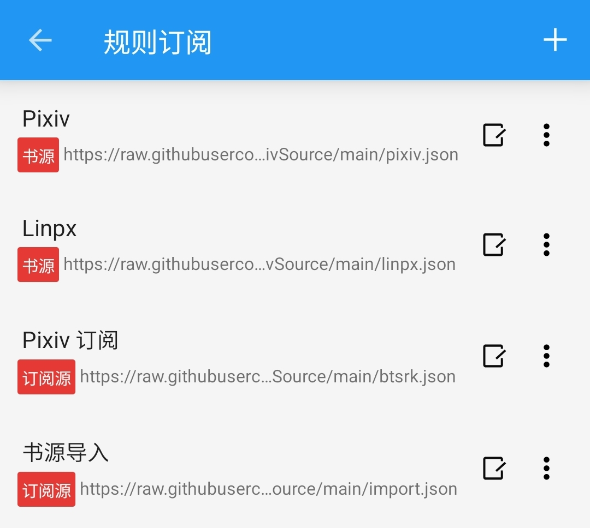
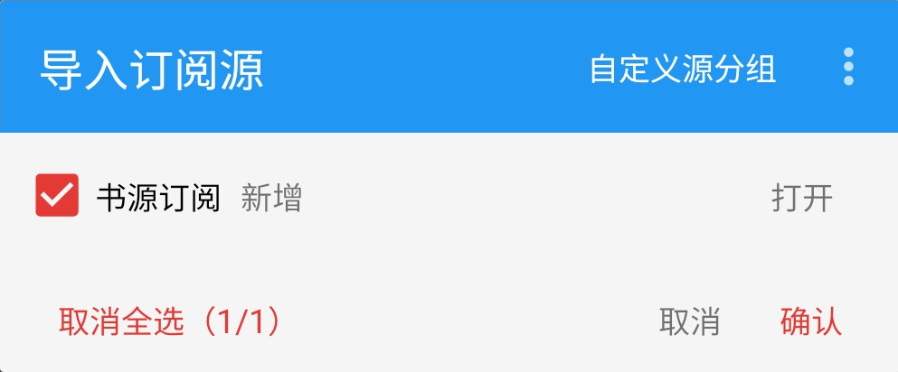

## 使用 import 订阅源导入书源

### 0.下载并安装阅读


### 1.导入 import 订阅源 
如已导入 import 订阅源 ，则可略过

<details>
<summary> ➕ 导入 import 订阅源 </summary>

复制下方【免代理】订阅源链接
```
https://cdn.jsdelivr.net/gh/windyhusky/PixivSource@main/import.json
```
#### 1.1 打开【订阅】页面，点击【规则订阅】


#### 1.2 点击加号，更改规则类型，粘贴链接，保存订阅
**注意这里要把【书源】改成【订阅源】**




#### 1.3 点击相应订阅规则，导入并启用/更新书源


**首次点击【订阅规则】 即可导入**



**导入之后，再次点击则会检查更新**
</details>


### 2.导入书源 & 订阅源
<details>
<summary> ➕ 导入书源 & 订阅源 </summary>


#### 2.1 打开“书源订阅”
点击 “书源订阅”（ import 订阅源）


点击相应书源/订阅源，导入该源


#### 2.2 导入相关资源
点击书源，导入书源,**导入之后，再次点击则会检查更新**


点击订阅源，导入订阅源，**导入之后，再次点击则会检查更新**


</details>


### 3.使用书源，畅享阅读
> #### 1. [Pixiv 书源的导入与使用](./Pixiv.md)
> #### 2. [Linpx 书源的导入与使用](./Linpx.md)
> #### 3. [兽人控小说站 书源的导入与使用](./FurryNovel.md)


## 本教程由兽人阅读频道 [@FurryReading](https://t.me/FurryReading) 提供