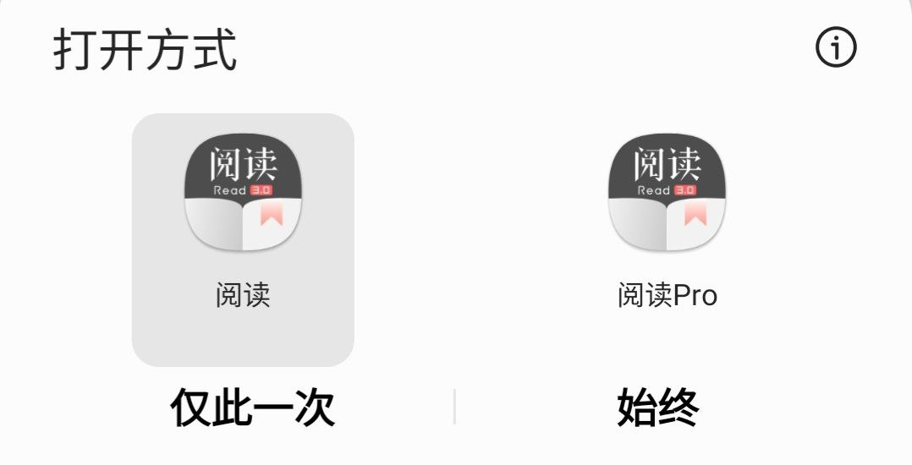

## 2.导入书源

## ⓪ 书源（订阅源）来源

- 官方频道 [@legado_channels](https://t.me/legado_channels)
- [三千书源](https://shuyuan.yiove.com)
- [喵公子书源管理](http://yuedu.miaogongzi.net/gx.html)
- [阅读 APP 源](https://legado.aoaostar.com/)  
- [一程书源/订阅源](https://flowus.cn/share/923f5a35-6dcf-47d1-b8eb-b9c5ef3ed39b/)
- [源仓库](https://www.yckceo.com/yuedu/shuyuan/index.htmll)
- [阅读论坛](https://legado.cn/forum-rssSources-1.html)
- 其他网络来源

## ① 导入书源/订阅源 [官方教程](https://www.yuque.com/legado/wiki/xdroke)

### A.文件导入更简单

#### 1.下载书源/订阅源文件

> https://raw.githubusercontent.com/windyhusky/PixivSource/main/pixiv.json
>
> https://raw.githubusercontent.com/windyhusky/PixivSource/main/linpx.json

#### 2.使用阅读打开


#### 3.导入完成并启用书源/订阅源


### B.规则订阅易更新

请【**开启代理**】后，复制下面的【书源】链接

```
https://raw.githubusercontent.com/windyhusky/PixivSource/main/pixiv.json

https://raw.githubusercontent.com/windyhusky/PixivSource/main/linpx.json
```

#### 1.打开【订阅】页面，点击【规则订阅】


#### 2.点击加号，粘贴链接，保存订阅

如果是订阅源，则需要切换到订阅源


#### 3.点击订阅，导入并启用/更新书源


**首次点击【订阅规则】 即是导入**，导入后 **再次点击则会检测并更新**


### C.网络导入也方便
此处示意图并不是 **[订阅源的网络导入方法](./Import2.md)**

请【**开启代理**】后，复制下面的【书源】链接

```
https://raw.githubusercontent.com/windyhusky/PixivSource/main/pixiv.json

https://raw.githubusercontent.com/windyhusky/PixivSource/main/linpx.json
```

#### 1.打开【我的】页面，点击【书源管理】


#### 2.点击右上角的三点菜单，选择【网络导入】


#### 3.粘贴书源链接，点击确定


#### 4.导入完成并启用书源

**无法网络导入时，请尝试开启代理，或过段时间重试**


订阅源的网络导入请看 **[订阅源的网络方法](./Import2.md)**


### D.Schema 链接导入最方便【适用于书源提供方】

大多点击链接一键导入书源/订阅源，都是是采用了这种方式，如：**[喵公子书源管理](http://yuedu.miaogongzi.net/gx.html)**

#### 0.【书源提供方】为按钮等添加链接

```
可通过url唤起阅读进行一键导入,url格式: legado://import/{path}?src={url}
path类型: bookSource,rssSource,replaceRule,textTocRule,httpTTS,theme,readConfig,addToBookshelf
path类型解释: 书源,订阅源,替换规则,本地txt小说目录规则,在线朗读引擎,主题,阅读排版,添加到书架
legado://import/addToBookshelf?src={url}
```
取自官方API：https://github.com/gedoor/legado#api-


```
yuedu://booksource/importonline?src=https://raw.githubusercontent.com/windyhusky/PixivSource/main/linpx.json

legado://import/bookSource?src=https://raw.githubusercontent.com/windyhusky/PixivSource/main/linpx.json
```


#### 1.手机浏览器内点击链接，跳转阅读
浏览器打开：** [喵公子书源管理](http://yuedu.miaogongzi.net/gx.html)**

一键导入按钮的链接，即为下面这条链接：
```
yuedu://booksource/importonline?src=https://cdn05042023.gitlink.org.cn/api/v1/repos/yi-c/yd/raw/sy.json?ref=master&access_token=92edf695d430562349cbfac4009fda6ad36817dd
```

点击链接，跳转阅读


#### 2.导入完成并启用书源


## ② 确认启用书源


转载网站一般无需登录，基本上到这里就可以回到主页面，搜索书名看小说了

**正版付费网站，以及一些登陆后才能看所有小说的网站，都需要登录账号**


## ③ 登录账号

### 【根据需要】开启代理工具

此处略过，请自行学习，**最好开启【全局代理】**

### 登录账号的方法

#### 1.找到需要登录的书源

**点击右上角的三点菜单，选择【登录】**


#### 2.登录你的账号

登录成功后，点击右上角的对勾，关闭登录页面


对于Pixiv而言，**如果需要验证码，请更换代理，或过段时间再次尝试**

