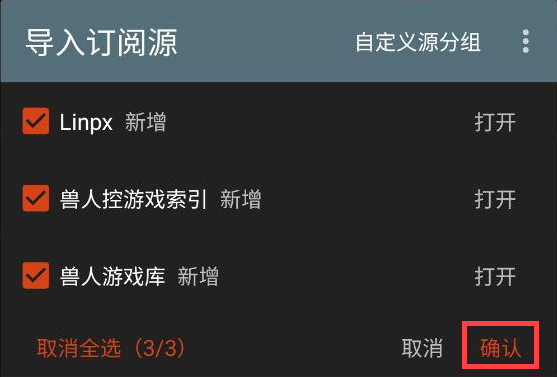
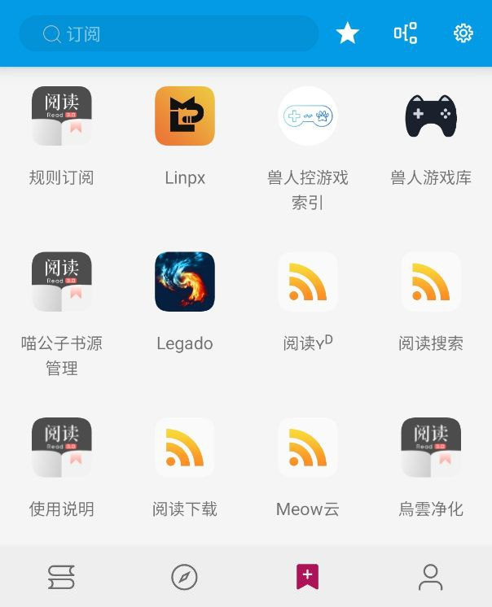

## ⓪ 订阅源来源
**请查看[书源获取方式](./Import.md)，一般二者会同时提供**

## ① 导入订阅源 
[官方教程](https://www.yuque.com/legado/wiki/grqch2)

### O.其他导入方式

**A.文件导入更简单**

**B.规则订阅易更新**

**D.Schema 链接导入最方便【适用于订阅源提供方】**

**上述导入方式大同小异，故不再复述，请查看[书源获取方式](./Import.md)**


### C.网络导入也方便

请【**开启代理**】后，复制下面的【订阅书源】链接

```
Linpx FurryGamesIndex KemonoGames 三合一订阅源
https://raw.githubusercontent.com/windyhusky/PixivSource/main/btsrkWeb.json

喵公子书源管理
http://yuedu.miaogongzi.net/shuyuan/miaogongziDY.json
```

#### 1.打开【订阅】页面，点击右上角【设置】


#### 2.点击右上角的三点菜单，选择【网络导入】


#### 3.粘贴订阅源链接，点击确定



#### 4.导入完成并启用订阅源


**无法网络导入时，请尝试开启代理，或过段时间重试**



