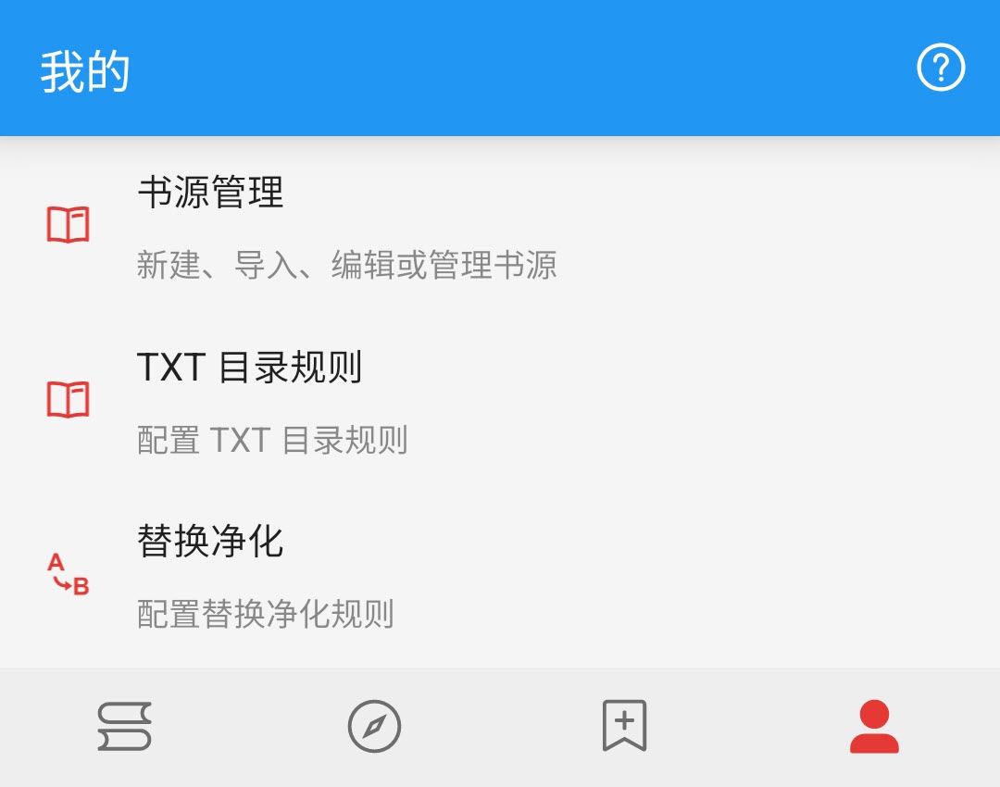
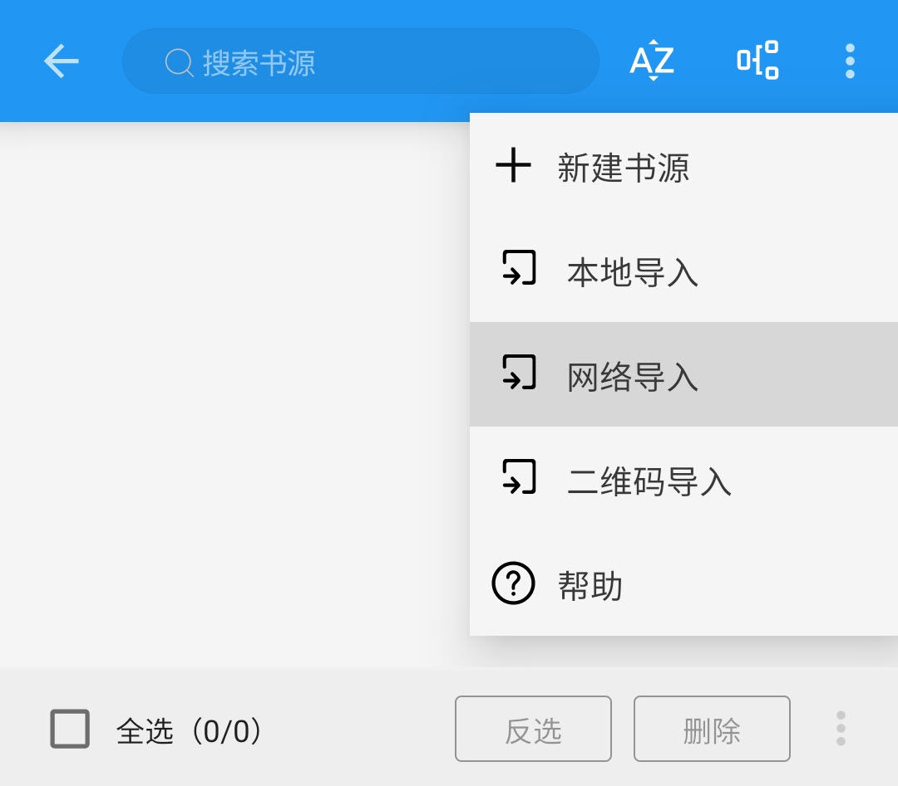
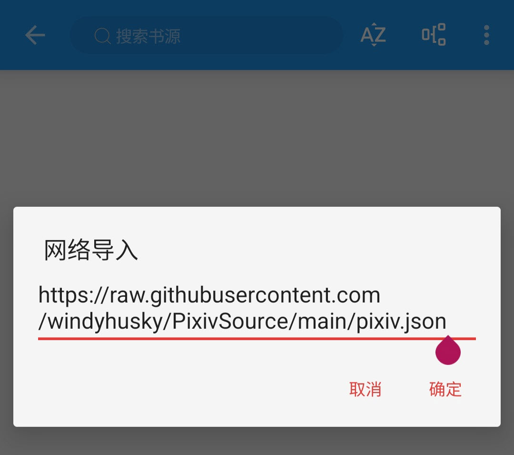

## 2.导入书源

## 2.0 书源（订阅源）来源
- [Legado｜开源阅读 | 频道](https://t.me/legado_channels)
- [三千书源](https://shuyuan.yiove.com)
- [喵公子书源管理](http://yuedu.miaogongzi.net/gx.html)
- [阅读 APP 源](https://legado.aoaostar.com/)  
- [一程书源/订阅源](https://flowus.cn/share/923f5a35-6dcf-47d1-b8eb-b9c5ef3ed39b/)
- [源仓库](https://www.yckceo.com/yuedu/shuyuan/index.html)
- 其他网络来源


## 2.1 导入书源

请【**开启代理**】后，复制下面的【书源】链接
```
https://raw.githubusercontent.com/windyhusky/PixivSource/main/pixiv.json
```
```
https://raw.githubusercontent.com/windyhusky/PixivSource/main/linpx.json
```
以下导入方法任选其一即可
<details><summary> A. 文件导入 </summary>

### A.文件导入更简单
#### 1.下载书源/订阅源文件
Chrome 等浏览器可以打开 [这个网址](https://github.com/windyhusky/PixivSource) ，选择 **链接另存为** 或 **下载链接**，下载相应书源


#### 2.使用阅读打开
点击书源，选择用阅读打开


#### 3.导入完成并启用书源/订阅源

</details>


<details><summary> B. 规则订阅 </summary>

### B.规则订阅易更新
#### 1. 打开【订阅】页面，点击【规则订阅】


#### 2. 点击加号，粘贴链接，保存订阅


#### 3. 点击相应订阅规则，导入并启用/更新书源


**首次点击【订阅规则】 即可导入**


**导入之后，再次点击则会检查更新**
</details>


<details><summary> C. 网络导入 </summary>

### C.网络导入也方便
#### 1.打开【我的】页面，点击【书源管理】



#### 2.点击右上角的三点菜单，选择【网络导入】



#### 3.粘贴书源链接，点击确定



#### 4.导入完成并启用书源
**如果导入失败，请开启代理，或过段时间重试**


</details>


<details><summary> D. Schema 链接导入 </summary>

### D.Schema 链接导入最方便【适用于书源提供方】
大多点击链接一键导入书源/订阅源，都是是采用了这种方式，如：**[喵公子书源管理](http://yuedu.miaogongzi.net/gx.html)**

#### 0.【书源提供方】为按钮等添加链接
大多一键导入书源/订阅源，都是采用了这种方式
> ```
> 可通过url唤起阅读进行一键导入,url格式: legado://import/{path}?src={url}
> path类型: bookSource,rssSource,replaceRule,textTocRule,httpTTS,theme,readConfig,addToBookshelf
> path类型解释: 书源,订阅源,替换规则,本地txt小说目录规则,在线朗读引擎,主题,阅读排版,添加到书架
> legado://import/addToBookshelf?src={url}
> ```
> 自官方API：https://github.com/gedoor/legado#api-


导入 Pixiv 书源的连接如下：
```
yuedu://booksource/importonline?src=https://raw.githubusercontent.com/windyhusky/PixivSource/main/pixiv.json
```
```
legado://import/bookSource?src=https://raw.githubusercontent.com/windyhusky/PixivSource/main/pixiv.json
```

#### 1.手机浏览器内点击链接，跳转阅读
浏览器打开：**[喵公子书源管理](http://yuedu.miaogongzi.net/gx.html)**

一键导入按钮的链接，即为下面这条链接：
```
yuedu://booksource/importonline?src=https://cdn05042023.gitlink.org.cn/api/v1/repos/yi-c/yd/raw/sy.json?ref=master&access_token=92edf695d430562349cbfac4009fda6ad36817dd
```

点击链接，跳转阅读


#### 2.导入完成并启用书源

</details>


<details><summary> E. 书源订阅（ import 订阅源） </summary>

### E.书源订阅（ import 订阅源）
如果你已经导入了【书源订阅】（ import 订阅源），则可以用其导入书源

#### 1.打开“书源订阅”
点击 “书源订阅”（ import 订阅源）


点击相应书源/订阅源，导入该源
 


#### 2.导入相关资源
点击书源，导入书源


点击订阅源，导入订阅源


</details>


## 2.2 确认启用书源


转载网站一般无需登录，基本上到这里就可以回到主页面，搜索书名看小说了

**正版付费网站，以及一些登陆后才能看所有小说的网站，都需要登录账号**


## 2.3 登录账号
<details><summary> 登陆账号 </summary>

### 0.【根据需要】开启代理工具
此处略过，请自行学习，**最好开启【全局代理】**


### 1.找到需要登录的书源
**点击右上角的三点菜单，选择【登录】,登录你的账号**


### 2.登录你的账号
登录成功后，点击右上角的对勾，关闭登录页面


对于Pixiv而言，**如果需要验证码，请更换代理，或过段时间再次尝试**
</details>