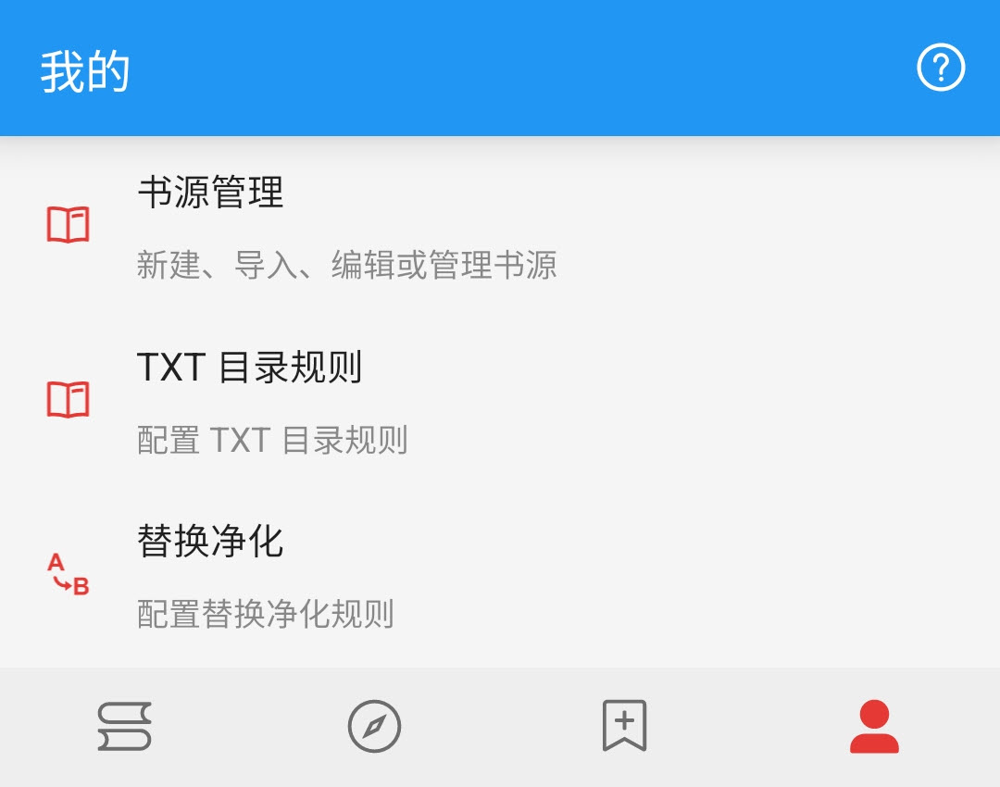
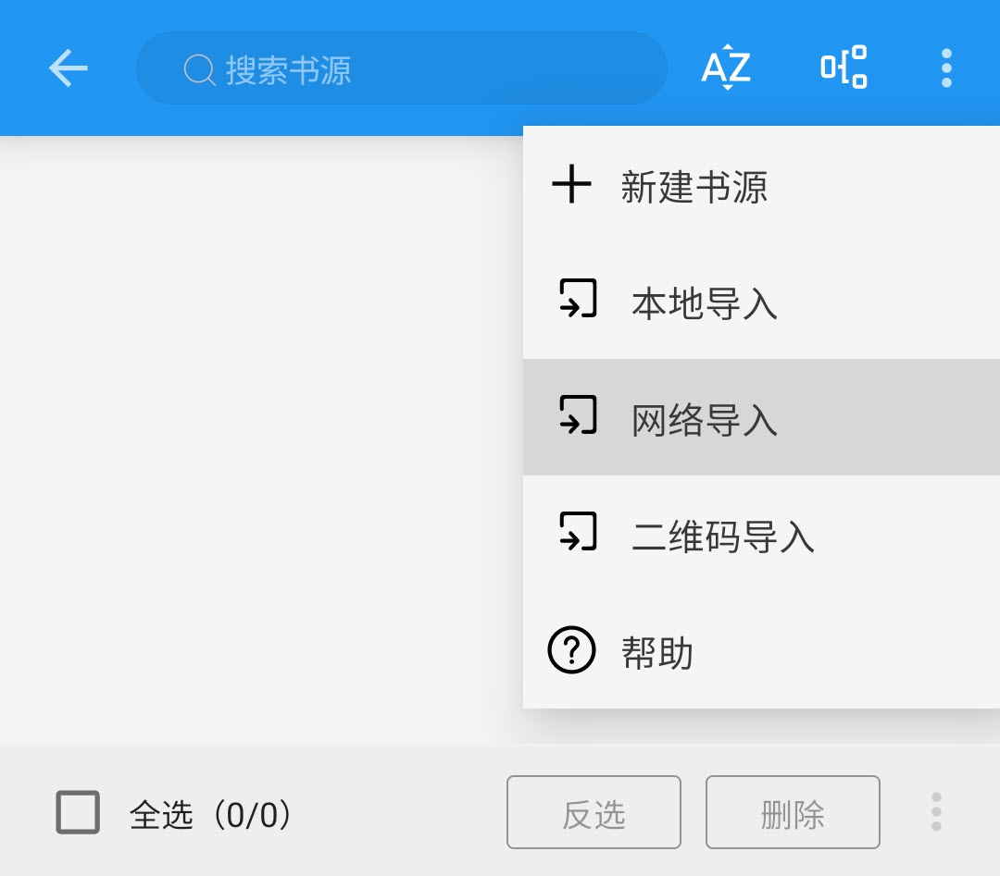
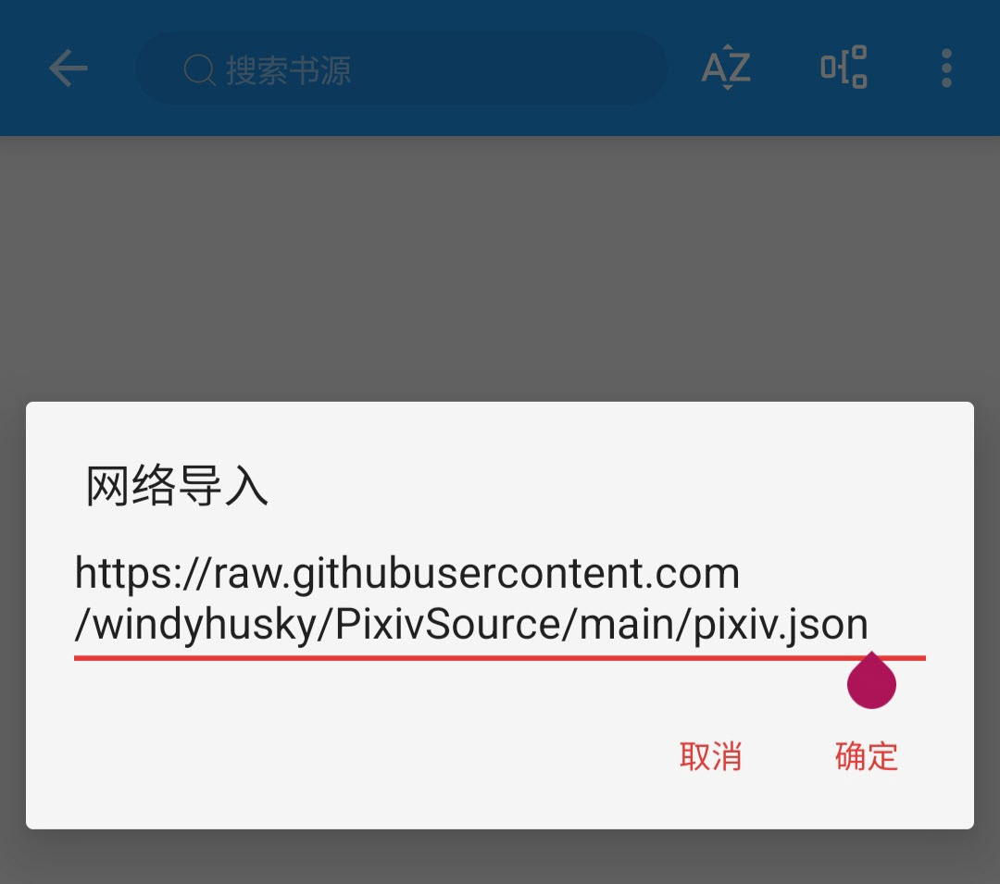

<div align="center">

<br>

# 导入书源
### 🅿️ [开源阅读](https://github.com/Luoyacheng/legado) Pixiv 书源
#### ✈️ 频道 [@PixivSource](https://t.me/PixivSource)
#### ☕ [书源项目打赏名单](./Sponsor.md)
</div>


<div class="github-only-notice">

> [!NOTE]
>
> 📖 **你正在 GitHub 上浏览此文档， [网页版](https://pixivsource.pages.dev/ImportBookSource) 内容更全面，排版更精美**
</div>


> [!TIP]
>
> **开源阅读 Legado 书源导入 指南**
>
> **另有：新手配置指南：**
> [✨臻享阅读](BetterExperience.md)；
> **极简配置指南：**
> [⚡️ 快速开始](QuickStart.md)


## 获取书源、订阅源
- [Legado | 开源阅读 | 频道](https://t.me/legado_channels)
- [源仓库](https://www.yckceo.com/yuedu/shuyuan/index.html)
- [Yiove 书源仓库](https://shuyuan.yiove.com)
- [喵公子书源管理](http://yuedu.miaogongzi.net/gx.html)
- [书源、图源、订阅源、规则、直播源、各种源 大型整合](https://source.zgqinc.gq)  
- [阅读 APP 源](https://legado.aoaostar.com)


## 导入书源
### 🚀 A.一键导入【最简单】 {#OneClickImport}
**点击链接，一键导入 书源、订阅源**
| 源名称    | jsDelivr | Github |
|--------| -------- | ------ |
| 🅿️ Pixiv 书源 | [一键导入](https://pixivsource.pages.dev/Import?src=https://cdn.jsdelivr.net/gh/DowneyRem/PixivSource@main/pixiv.json) | [一键导入](https://pixivsource.pages.dev/Import?src=https://raw.githubusercontent.com/DowneyRem/PixivSource/main/pixiv.json) |
| 🦊 Linpx 书源 | [一键导入](https://pixivsource.pages.dev/Import?src=https://cdn.jsdelivr.net/gh/DowneyRem/PixivSource@main/linpx.json) | [一键导入](https://pixivsource.pages.dev/Import?src=https://raw.githubusercontent.com/DowneyRem/PixivSource/main/linpx.json) |
| 🐲 BTSRK 订阅源 | [一键导入](https://pixivsource.pages.dev/Import?src=https://cdn.jsdelivr.net/gh/DowneyRem/PixivSource@main/btsrk.json) | [一键导入](https://pixivsource.pages.dev/Import?src=https://raw.githubusercontent.com/DowneyRem/PixivSource/main/btsrk.json) |
| | | |
| 🌌 通用书源 | [一键导入](https://pixivsource.pages.dev/Import?src=https://cdn.jsdelivr.net/gh/DowneyRem/PixivSource@main/normal.json) | [一键导入](https://pixivsource.pages.dev/Import?src=https://raw.githubusercontent.com/DowneyRem/PixivSource/main/normal.json) |
| 📚 Books 订阅源 | [一键导入](https://pixivsource.pages.dev/Import?src=https://cdn.jsdelivr.net/gh/DowneyRem/PixivSource@main/books.json)  | [一键导入](https://pixivsource.pages.dev/Import?src=https://raw.githubusercontent.com/DowneyRem/PixivSource/main/books.json) |
| 📃 Pixiv 目录规则 | [一键导入](https://pixivsource.pages.dev/Import?src=https://cdn.jsdelivr.net/gh/DowneyRem/PixivSource@main/pixivToc.json) | [一键导入](https://pixivsource.pages.dev/Import?src=https://raw.githubusercontent.com/DowneyRem/PixivSource/main/pixivToc.json) |


<details><summary><strong> 🚀 一键导入　详细操作 </strong></summary>

#### 1.点击上述链接，跳转阅读


#### 2.导入并启用书源

</details>


<details><summary><strong> ⚙️ 一键导入　网站设置 </strong></summary>

> [!NOTE]
> 官方API：https://github.com/gedoor/legado#api-
```
可通过url唤起阅读进行一键导入,url格式: legado://import/{path}?src={url}
path类型: bookSource,rssSource,replaceRule,textTocRule,httpTTS,theme,readConfig,addToBookshelf
path类型解释: 书源,订阅源,替换规则,本地txt小说目录规则,在线朗读引擎,主题,阅读排版,添加到书架
legado://import/addToBookshelf?src={url}
```

- 一键导入的书源链接：
  - `yuedu://booksource/importonline?src=https://raw.githubusercontent.com/DowneyRem/PixivSource/main/pixiv.json`
  - `legado://import/bookSource?src=https://raw.githubusercontent.com/DowneyRem/PixivSource/main/pixiv.json`

- 一键导入的订阅源链接：
  - `yuedu://rsssource/importonline?src=https://raw.githubusercontent.com/DowneyRem/PixivSource/main/btsrk.json`
  - `legado://import/rsssource?src=https://raw.githubusercontent.com/DowneyRem/PixivSource/main/btsrk.json`

</details>


### 🔗 B.规则订阅【易更新】 {#Subscription}
> [!NOTE]
>
> 阅读 Plus 支持自动 **通过订阅规则** 更新书源
> 
>　**订阅 - 规则订阅 - 添加 - 复制链接、粘贴 - 添加订阅**

| 源名称 | jsDelivr | Github |
| ----- | -------- | ------ |
| 🅿️ Pixiv 书源   | [订阅链接](https://cdn.jsdelivr.net/gh/DowneyRem/PixivSource@main/pixiv.json) | [订阅链接](https://raw.githubusercontent.com/DowneyRem/PixivSource/main/pixiv.json) |
| 🦊 Linpx 书源   | [订阅链接](https://cdn.jsdelivr.net/gh/DowneyRem/PixivSource@main/linpx.json) | [订阅链接](https://raw.githubusercontent.com/DowneyRem/PixivSource/main/linpx.json) |
| 🐲 BTSRK 订阅源 | [订阅链接](https://cdn.jsdelivr.net/gh/DowneyRem/PixivSource@main/btsrk.json) | [订阅链接](https://raw.githubusercontent.com/DowneyRem/PixivSource/main/btsrk.json) |
| | | |
| 🌌 通用书源 | [订阅链接](https://cdn.jsdelivr.net/gh/DowneyRem/PixivSource@main/normal.json) | [订阅链接](https://raw.githubusercontent.com/DowneyRem/PixivSource/main/normal.json) |
| 📚 Books 订阅源 | [订阅链接](https://cdn.jsdelivr.net/gh/DowneyRem/PixivSource@main/books.json)  | [订阅链接](https://raw.githubusercontent.com/DowneyRem/PixivSource/main/books.json) |
| 📃 Pixiv 目录规则 | [订阅链接](https://pixivsource.pages.dev/Import?src=https://cdn.jsdelivr.net/gh/DowneyRem/PixivSource@main/pixivToc.json) | [订阅链接](https://pixivsource.pages.dev/Import?src=https://raw.githubusercontent.com/DowneyRem/PixivSource/main/pixivToc.json) |

<details><summary><strong> 🔗 规则订阅　详细操作 </strong></summary>

#### 1. 打开【订阅】页面，点击【规则订阅】


#### 2. 点击加号，粘贴链接，保存订阅


#### 3. 点击相应订阅规则，导入并启用/更新书源


**首次点击【订阅规则】 即可导入**


**导入之后，再次点击则会检查更新**
</details>


<details><summary><strong> 🌐 网络导入　详细操作</strong></summary>

### 🌐 C.网络导入
**我的 - 书源管理 - 菜单 - 网络导入 - 复制链接、粘贴 - 添加书源**

#### 1. 打开【我的】页面，点击【书源管理】


#### 2. 点击右上角的三点菜单，选择【网络导入】


#### 3. 粘贴书源链接，点击确定


#### 4. 导入并启用书源
**如果导入失败，请开启代理，或过段时间重试**


</details>


<details><summary><strong> 📄 文件导入　详细操作</strong></summary>

### 📑 D.文件导入
#### 1.下载书源/订阅源文件
打开 [此处的书源链接](#Subscription) ，选择 **链接另存为**，下载相应书源

或打开 [Github Release](https://github.com/DowneyRem/PixivSource/releases/latest)，下载相应书源

#### 2.使用阅读打开
点击书源文件，打开方式选择：阅读


#### 3.导入并启用书源/订阅源

</details>


## 书源配置 {#BookSourceSet}
### ✅ 启用书源


转载网站一般无需登录，基本上到这里就可以回到主页面，搜索书名看小说了

**正版付费网站，以及一些登陆后才能看所有小说的网站，都需要登录账号**


### 📡 开启代理（可选） {#SetProxy}
> [!TIP]
>
>  - 此处略过，**最好开启【全局代理】，确保阅读可用访问代理**
>  - 如果你可以直接访问 Pixiv 或其他网站，可以略过这一步


### 🅿️ 登录账号（可选） {#LoginAccount}
> [!NOTE]
>
> **有账号的网站，在书源里登录账号才能阅读相关小说**
>
> **🅿️ 登录账号 => 我的 - 书源管理 - Pixiv 小说 - 登录**

打开书源管理，有书源的话，点击书源菜单后，应该是这样的：


**点击【登录】，打开书源登录界面**


**点击【🅿️ 登录账号】，跳转 Pixiv 登录界面，输入账号密码**


> [!TIP]
>
> 对于Pixiv而言，**如果需要验证码，请更换代理，或过段时间再次尝试**
- **登录成功后，点击右上角的对勾返回，即可使用 Pixiv 书源查看小说了**
