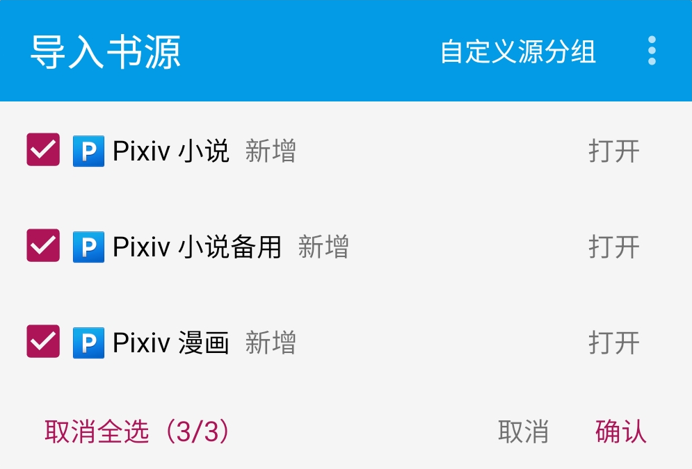

{{ route.path }}

 

# 导入书源
### 🅿️ [开源阅读](https://github.com/Luoyacheng/legado) Pixiv 书源
#### ✈️ 频道 [@PixivSource](https://t.me/PixivSource)
#### ☕ [书源项目打赏名单](./Sponsor.md)

> [!WARNING]
>
> ⚠️ **你正在 GitHub 上浏览此文档， Github 文档可能不完整
> [网页版](https://pixivsource.pages.dev/ImportBookSource)
> 内容更全面，排版更精美**

> [!TIP]
>
> **开源阅读 Legado 书源导入 指南**
>
> **另有：新手配置指南：**
> [✨臻享阅读](BetterExperience.md)；
> **极简配置指南：**
> [⚡️ 快速开始](QuickStart.md)

## 获取书源、订阅源
- [Legado | 开源阅读 | 频道](https://t.me/legado_channels)
- [源仓库](https://www.yckceo.com/yuedu/shuyuan/index.html)
- [Yiove 书源仓库](https://shuyuan.yiove.com)
- [喵公子书源管理](http://yuedu.miaogongzi.net/gx.html)
- [书源、图源、订阅源、规则、直播源、各种源 大型整合](https://source.zgqinc.gq)  
- [阅读 APP 源](https://legado.aoaostar.com)

## 导入书源

<!--@include: CommonImport.md-->

### 🌐 C.网络导入 {#Internet}

<strong> 🌐 网络导入　详细操作</strong>

**我的 - 书源管理 - 菜单 - 网络导入 - 复制链接、粘贴 - 添加书源**

#### 1. 打开【我的】页面，点击【书源管理】

#### 2. 点击右上角的三点菜单，选择【网络导入】

#### 3. 粘贴书源链接，点击确定

#### 4. 导入并启用书源
**如果导入失败，请开启代理，或过段时间重试**

### 📑 D.文件导入 {#File}

<strong> 📄 文件导入　详细操作</strong>

#### 1.下载书源/订阅源文件
打开 [此处的书源链接](#Subscription) ，选择 **链接另存为**，下载相应书源

或打开 [Github Release](https://github.com/DowneyRem/PixivSource/releases/latest)，下载相应书源

#### 2.使用阅读打开
点击书源文件，打开方式选择：阅读

#### 3.导入并启用书源/订阅源

