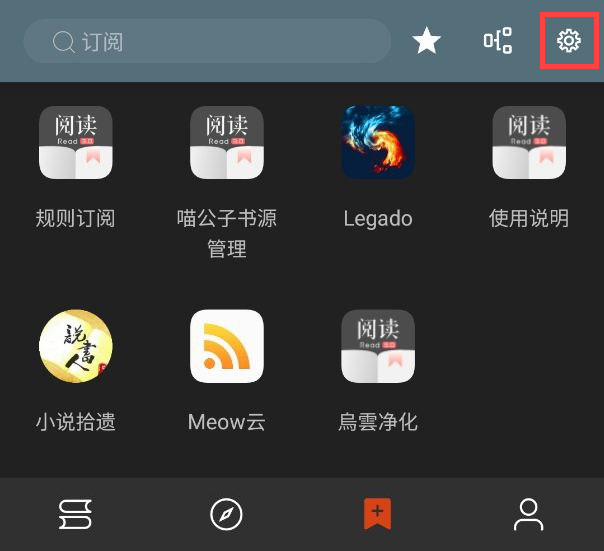
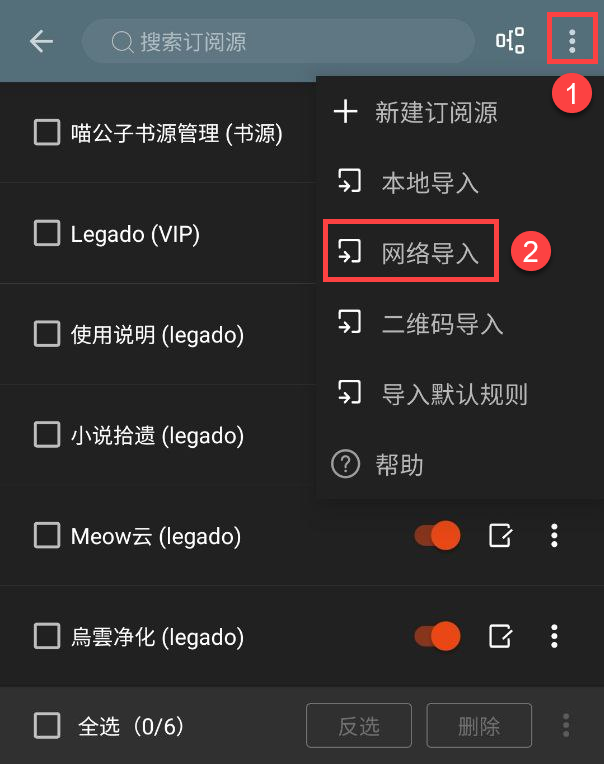
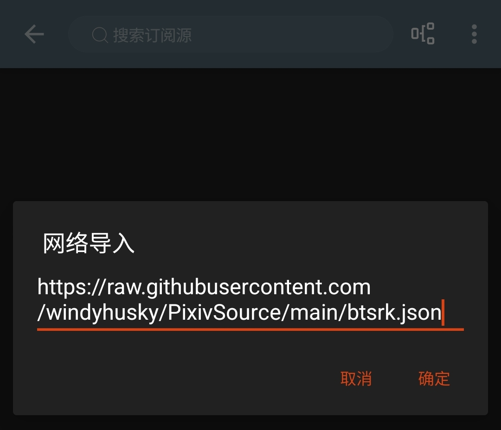
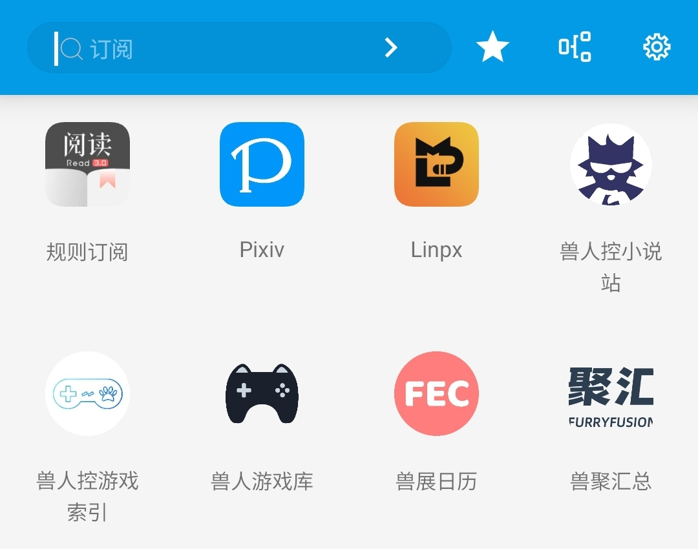

<div align="center">

<br>

# 导入订阅源
### 🅿️ [开源阅读](https://github.com/gedoor/legado) Pixiv 书源
#### ✈️ 频道 [@PixivSource](https://t.me/PixivSource)
#### ☕ [书源项目打赏名单](./Sponsor.md)
</div>


> [!TIP]
>
> **从未使用过【开源阅读】的读者可以看这篇指南：**
> [✨臻享阅读](BetterExperience.md)


## 3.导入订阅源
## 3.0 订阅源来源
- [Legado｜开源阅读 | 频道](https://t.me/legado_channels)
- [源仓库](https://www.yckceo.com/yuedu/rss/index.html)
- [三千书源 | Yiove 书源仓库](https://shuyuan.yiove.com)
> **更多方式请查看[书源获取方式](./ImportBookSource.md)，一般二者会同时提供**

书源分享【订阅源】：
- [喵公子订阅源](https://yd.mgz6.com)
- [阅读 APP 源](https://legado.aoaostar.com)


## 3.1 导入订阅源
### O.一键导入
- 🅿️ [一键导入 Pixiv 书源](https://loyc.xyz/b/cdx.html?src=legado://import/importonline?src=https://cdn.jsdelivr.net/gh/DowneyRem/PixivSource@main/pixiv.json)
- 🦊 [一键导入 Linpx 书源](https://loyc.xyz/b/cdx.html?src=legado://import/importonline?src=https://cdn.jsdelivr.net/gh/DowneyRem/PixivSource@main/linpx.json)
- 🐲 [一键导入 BTSRK 订阅源](https://loyc.xyz/b/cdx.html?src=legado://import/importonline?src=https://cdn.jsdelivr.net/gh/DowneyRem/PixivSource@main/btsrk.json)
- 📚 [一键导入 Books 订阅源](https://loyc.xyz/b/cdx.html?src=legado://import/importonline?src=https://cdn.jsdelivr.net/gh/DowneyRem/PixivSource@main/btsrk.json)
- ➕ [一键导入 Import 订阅源](https://loyc.xyz/b/cdx.html?src=legado://import/importonline?src=https://cdn.jsdelivr.net/gh/DowneyRem/PixivSource@main/btsrk.json)


<details><summary> ➕ 更多方法 </summary>

以下导入方法任选其一亦可

<details>
<summary> A. 文件导入 </summary>

### A.文件导入更简单
#### 1.下载书源/订阅源文件
```
https://raw.githubusercontent.com/DowneyRem/PixivSource/main/btsrk.json
```
```
https://raw.githubusercontent.com/DowneyRem/PixivSource/main/books.json
```

#### 2.使用阅读打开
点击书源，选择用阅读打开


#### 3.导入完成并启用书源/订阅源

</details>


<details>
<summary> B. 规则订阅 </summary>

### B.规则订阅易更新
【**开启代理**】后，复制下方的订阅源链接
```
https://raw.githubusercontent.com/DowneyRem/PixivSource/main/btsrk.json
```
```
https://raw.githubusercontent.com/DowneyRem/PixivSource/main/books.json
```
#### 1. 打开【订阅】页面，点击【规则订阅】


#### 2. 点击加号，更改规则类型，粘贴链接，保存订阅
**注意这里要把【书源】改成【订阅源】**


#### 3. 点击相应订阅规则，导入并启用/更新书源


**首次点击【订阅规则】 即可导入**

**导入之后，再次点击则会检查更新**
</details>


<details>
<summary> C. 网络导入 </summary>

### C.网络导入也方便
请【**开启代理**】后，复制下面的【订阅书源】链接
- btsrk 订阅源
```
https://raw.githubusercontent.com/DowneyRem/PixivSource/main/btsrk.json
```
- 书源分享 订阅源
```
https://raw.githubusercontent.com/DowneyRem/PixivSource/main/books.json
```

#### 1.打开【订阅】页面，点击右上角【设置】


#### 2.点击右上角的三点菜单，选择【网络导入】


#### 3.粘贴订阅源链接，点击确定


#### 4.导入完成并启用订阅源




**无法网络导入时，请尝试开启代理，或过段时间重试**
</details>


<details>
<summary> D. Schema 链接导入 </summary>

### D.Schema 链接导入
大多一键导入书源/订阅源，都是采用了这种方式

#### 0.【书源提供方】为按钮等添加链接
> ```
> 可通过url唤起阅读进行一键导入,url格式: legado://import/{path}?src={url}
> path类型: bookSource,rssSource,replaceRule,textTocRule,httpTTS,theme,readConfig,addToBookshelf
> path类型解释: 书源,订阅源,替换规则,本地txt小说目录规则,在线朗读引擎,主题,阅读排版,添加到书架
> legado://import/addToBookshelf?src={url}
> ```
> 自官方API：https://github.com/gedoor/legado#api-

导入 Pixiv 订阅源的连接如下：
```
yuedu://rsssource/importonline?src=https://raw.githubusercontent.com/DowneyRem/PixivSource/main/btsrk.json
```
```
legado://import/rssSource?src=https://raw.githubusercontent.com/DowneyRem/PixivSource/main/btsrk.json
```

#### 1.点击链接，跳转阅读
浏览器打开：**[喵公子订阅源](https://dy.mgz6.com)**

一键导入按钮的链接，即为下面这条链接：
```
yuedu://rsssource/importonline?src=http://yuedu.miaogongzi.net/shuyuan/miaogongziDY.json
```
点击链接，跳转阅读


#### 2.选择订阅源并导入


</details>


<details>
<summary> E. 书源订阅（ import 订阅源） </summary>

### E.书源订阅（ import 订阅源）
如果你已经导入了【书源订阅】（ import 订阅源），则可以用其导入书源

#### 1.打开“书源订阅”
点击 “书源订阅”（ import 订阅源）


点击相应书源/订阅源，导入该源


#### 2.导入相关资源
点击书源，导入书源


点击订阅源，导入订阅源


</details>
</details>