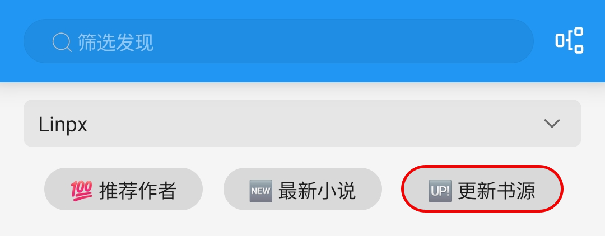
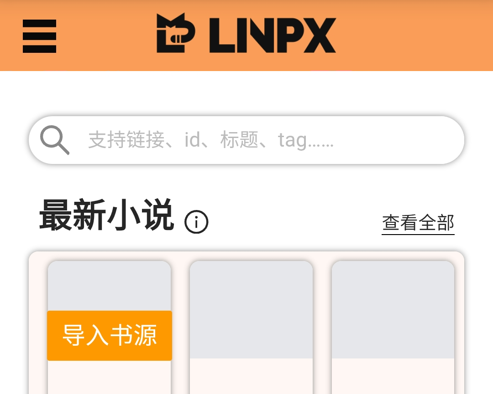
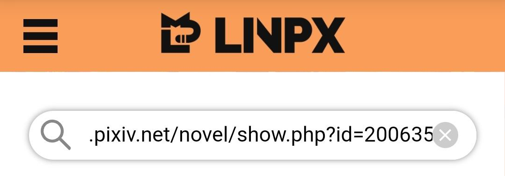

<div align="center">

<br>

# Linpx 书源指南
### 🦊 [开源阅读](https://github.com/gedoor/legado) Linpx 书源
#### ✈️ 频道 [@PixivSource](https://t.me/PixivSource)
#### ☕ [书源项目打赏名单](./Sponsor.md)
</div>


> [!TIP]
>
> **从未使用过【开源阅读】的读者可以看这篇指南：**
> [✨臻享阅读](BetterExperience.md)
 

## [Linpx](http://www.furrynovel.ink) 是第三方 Pixiv 小说镜像站，主要内容为【兽人小说】
### ⬇️ 下载阅读 {#DownloadLegado}
> [!IMPORTANT] 重要
>
> 点击链接，下载 **【阅读 Plus】** 安装包并安装软件
>
> https://loyc.xyz/c/legado.html#download
>
> **苹果设备及更多兼容软件详见：** [下载阅读](./Download.md)


### 🚀 导入书源 & 订阅源 {#ImportSources}
> [!IMPORTANT] 重要
>
> **点击下方链接，一键导入书源、订阅源**
>
> 🦊 [一键导入 Linpx 书源](https://loyc.xyz/b/cdx.html?src=legado://import/importonline?src=https://cdn.jsdelivr.net/gh/DowneyRem/PixivSource@main/linpx.json)
>
> 🐲 [一键导入 Linpx 订阅源](https://loyc.xyz/b/cdx.html?src=legado://import/importonline?src=https://cdn.jsdelivr.net/gh/DowneyRem/PixivSource@main/btsrk.json)
>
> **更多导入方法详见：** [如何导入书源](./ImportBookSource.md)


## 书源配置 {#BookSourceSet}
### ✅ 检查网站能否访问 {#CheckAccess}
> [!NOTE]
>
> **有账号的网站，在书源里登录账号才能阅读相关小说**
> 
> **Linpx & 兽人控小说站 暂无账号体系，无需登录即可使用**

**订阅 - 点击 Linpx / 兽人控小说站 - 打开网站**

- 如果可以直接打开，那么一切大功告成！
  - **多数网络下，Linpx & 兽人控小说站 无需代理即可访问**
  - Linpx & 兽人控小说站 没有账号体系，**无需登录即可使用**，不必做过多的操作

- 如果 **无法直接打开** 则可以：
  - 切换至其他网络（**更换网络运营商、使用流量或 WIFI**）后再尝试
  - 开启代理后再尝试


## 阅读设置 {#LegadoSettings}
### 💾 [备份恢复](WebdavBackup.md) {#WebdavBackup}
> [!IMPORTANT] 重要
>
> **【开源阅读】没有账号体系，不能在登录书源网站的同时恢复数据**
>
> **需要配置 Webdav 服务，才能从云端恢复数据**
>
> **详见：[备份与恢复](WebdavBackup.md)**


### 🔄 关闭刷新 {#TurnOffAutoRefresh}
> [!IMPORTANT] 重要
>
> **使用时，请在设置里，关闭自动刷新**
>
> **否则很容易触发触发请求限制，甚至封号**

**我的 - 其他设置 - 自动刷新**


> [!NOTE]
>
> **截止到这里，你基本上就拥有了完整的阅读体验了**
>
> **可以像是使用常规阅读软件一样，使用开源阅读了**


### ☁️ [远程书籍](RemoteBooks.md)（可选）{#RemoteBooks}
> [!TIP]
>
> **使用支持 Webdav 的网盘，阅读网盘上的书籍**
>
> **详见：[远程书籍](RemoteBooks.md)**


## 高级功能 {#AddNovel}
### 🔍 搜索小说 {#SearchNovel}
<details><summary> 🔎 搜索小说 </summary>

- ✅ 支持搜索：小说名称、作者名称、小说标签、小说链接
- ⚠️ 暂不支持：系列小说名称


</details>


### ⭐️ 发现小说 {#DiscoverNovel}
<details><summary> ⭐️ 发现小说 </summary>

发现：推荐作者、最新小说


</details>


### 🔗 添加网址 {#AddUrl}
<details><summary> 🔗 添加网址 </summary>

- 书架 - 菜单 - 添加网址 - 粘贴小说链接
- 可以同时添加多个小说的链接

- <details><summary> 🔗 操作流程 </summary>

  #### 3.1 操作流程
  
  
  
  </details>

- <details><summary> 🔗 支持链接 </summary>

  #### 3.2 支持链接

  - Linpx 小说链接
  ```
  https://furrynovel.ink/pixiv/novel/26200191
  ```
  - Linpx 分享链接
  ```
  我正在看唐尼瑞姆创作的《测试页面》一起来看吧！
  https://furrynovel.ink/pn/26200191
  ```
  - Linpx 作者链接
  ```
  https://furrynovel.ink/pixiv/user/119908520
  ```
  </details>
</details>


### 🌐 订阅源 {#RssSource}
<details><summary> 🌐 订阅源 </summary>

- <details><summary> ⬇️ 导入书源 </summary>

  

  - 点击按钮，导入书源；再次点击，则可更新书源
  - 此处使用的是 Jsdelivr CDN ，更新有延迟

  
  </details>

- <details><summary> 🔍 站内搜索 </summary>

  #### 4.1 替代阅读搜索
  受阅读设计的限制，阅读内部搜索不可能完全支持 Linpx 的功能。网站的搜索功能更加全面。

  
  </details>

- <details><summary> 🔜 链接转换 </summary>

  #### 4.2 Pixiv 链接转换
  阅读内部浏览器内打开 Linpx，搜索栏中粘贴 Pixiv 小说链接，即可进入对应页面
  
  
  
  
  </details>

- <details><summary> ➕ 添加小说 </summary>

  #### 4.3 添加小说至书架
  打开 Linpx 小说页面，点击【添加到书架】按钮，即可添加小说到书架
  
  
  </details>
</details>


## 🐞 [故障处理](./TroubleShoot.md) {#TroubleShoot}


## ☕️ [支持开发](./Sponsor.md) {#Sponsor}
> [!NOTE]
>
> **如果书源帮到了你，欢迎请开发者喝杯咖啡**
>
> **你的鼓励是持续更新的动力～**

## 🐲 本教程由兽人阅读频道 [@FurryReading](https://t.me/FurryReading) 提供
