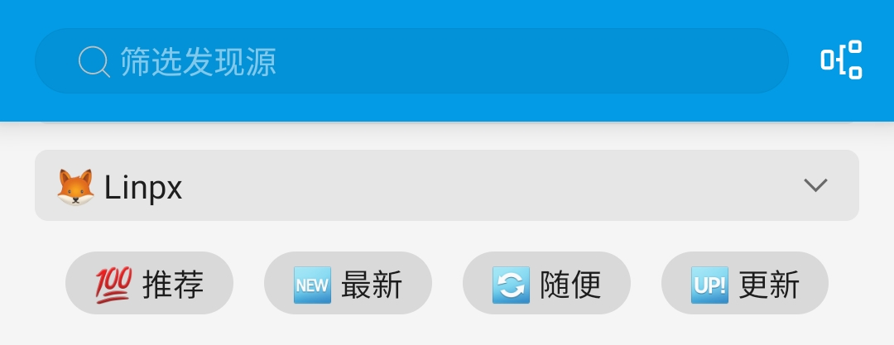
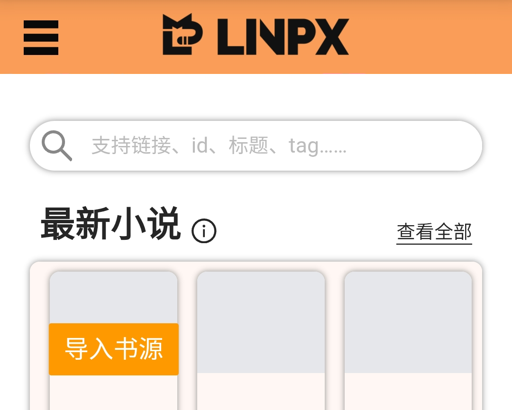
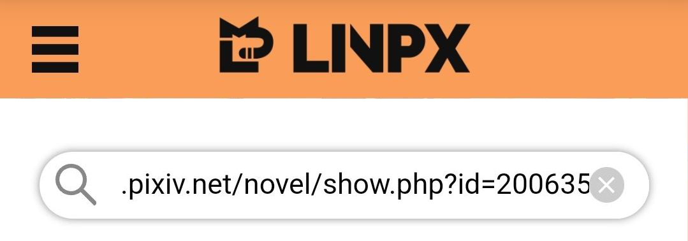
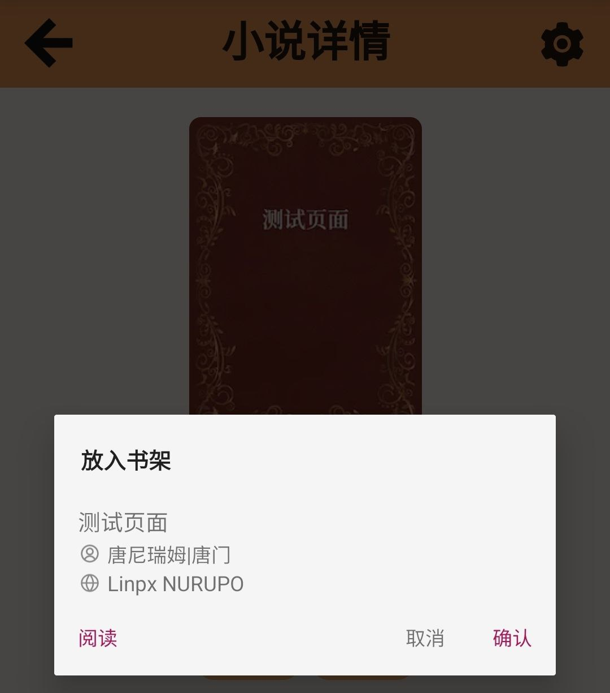

<div align="center">

<br>

# Linpx 书源使用指南
### 🦊 [开源阅读](https://github.com/Luoyacheng/legado) Linpx 书源
#### ✈️ 频道 [@PixivSource](https://t.me/PixivSource)
#### ☕ [书源项目打赏名单](./Sponsor.md)
</div>


<div class="github-only-notice">

> [!NOTE]
>
> 📖 **你正在 GitHub 上浏览此文档， [网页版](https://pixivsource.pages.dev/Linpx) 内容更全面，排版更精美**
</div>


> [!TIP]
> **🦊 Linpx 书源 全功能使用手册**
>
> **另有：新手配置指南：**
> [✨臻享阅读](BetterExperience.md)；
> **极简配置指南：**
> [⚡️ 快速开始](QuickStart.md)
>
> **另有：**
> [🅿️ Pixiv 书源 功能手册](Pixiv.md)；
> [🐯 FurryNovel 书源使用指南](FurryNovel.md)
 

## [Linpx](http://www.furrynovel.ink) 是第三方 Pixiv 小说镜像站，主要内容为【兽人小说】


[//]: # (<div v-if="false">)
  <!--@include: LinpxCommon.md-->

[//]: # (</div>)


## 高级功能 {#All}
### 🔍 搜索小说 {#SearchNovel}
<details><summary> 🔎 搜索小说 </summary>

> [!NOTE]
>
> **书架页面 - 放大镜 - 输入关键词 - 搜索小说**

- <details><summary> 🔎 搜索小说 </summary>
  
  #### 1.0 搜索小说
  - ✅ 支持搜索：小说名称、作者名称、小说标签、小说链接
  - ⚠️ 暂不支持：系列小说名称
  
  
  </details>

- <details><summary> 🀄️ 繁简通搜 </summary>

  #### 1.1 繁简通搜
  - 【搜索】默认进行繁简转换，同时返回繁体简体小说内容（可在书源设置中关闭）
  - 【搜索作者 `@作者名称`】不转换
  - 【搜索标签 `#标签名称`】不转换
  - 返回小说内容不转换

  
  </details>

- <details><summary> 👤 搜索作者 </summary>

  #### 1.2 搜索作者（格式：`@作者名称`）
  - 仅搜索作者；不进行繁简转换
  - 使用 `@` 标记符，例如：`@pixiv事務局`

  
  </details>

- <details><summary> #️⃣ 标签专搜 </summary>

  #### 1.3 标签专搜（格式：`#标签1` `#标签1 标签2 `）
  - 仅搜索标签、小说名称；多个标签空格间隔，不进行繁简转换
  - `#` 为标记符，打出1个即可，例如：`#校园` `#校园 纯爱` `#校园 纯爱 BG`

  
  </details>
</details>


### ⭐️ 发现小说 {#DiscoverNovel}
<details><summary> ⭐️ 发现小说 </summary>

> [!NOTE]
>
> **发现页面 - 点击各按钮**


</details>

<details><summary> 🆙 更新书源 </summary>


> [!NOTE]
>
> **点击按钮【🆙 更新】进入书源更新界面**


> [!TIP]
>  - Jsdelivr CDN 更新有延迟
>  - Github 更新需代理
>  - Godeberg 更新免代理
</details>


### 🔗 添加网址 {#AddUrl}
<details><summary> 🔗 添加网址 </summary>

> [!NOTE]
>
> **书架 - 菜单 - 添加网址 - 粘贴小说链接**
> 
> **可以同时添加多个小说的链接**

- <details><summary> 🔗 操作流程 </summary>

  #### 3.1 操作流程
  
  
  
  </details>

- <details><summary> 🔗 支持链接 </summary>

  #### 3.2 支持链接

  - Linpx 小说链接
  ```
  https://furrynovel.ink/pixiv/novel/26200191
  ```
  - Linpx 分享链接
  ```
  我正在看唐尼瑞姆创作的《测试页面》一起来看吧！
  https://furrynovel.ink/pn/26200191
  ```
  - Linpx 作者链接
  ```
  https://furrynovel.ink/pixiv/user/119908520
  ```
  </details>
</details>


### 🌐 订阅源 {#RssSource}
<details><summary> 🌐 订阅源 </summary>

> [!NOTE]
> 
> 订阅界面，打开 Linpx 订阅源

- <details><summary> ⬇️ 导入书源 </summary>

  

  - 点击按钮，导入书源；再次点击，则可更新书源
  - 此处使用的是 Jsdelivr CDN ，更新有延迟

  
  </details>

- <details><summary> 🔍 站内搜索 </summary>

  #### 4.1 替代阅读搜索
  受阅读设计的限制，阅读内部搜索不可能完全支持 Linpx 的功能。网站的搜索功能更加全面。

  
  </details>

- <details><summary> 🔜 链接转换 </summary>

  #### 4.2 Pixiv 链接转换
  阅读内部浏览器内打开 Linpx，搜索栏中粘贴 Pixiv 小说链接，即可进入对应页面
  
  
  
  
  </details>

- <details><summary> ➕ 添加小说 </summary>

  #### 4.3 添加小说至书架
  打开 Linpx 小说页面，点击【添加到书架】按钮，即可添加小说到书架
  
  
  </details>
</details>


## 🐞 [故障处理](TroubleShoot.md) {#TroubleShoot}
> [!NOTE]
>
> **建议先阅读 [故障处理](TroubleShoot.md)，
> 再去 [书源 GitHub 仓库](https://github.com/DowneyRem/PixivSource/issues) 提交问题**


## ☕️ [支持开发](./Sponsor.md) {#Sponsor}
> [!NOTE]
>
> **如果书源帮到了你，欢迎请开发者喝杯咖啡**
>
> **你的鼓励是持续更新的动力～**

## 🐲 本教程由兽人阅读频道 [@FurryReading](https://t.me/FurryReading) 提供
