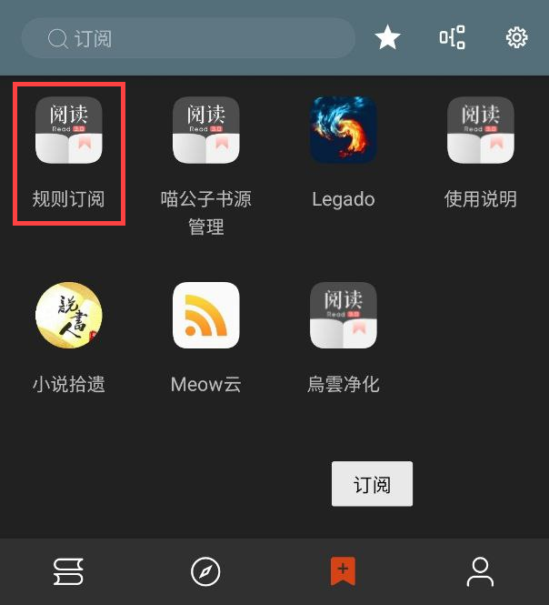
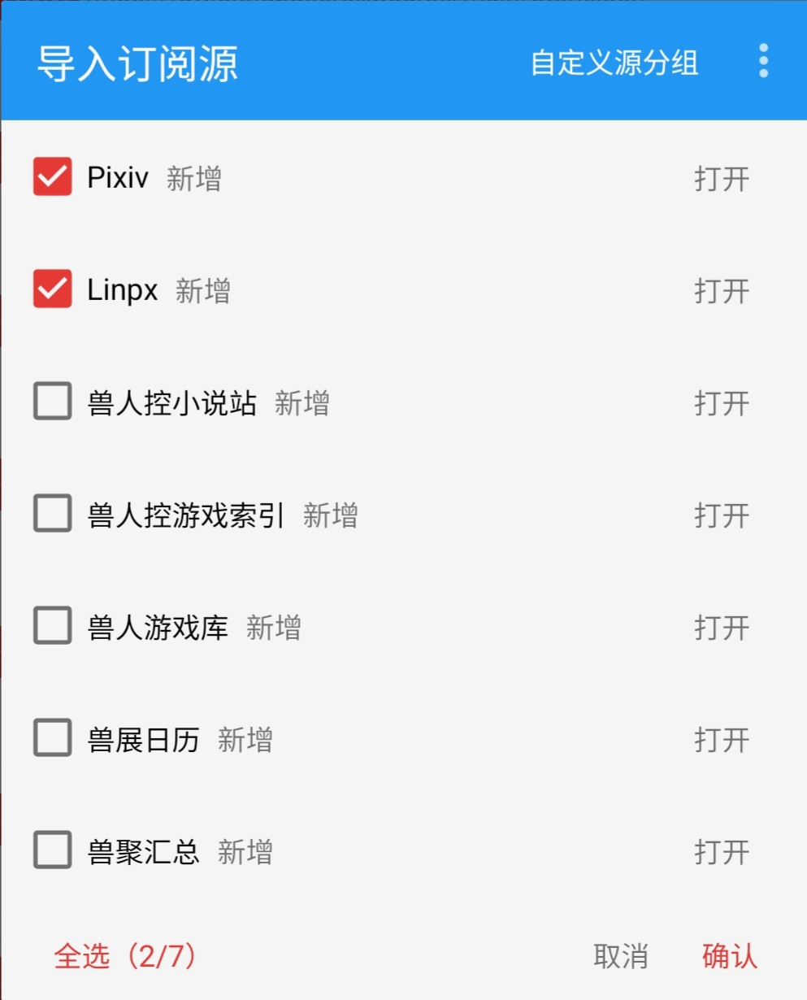
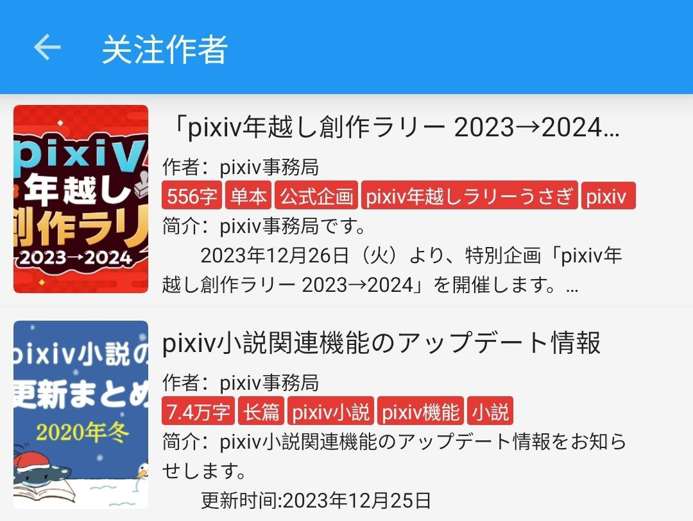

## Pixiv 书源的导入与使用

Pixiv 是以插图、漫画、小说为中心的允许 R18 内容的艺术网站

### 本书源使用前提

1. 使用阅读 3.0 版本
2. 开启代理【必须】
3. 导入 Pixiv 的书源、订阅源
4. 登录 Pixiv 的账号【必须】
5. 开启 Pixiv R18 设置


## 一、导入书源 & 订阅源
### 0.下载阅读 3.0 版本
点击链接，下载安装包并安装，**推荐使用共存版**

> https://miaogongzi.lanzout.com/b01rgkhhe
> 
> 最新下载链接请查看 [阅读是什么软件？3.下载阅读](./ReadMe.md#3.下载阅读)


### 1.了解阅读功能与用法
> 请查看[阅读是什么软件？阅读简介](./ReadMe.md)


### 2.导入 Pixiv 书源
【**开启代理**】后，复制下方的书源链接
```
https://raw.githubusercontent.com/windyhusky/PixivSource/main/pixiv.json
```
或复制下方【免代理】书源链接
```
https://cdn.jsdelivr.net/gh/windyhusky/PixivSource@main/pixiv.json
```
#### 2.1 打开【订阅】页面，点击【规则订阅】



#### 2.2 点击加号，粘贴链接，保存订阅


#### 2.3 点击相应订阅规则，导入并启用/更新书源


**首次点击【订阅规则】 即可导入**

**【系列书源】与【单篇书源】功能完全一致，导入/启用其中一个即可**

**导入之后，再次点击则会检查更新**

> 更多导入方法请查看[如何获取书源？导入书源？](./ImportBookSource.md)


### 3.导入 Pixiv 订阅源
【**开启代理**】后，复制下方的订阅源链接
```
https://raw.githubusercontent.com/windyhusky/PixivSource/main/btsrk.json
```
或复制下方【免代理】订阅源链接
```
https://cdn.jsdelivr.net/gh/windyhusky/PixivSource@main/btsrk.json
```

#### 3.1 打开【订阅】页面，点击【规则订阅】


#### 3.2 点击加号，更改规则类型，粘贴链接，保存订阅
**注意这里要把【书源】改成【订阅源】**


#### 3.3 点击相应订阅规则，导入并启用/更新书源


**首次点击【订阅规则】 即可导入**

**导入之后，再次点击则会检查更新**

> 更多导入方法请查看[如何导入订阅源](./ImportRssSource.md)


### 4.登录 Pixiv 账号
正版付费书源，以及Pixiv这种，都是需要登录账号的才能正常观看的相关内容的。

#### 4.1开启代理工具
此处略过，请自行学习，**最好开启【全局代理】**

#### 4.2登录 Pixiv 账号
**我的-书源管理-点击 Pixiv 书源右侧三点菜单-登录**


**登录你的账号，登录成功后，点击右上角的对勾**


**如果需要验证码，请更换代理，或过段时间再次尝试**


### 5.开启 Pixiv 的 R18 设置
#### 如果你之前已经开启了，则可以跳过第4步
**再次点击登录，滑动屏幕，点击头像，再次点击头像，编辑个人资料**

### 5.1 [Pixiv 个人资料](https://www.pixiv.net/settings/profile) - 编辑个人资料 - 出生年份

出生年份改到：**2000年或2000年之前**，确保你的年龄在20岁及以上


### 5.2 [Pixiv 设置](https://www.pixiv.net/settings/viewing) - 浏览与显示 - 年龄限制作品
**再次点击登录，滑动屏幕，点击头像，选择设置**

根据自己情况选择显示：R18 作品与 R18G 作品

不知道二者区别的可以自行搜索后了解


## 二、添加小说，尽情使用
### 1.阅读内部搜索
支持搜索小说名称、系列小说名称、作者名称、小说标签


### 2.发现更多小说
发现：关注作者、追更列表、推荐小说、收藏小说





### 3.添加网址【需要代理】
首页打开【添加网址】，粘贴小说链接，可以同时添加多个小说的链接


(这里懒得换图片了)

此处使用正则匹配网址，支持 Pixiv 多个格式的网址链接：
```
Pixiv 小说链接
https://www.pixiv.net/novel/show.php?id=20063566

Pixiv 系列小说链接
https://www.pixiv.net/novel/series/8054073
```
无法添加的链接：
```
Pixiv App 小说分享链接（删掉#号即可正常添加）
测试页面 | 唐尼瑞姆 #pixiv https://www.pixiv.net/novel/show.php?id=20063566
```


### 4.订阅源添加小说
导入 Pixiv 订阅源，配合书源使用体验更好

#### 4.1 替代阅读搜索
受阅读设计的限制，阅读内部搜索不可能完全支持 Pixiv 的搜索功能。网站的搜索功能更加全面。


#### 4.2 替代阅读发现
阅读内部浏览器内打开 Pixiv，即可使用 Pixiv 书源未完成的功能，如排行榜等功能


#### 4.3 添加小说至书架
在阅读内部浏览器内打开 Pixiv 小说/系列小说页面，【刷新】，点击【加入书架】按钮添加小说到书架

- 添加小说到书架


- 添加系列小说到书架


## 三、故障排查
> 详见：[故障排查与处理](./TroubleShoot.md)
> 
### 1.确定书源可以正常使用
书架页面，点击【**放大镜图标**】，搜索 `R18` 测试书源能否正常使用，以及R18设置是否打开。

#### 如果没有搜索结果，请检查一下内容：
**⓪检查 Pixiv 书源是否导入**

**①检查 Pixiv 书源是否启用**

**②检查代理是否可用**

**③检查阅读软件是否走了代理**

**④检查网络是否可用**

**如果上述均无问题，但依然没有搜索结果，那就是书源需要更新了**


### 2.图片无法正常显示
#### 解决措施：关闭替换净化


## 本教程由兽人阅读频道 [@FurryReading](https://t.me/FurryReading) 提供
