<div align="center">

<br>


# Pixiv 书源 功能手册
### 🅿️ [开源阅读](https://github.com/Luoyacheng/legado) Pixiv 书源
#### ✈️ 频道 [@PixivSource](https://t.me/PixivSource)
#### ☕ [书源项目打赏名单](./Sponsor.md)
</div>


> [!WARNING]
>
> ⚠️ **你正在 GitHub 上浏览此文档， Github 文档可能不完整
> [网页版](https://pixivsource.pages.dev/Pixiv)
> 内容更全面，排版更精美**


> [!TIP]
> **🅿️ Pixiv 书源 全功能使用手册**
> 
> **另有：新手配置指南：**
> [✨臻享阅读](BetterExperience.md)；
> **极简配置指南：**
> [⚡️ 快速开始](QuickStart.md)，
> **重复内容不再赘述**


## [Pixiv](https://www.pixiv.net) 是以插图、漫画、小说为中心的艺术网站
### ⚠️ 使用须知 {#Notice}
> [!CAUTION] 危险！
> #### ⚠️ 使用本书源造成的一切损失均由【使用者】自行承担

> [!WARNING] 警告！
> #### ⚠️ 请勿在 Pixiv 平台宣传本项目（书源）
> <details><summary><strong> 📄 包括但不限于以下内容 </strong></summary>
>
>  - 项目名称：
>    - **Pixiv 书源**
>    - **PixivSource**
>  - 项目链接：
>    - https://github.com/DowneyRem/PixivSource
>    - https://github.com/windyhusky/PixivSource
>    - https://github.com/eigeen/PixivSourceProject
>  - 书源主页：
>    - https://downeyrem.github.io/PixivSource
>    - https://pixivsource.pages.dev
>  - 项目参与者链接：
>    - https://github.com/DowneyRem
>    - https://github.com/windyhusky
>    - https://github.com/eigeen
> </details>
> 
> #### 可能会触发 shadow ban 限制（大）部分功能，严重的甚至会封号


> [!WARNING] 警告！
> #### ⚠️ 不建议在书架上添加过多小说（超过100篇）
> #### 否则刷新书架时，可能会触发请求限制，严重的会封号


> [!IMPORTANT] 重要  
> #### ⚠️ 使用本书源时，请务必在阅读设置里 [关闭【自动刷新】](#TurnOffAutoRefresh)
> #### 否则自动刷新时，可能会触发请求限制，严重的会封号


> [!NOTE]
> #### 最新版【阅读 Sigma + 书源】已支持降低刷新书架时的并发率
> #### 但依然不建议在书架上添加过多小说

 
### ⬇️ 下载阅读 {#DownloadLegado}
> [!IMPORTANT] 重要
>
> 点击链接，下载 **【阅读 Plus】** 安装包并安装软件
>
> https://gitee.com/lyc486/legado/releases/download/3.26.030717/legado_%E6%AD%A3%E5%BC%8F%E7%89%88_3.26.03071721_releaseS.apk
>
> **苹果设备及更多兼容软件详见：** [下载阅读](./Download.md)


### 🚀 导入书源 & 订阅源 {#ImportSources}
> [!IMPORTANT] 重要
>
> **点击下方链接，一键导入书源、订阅源**
>
> 🅿️ [一键导入 Pixiv 书源](https://pixivsource.pages.dev/Import?src=https://cdn.jsdelivr.net/gh/DowneyRem/PixivSource@main/pixiv.json)
>
> 🐲 [一键导入 Pixiv 订阅源](https://pixivsource.pages.dev/Import?src=https://cdn.jsdelivr.net/gh/DowneyRem/PixivSource@main/btsrk.json)
> 
> **更多导入方法详见：** [如何导入书源](./ImportBookSource.md)


> [!NOTE]
> **🅿️ Pixiv 书源 新手配置指南，详见：**
> [✨臻享阅读](BetterExperience.md)，
> **重复内容不再赘述**
> 
> **快速跳转：
> 🔍 [搜索小说](#SearchNovel)；
> ⭐️ [发现小说](#DiscoverNovel)；
> 🔗 [添加网址](#AddUrl)；
> 🌐 [订阅源](#RssSource)；
> ⚙️ [️设置功能](#Settings)；
> ⏺ [互动功能](#Interact)**


<div v-if="false">
  <!--@include: CommonPixiv.md-->
</div>


## 搜索小说 {#SearchNovel}
> [!NOTE]
>
> **书架页面 - 放大镜 - 输入关键词 - 搜索小说**


### 🔍 搜索小说
> [!TIP]
> ✅ 默认搜索：同时搜索**小说名称、系列小说名称、标签**


### 🀄️ 繁简通搜
> [!TIP]
> **【默认搜索】进行繁简转换，同时返回繁体简体小说内容，可在书源设置中关闭**
> 
> 【搜索作者 `@作者名称`】时，不转换
> 
> 【搜索标签 `#标签名称`】时，不转换
> 
> 返回小说内容不转换

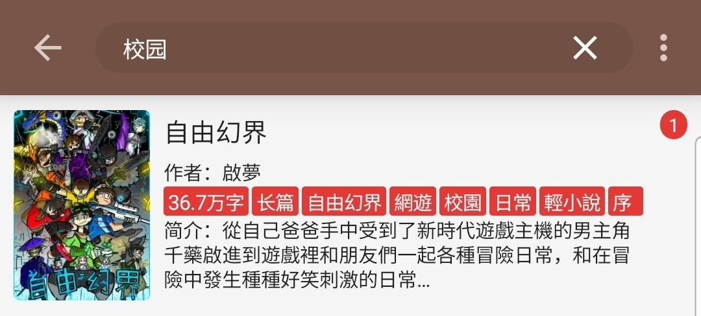


### ➖ 排除标签
> [!TIP]
> **格式：`标签1 -标签2` `标签1 -标签2 -标签3`**
> 
> **使用减号 `-` 在搜索结果中，排除不想看的的标签**
> 
> **每个排除的标签前都需要添加减号`-`，减号前需加空格，减号后无需空格**
> 
> **由 Pixiv 官方提供支持**，
> 仅适用于单次搜索

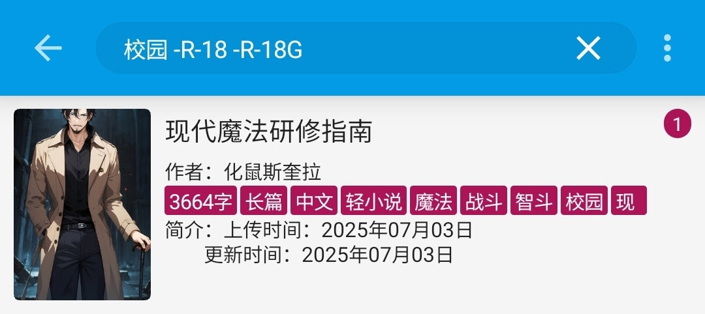


###  ➕ 多选标签
> [!TIP]
> **多选标签（格式：`标签1 or 标签2` `标签1 or 标签2 or 标签3`）**
> 
> 使用 `or` 同时搜索多个标签（满足其一即可，也就是取并集）
> 
> **可相互替换的标签间添加` or `，前后需要空格间隔**
> 
> **由 Pixiv 官方提供支持**，
> 仅适用于单次搜索

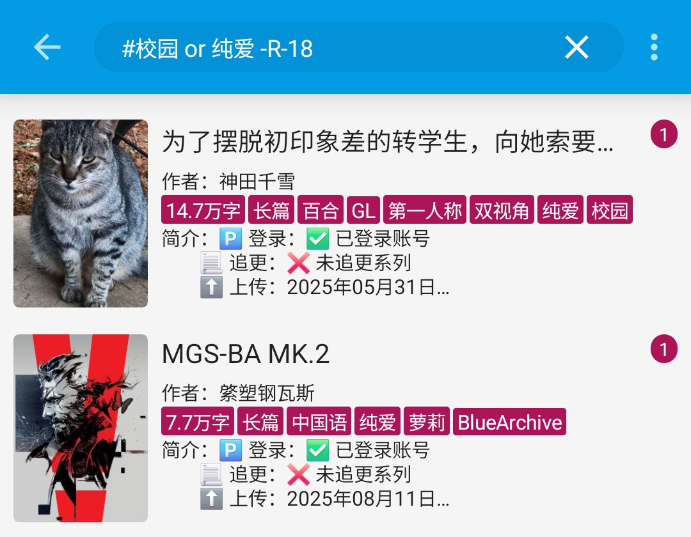


###  👤 搜索作者(模糊)
> [!TIP]
> **模糊搜索作者（格式：`$作者名称`）**
> 
> **仅搜索作者；不进行繁简转换**，使用方法：
> 
> **1️⃣ 使用 `$` 标记符，例如：`$pixiv事務局`**
> 
> 2️⃣ 设置中，开启【👤 搜索作者】时，无需添加标记符，例如：`pixiv事務局`

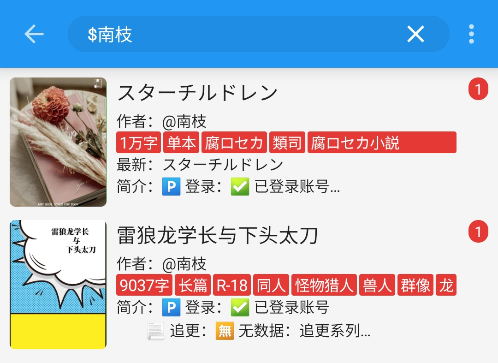


###  👤 搜索作者(精确)
> [!TIP]
> **精确搜索作者（格式：`@作者名称`）**
> 
> **使用 `@` 标记符，例如：`@pixiv事務局`，仅搜索作者；不进行繁简转换**
> 
> 可与【字数过滤】同时使用，格式：`@作者名称 字数3k`
> 
> 可与【标签专搜】同时使用，格式：`@作者名称 #标签`，筛选 `@作者` 的具有 `#标签` 的小说

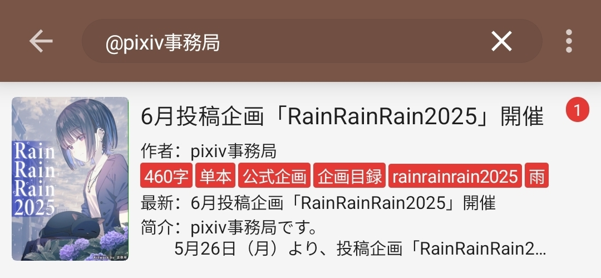


###  #️⃣ 标签专搜
> [!TIP]
> **标签专搜（格式：`#标签1` 或 `#标签1 标签2`）**
> 
> **仅搜索标签、小说名称；多个标签空格间隔，不进行繁简转换**
> 
> **`#` 为标记符，打出1个即可，例如：`#校园` `#校园 纯爱` `#校园 纯爱 BG`**
> 
> 可与【排除标签】【字数过滤】同时使用

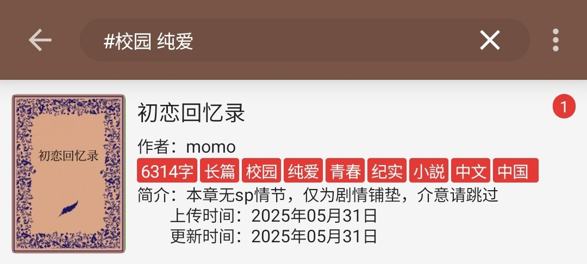


###  ⏬ 字数过滤
> [!TIP]
> **字数过滤（格式：`关键词 字数3k`）** 
> 
> **字数限制规则：`3k 3k5 3w 3w5`【注意`k`与`w`均为小写】** 
> 
> 例如：`校园 字数3k` `校园 纯爱 字数3k`
> 
> 可与【标签专搜】【排除标签】同时使用


- 可与【搜索作者】同时使用


###  🔝 高级搜索
> [!TIP]
> **上述搜索规则基本可以共同使用**，~~发挥你的想象力，自由组合吧~~
> 
> 搜索`@作者`指定`#标签1`或`标签2`，排除`标签3`，筛选字数 `3k` 及以上的小说：
> 
> **格式：`@作者 #标签1 or 标签2 -标签3 字数3k`**
> 
> 搜索 `#标签1`或`标签2`，排除`标签3`，筛选字数 `3k` 及以上的小说： 
> 
> **格式：`#标签1 or 标签2 -标签3 字数3k`**


## 发现小说 {#DiscoverNovel}
> [!NOTE]
>
> **发现页面 - 点击“Pixiv 小说” - 点击按钮**


### ⭐️ 常规小说
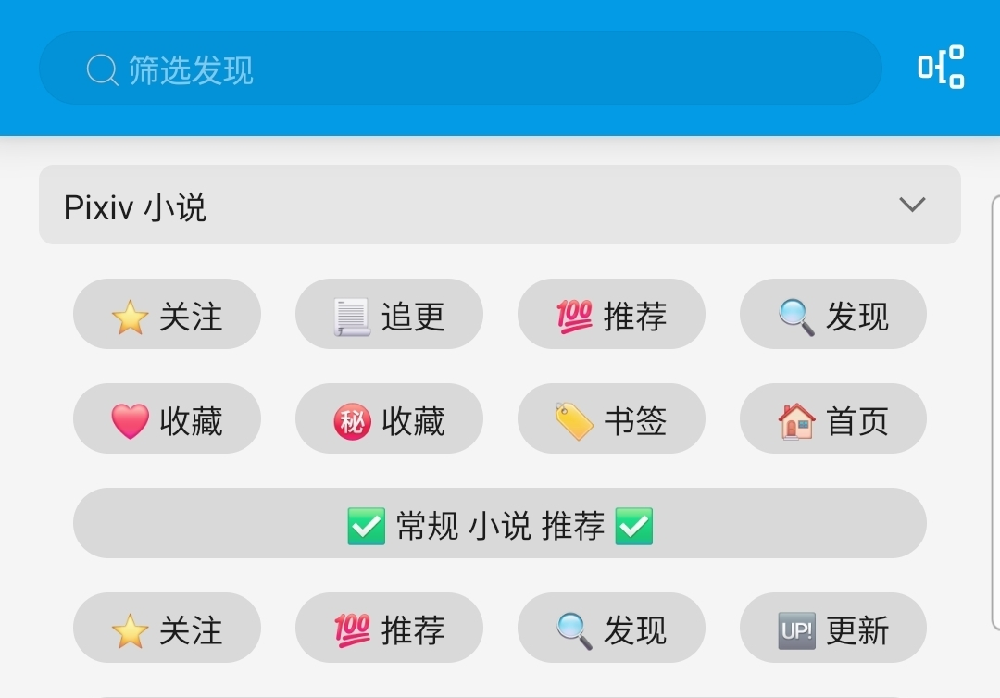
> [!TIP]
>
> 🔞 默认发现 => **✅ 默认显示，不可隐藏**
> 
> 💼 常规小说 => **✅ 默认显示，可以隐藏**
>
> 可在 **发现设置** 中修改【💼 常规小说】


### 🆙 更新书源
> [!NOTE]
>
> **💼 常规小说 的发现按钮中，点击按钮【🆙 更新】进入书源更新界面**

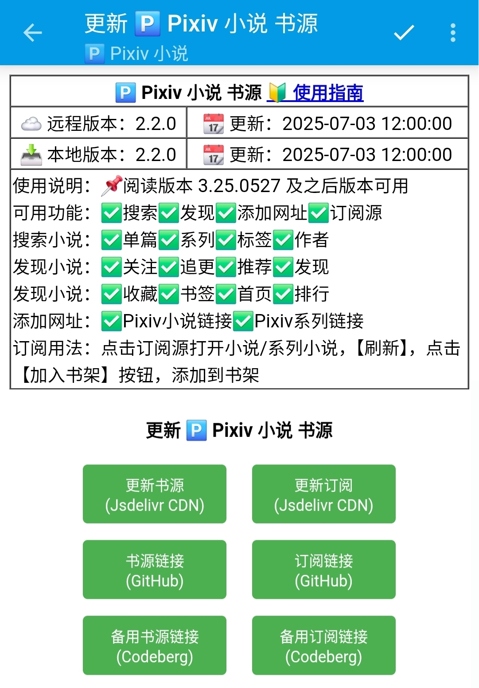

> [!TIP]
>  - Jsdelivr CDN 更新有延迟
>  - Github 更新需代理
>  - Codeberg 更新免代理


### 🆕 最新企划
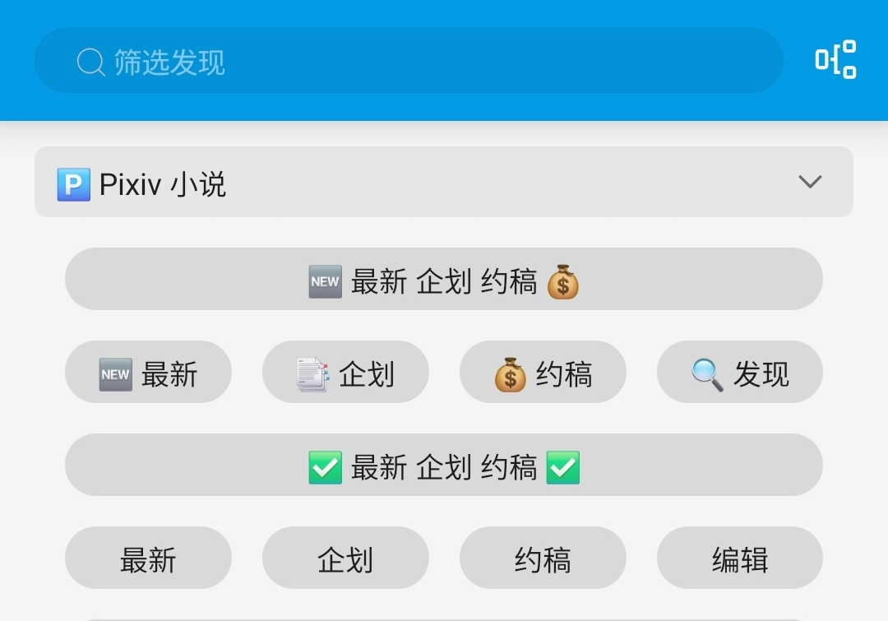
> [!TIP]
> 
> 🔞 最新企划 => **✅ 默认显示**
> 
> 💼 最新企划 => ❌ 默认隐藏
> 
> 可在 **发现设置** 中修改【🔞 最新企划】【💼 最新企划】


### 👑 小说排行
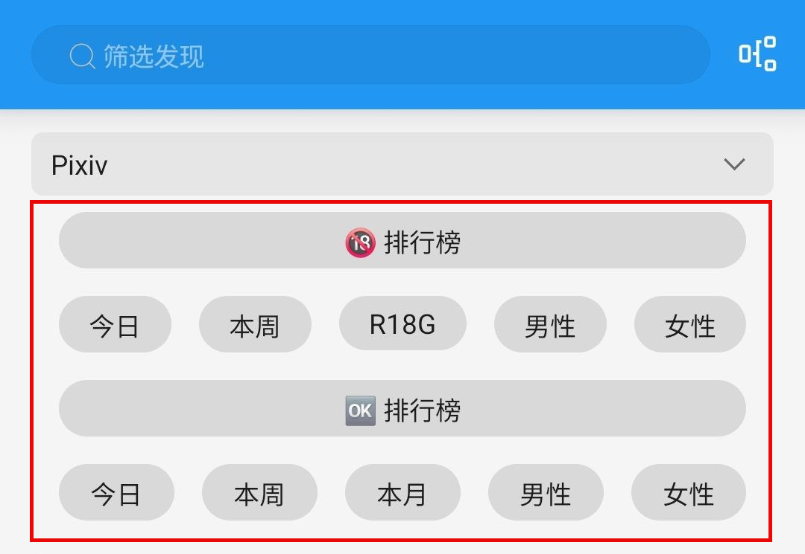
> [!TIP]
>
> 🔞 排行榜单 => **✅ 默认显示**
> 
> 💼 排行榜单 => ❌ 默认隐藏
>
> 可在 **发现设置** 中修改【🔞 排行榜单】【💼 排行榜单】


### 🔥 原创热门
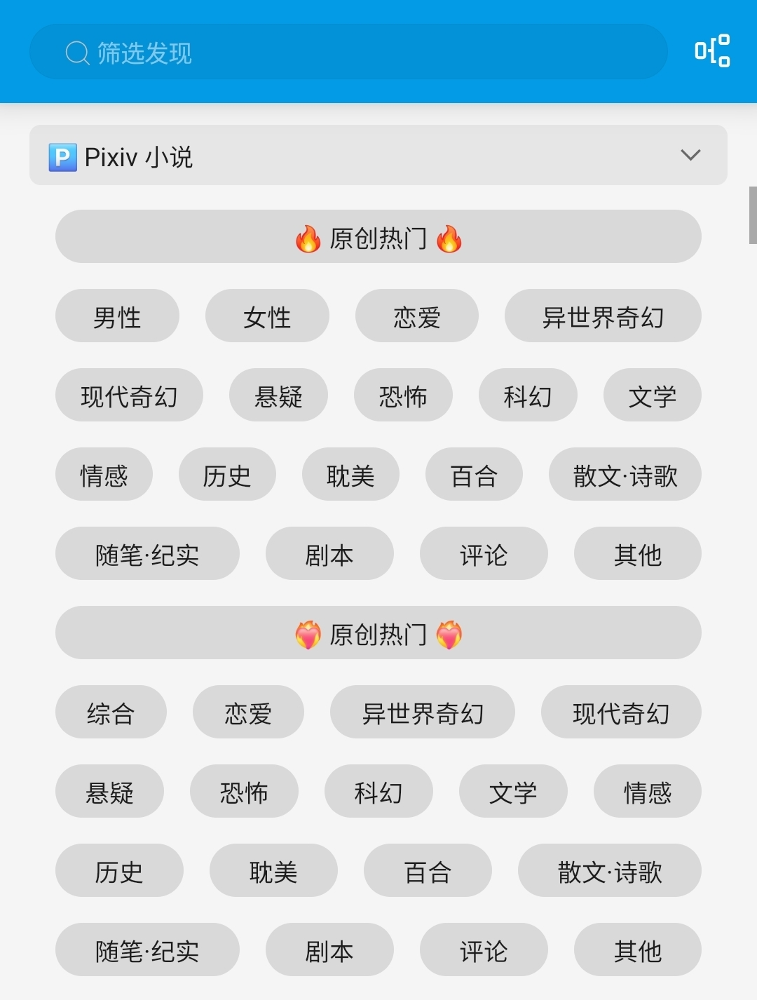
> [!TIP]
>
> 🔞 原创热门 => ❌ 默认隐藏
> 
> 💼 原创热门 => ❌ 默认隐藏
>
>  可在 **发现设置** 中修改【🔞 原创热门】【💼 原创热门】


### 📌 [喜欢标签](#LikeTags)
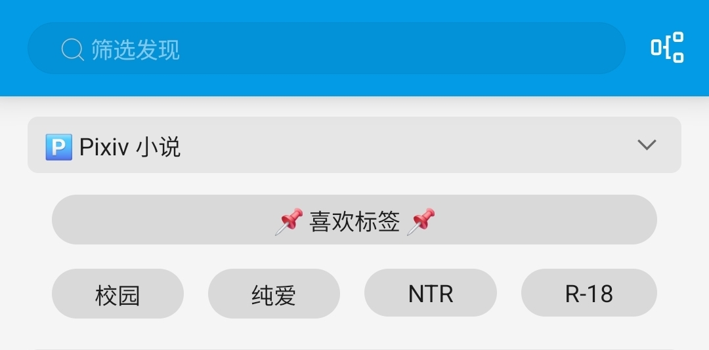
> [!TIP]
> 
> **可在登录界面中，通过【📌 喜欢标签】添加**
> 
> **⏺ 互动功能 => 书架 - 小说阅读界面 - Pixiv 小说 - 登录**


### ❤️ [他人收藏](#LikeAuthors)
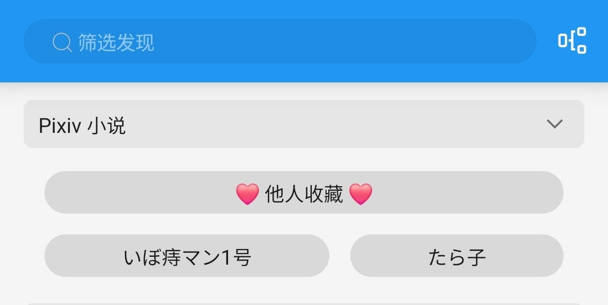
> [!TIP]
>
> **可在登录界面中，通过【❤️ 他人收藏】添加，详见：**
>
> **⏺ 互动功能 => 书架 - 小说阅读界面 - Pixiv 小说 - 登录**


## 添加网址 {#AddUrl}
### 🔗 添加网址
> [!NOTE]
>
> **书架 - 菜单 - 添加网址 - 粘贴小说链接**
> 
> **可以同时添加多个小说的链接**

### ⏺️ 实际操作
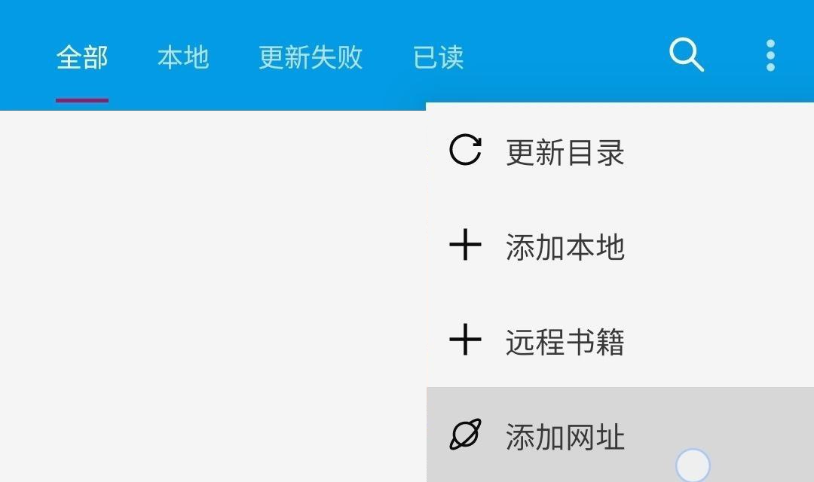


### 🔗 支持链接
支持 Pixiv 多个格式的网址链接：
- Pixiv 单篇小说链接
```
https://www.pixiv.net/novel/show.php?id=20063566
```
- Pixiv 系列小说链接
```
https://www.pixiv.net/novel/series/8054073
```
- Pixiv 作者链接（添加近期1本小说）
```
https://www.pixiv.net/users/16721009
```
**无法添加的链接：**
- Pixiv App 小说分享链接 **（删掉#号即可正常添加）**
```
测试页面 | 唐尼瑞姆 #pixiv https://www.pixiv.net/novel/show.php?id=20063566
```


## 订阅源 {#RssSource}
### 🌐 订阅源
> [!NOTE]
> 
> 订阅界面，打开 Pixiv 订阅源

### ⬇️ 导入书源
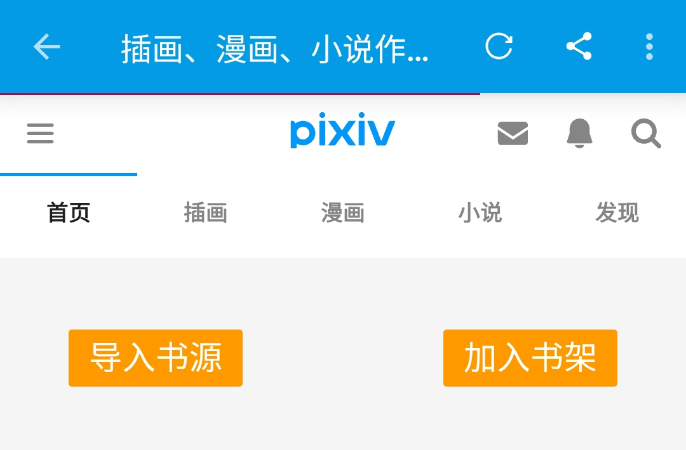

- 点击按钮，导入书源；再次点击，则可更新书源
- 此处使用的是 Jsdelivr CDN ，更新有延迟


###  🔍 站内搜索
Pixiv 网站的搜索功能更加全面，可以替代阅读搜索

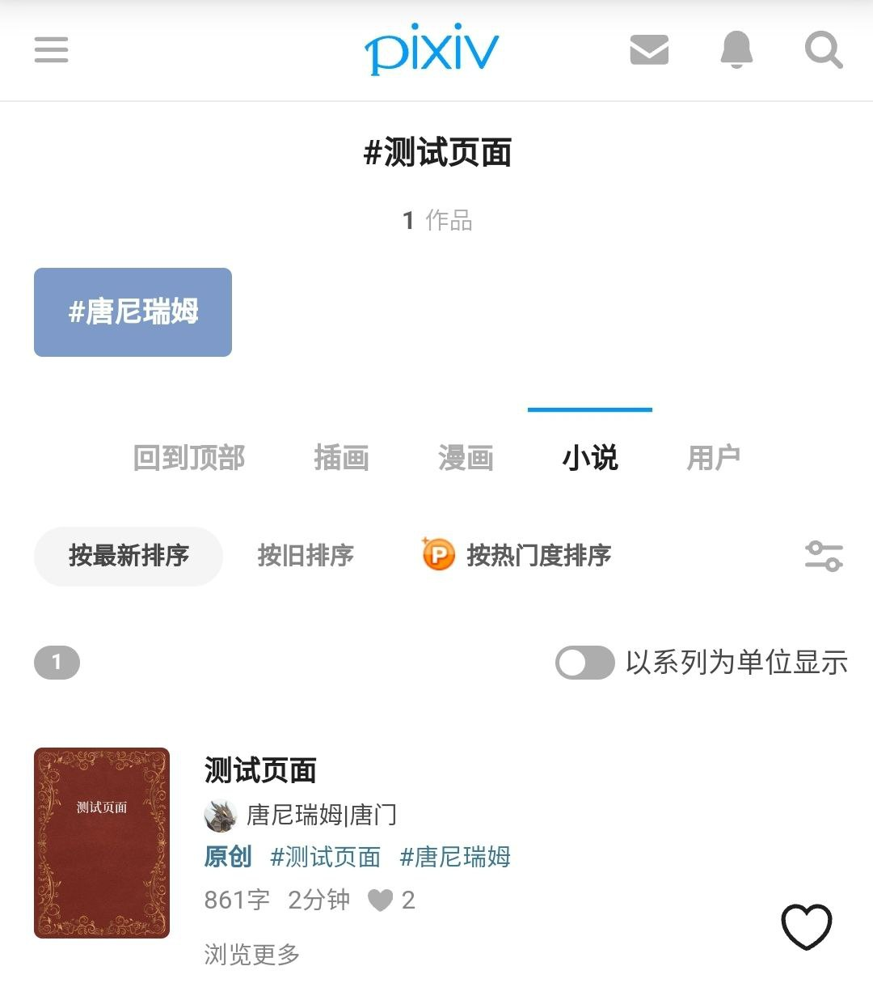

使用 Pixiv 书源未完成/隐藏功能
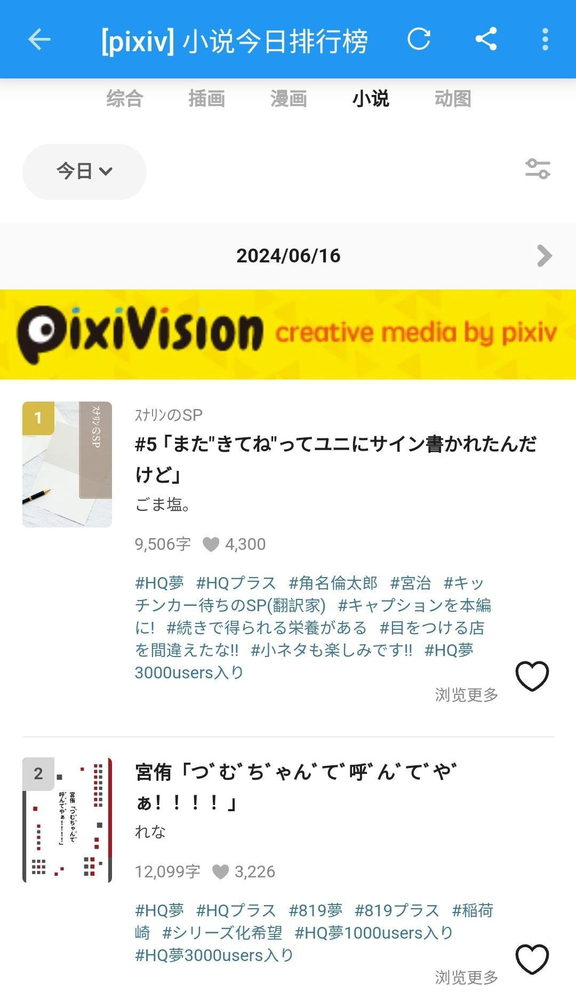


###  ➕ 添加小说
在阅读内部浏览器内打开 Pixiv 小说/系列小说页面，【刷新】，点击【加入书架】按钮添加小说到书架

- 小说正文页，添加小说到书架
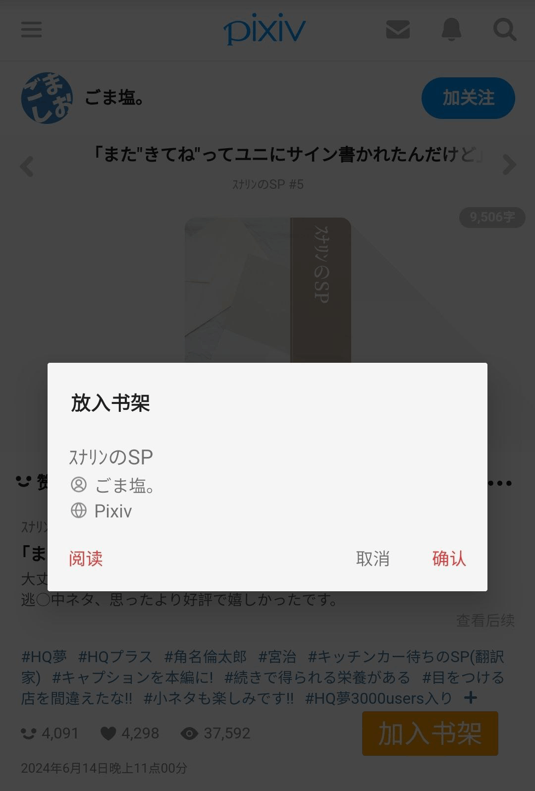

- 系列目录页，添加系列到书架
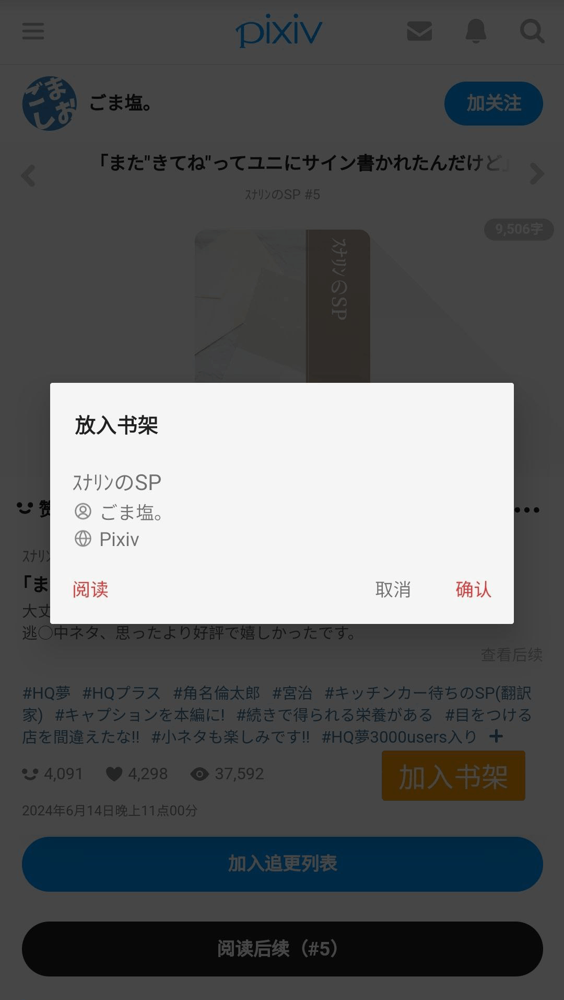


## 设置功能 {#Settings}
> [!NOTE]
>
> **⚙️ 书源设置 => 我的 - 书源管理 - Pixiv 小说 - 登录**


### ▶️ 基础设置
> [!NOTE]
>
> **⚙️ 书源设置 => 我的 - 书源管理 - Pixiv 小说 - 登录**


> [!IMPORTANT]
> 
> **⚠️ 登录账号/退出账号 都要使用按钮**


- **🅿️ 登录账号：登录 Pixiv 账号**
- ⚙️ 账号设置：设置 Pixiv 账号的浏览范围
- **🔙 退出账号：退出 Pixiv 账号，并清理缓存**
- 
- **🆙 更新书源：更新书源/更新订阅**
- 🔰 使用指南：打开 Github 文档(本页)
- 🐞 反馈问题：打开 Github Issues
- 
- **👀 书源设置：显示/隐藏 书源设置按钮**
- **👀 发现设置：显示/隐藏 发现设置按钮**
- **✈️ 直连模式：直连模式（需登录账号）**


### ⚙️ 书源设置
> [!NOTE]
>
> **⚙️ 书源设置 => 我的 - 书源管理 - Pixiv 小说 - 登录**

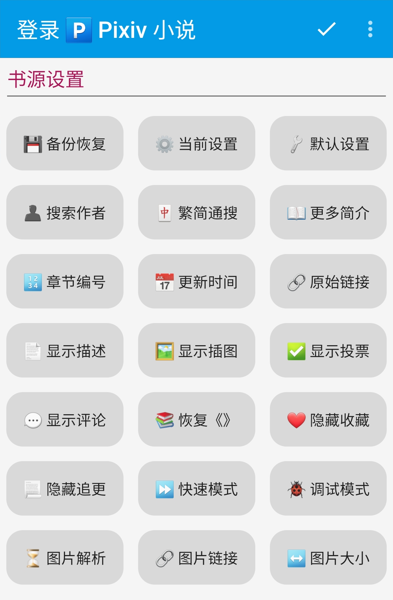
- ⚙️ 当前设置：显示当前设置
- 🔧 默认设置：恢复默认设置
- 👤 搜索作者：切换搜索关键词、模糊搜索作者
-
- 🀄 繁简通搜：搜索进行繁简转换（搜索作者、标签不转换）
- 📖 更多简介：详情显示更多简介
- 📅 更新时间：目录显示更新时间
-
- 🔗 原始链接：显示原始链接
- 📚 恢复《》：恢复正文内被替换的书名号《》
- 🖼️ 显示描述：章首显示描述
-
- 💬 显示评论：章尾显示评论
- ❤️ 隐藏收藏：搜索发现 显示/隐藏 收藏单篇小说
- 📃 隐藏追更：搜索发现 显示/隐藏 追更系列小说
-
- ⏩ 快速模式：开启快速模式（关闭影响搜索速度的功能）
- 🐞 调试模式：开启调试模式
- 🔍 搜索说明：显示搜索说明


### 🔍 发现设置
> [!NOTE]
>
> **🔍 发现设置 => 我的 - 书源管理 - Pixiv 小说 - 登录**

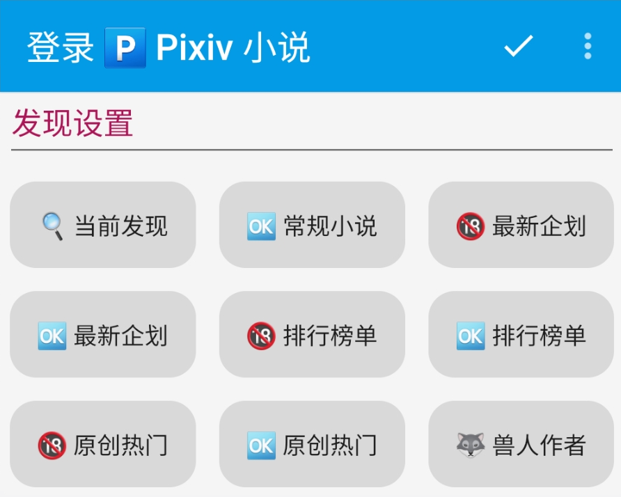

- 🔍 当前发现：显示当前发现设置
- ⏺️ 其他按钮：发现 显示/隐藏 对应功能
- 🐺 兽人小说：发现 显示/隐藏 兽人小说；优化兽人小说搜索作者


## 互动功能 {#Interact}
### ⏺ 互动功能
> [!NOTE]
>
> **⏺ 互动功能 => 书架 - 小说阅读界面 - Pixiv 小说 - 登录**

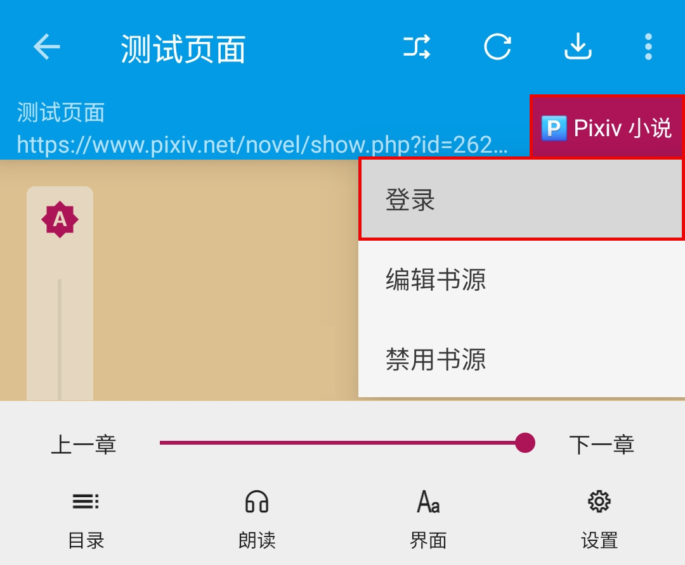

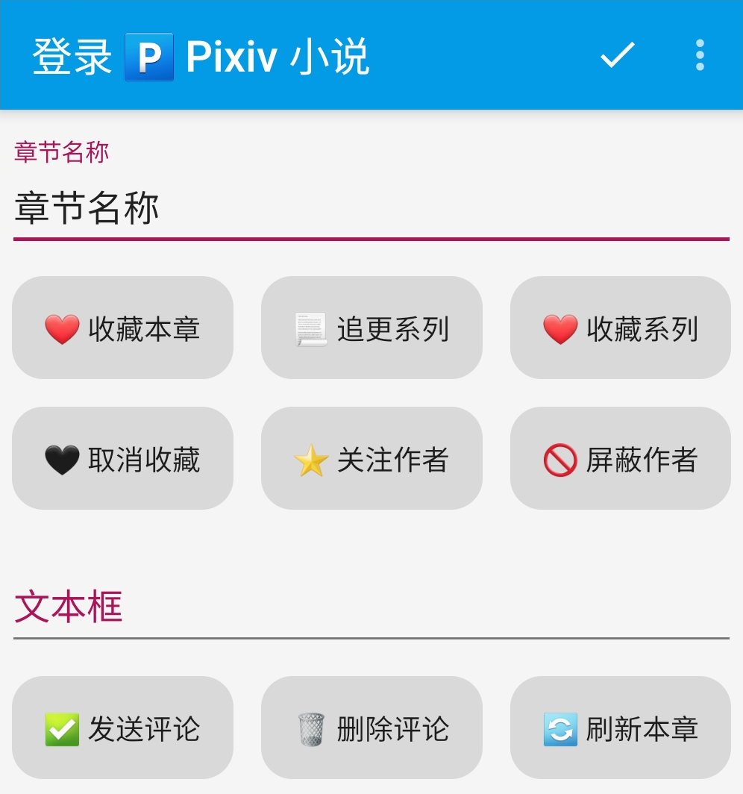

- **❤️ 收藏本章：添加公开收藏、切换私密收藏**
- **📃 追更系列：追更系列、取消追更**
- **❤️ 收藏系列：公开收藏系列内的每篇小说（可追加）**
-
- **🖤 取消收藏：短按取消收藏本章、长按取消收藏系列**
- **⭐️ 关注作者：关注作者（按钮 & 浏览器）、取消关注**
- **🚫 屏蔽作者：屏蔽作者、取消屏蔽（本地）**
-
- **✅ 发送评论：当前章节下发送评论（自动拆分超长评论）**
- **🗑 删除评论：当前章节下删除评论（支持批量删除评论）**
- **🔄 刷新本章：刷新章节正文（以及评论）**


### 🚫 屏蔽作者
> [!NOTE]
>
> **⏺ 互动功能 => 书架 - 小说阅读界面 - Pixiv 小说 - 登录**
> 
> **🚫 屏蔽作者：屏蔽作者、取消屏蔽（本地）**


> [!TIP]
> 
> **1️⃣ 点击按钮【🚫 屏蔽作者】，屏蔽当前小说的作者** 
> 
> **2️⃣ 文本框输入作者ID，点击按钮【🚫 屏蔽作者】，屏蔽指定作者**


### 🚫 屏蔽标签 & 屏蔽描述
> [!NOTE]
>
> **⏺ 互动功能 => 书架 - 小说阅读界面 - Pixiv 小说 - 登录**

- 1️⃣ 在登陆页面的【输入内容】输入内容（不需要`#`），点击【添加屏蔽】，添加至【标签屏蔽列表】或【描述屏蔽列表】

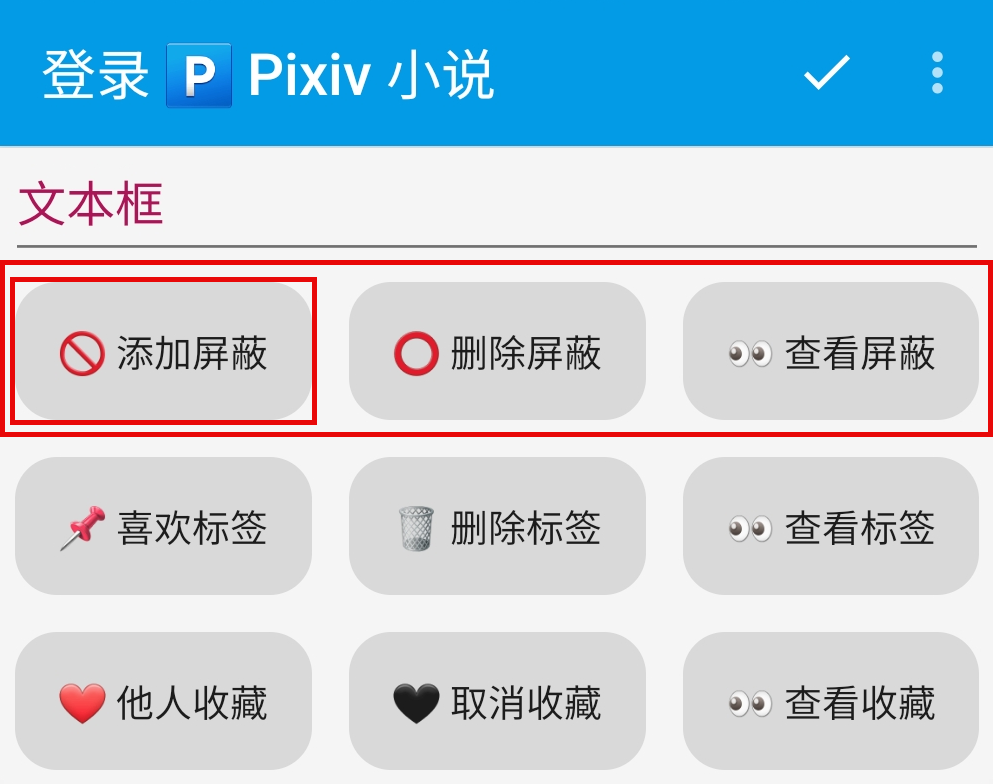

- 2️⃣ 添加屏蔽内容时，会提示具体的屏蔽列表

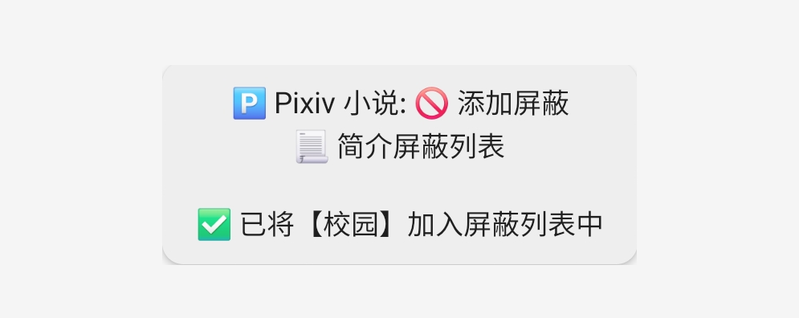

- 3️⃣ 点击【查看屏蔽】按钮，会切换屏蔽列表，并显示屏蔽内容
  
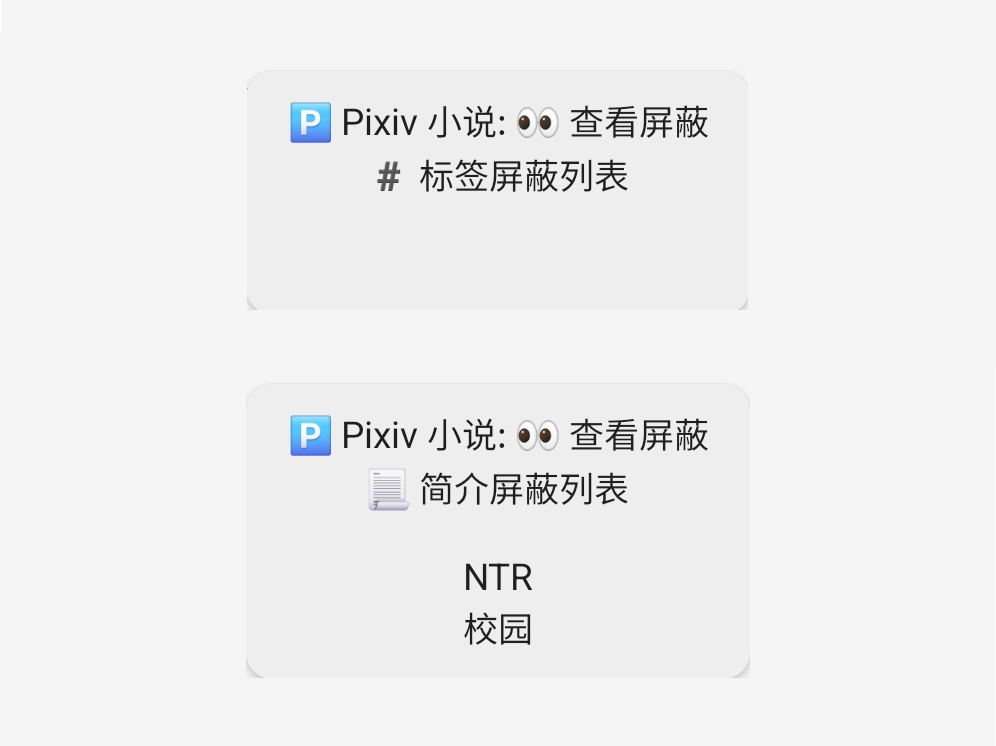


## 自定义发现 {#CustomizationDiscover}
### 📌 喜欢标签 {#LikeTags}
> [!NOTE]
>
> **⏺ 互动功能 => 书架 - 小说阅读界面 - Pixiv 小说 - 登录**

- 1️⃣ 在登陆页面的【输入内容】输入标签（不需要`#`），点击【喜欢标签】，添加至 发现页面的【喜欢标签】列表

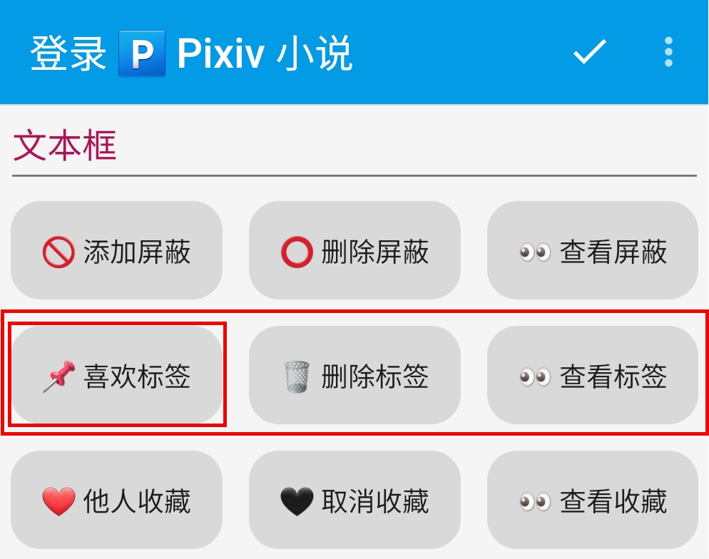

- 2️⃣ 打开发现页面，点击按钮，查看内容


- ▶️ 如未更新，请手动更新发现：发现 - 长按"Pixiv" - 刷新


### ❤️ 他人收藏 {#LikeAuthors}
> [!NOTE]
>
> **⏺ 互动功能 => 书架 - 小说阅读界面 - Pixiv 小说 - 登录**

- 1️⃣ 在登陆页面的【输入内容】输入作者ID（数字），点击【他人收藏】，添加至 发现页面的【他人收藏】列表

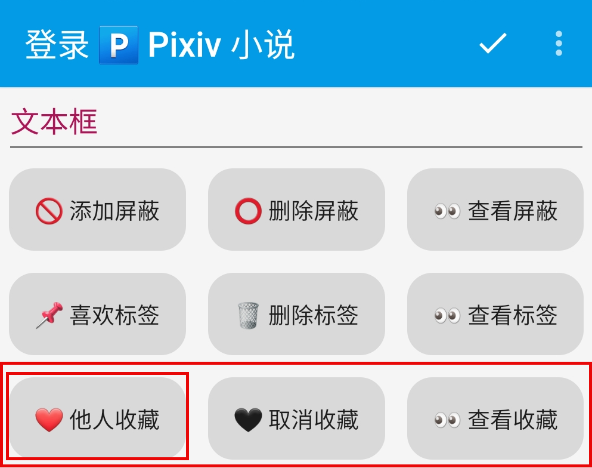
- 输入作者/用户ID，则会添加【指定作者/用户】
  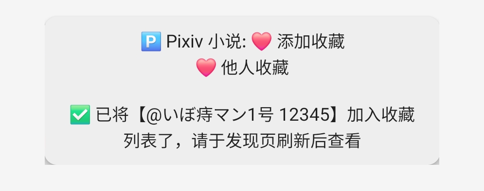
- 若未输入作者/用户ID，则会添加【当前小说的作者】

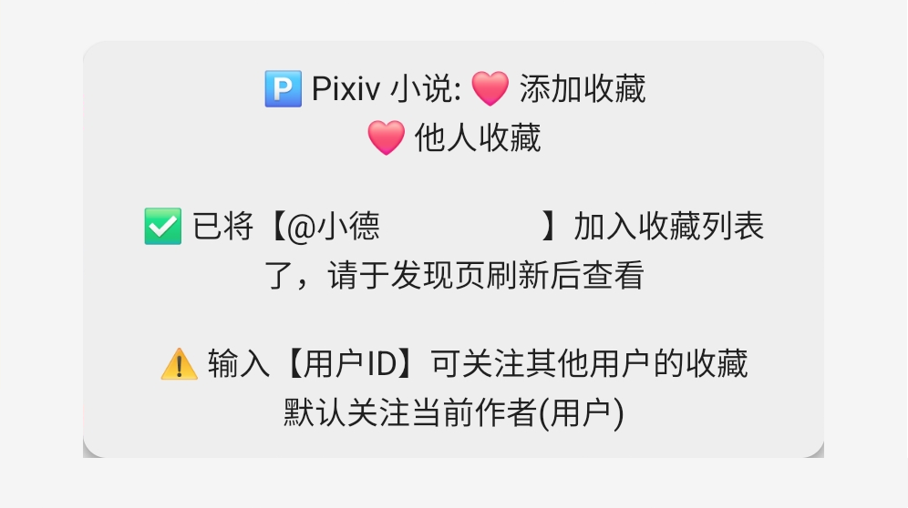
- 2️⃣ 打开发现页面，点击按钮，查看内容


- ▶️ 如未更新，请手动更新发现：发现 - 长按"Pixiv" - 刷新


<!--@include: CommonSuffix.md-->