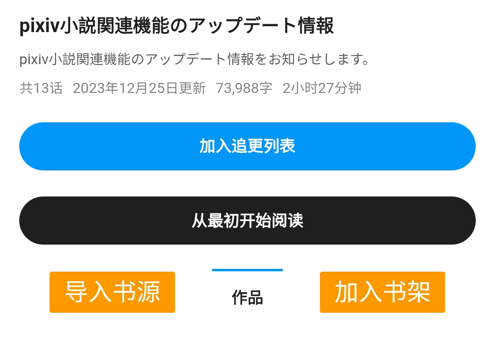

# Pixiv 书源的导入与使用

### [Pixiv](www.pixiv.net) 是以插图、漫画、小说为中心的艺术网站


## 本书源使用前提
1. 使用阅读 3.0 版本
2. 开启代理【必须】
3. 导入 Pixiv 的书源、订阅源
4. 登录 Pixiv 的账号【必须】
5. 开启 Pixiv R18 设置


## 〇、下载并安装阅读
### 1.下载阅读 3.0 版本
<details>
<summary> ⬇️ 下载阅读 </summary>

点击链接，下载安装包并安装，**推荐使用共存版**
> https://miaogongzi.lanzout.com/b01rgkhhe
> 
> 最新下载链接请查看 [下载阅读](./Download.md)


### 2.了解阅读功能与用法
> 请查看[阅读是什么软件？阅读简介](./ReadMe.md)
</details>


## 一、导入书源 & 订阅源
### 1.导入 Pixiv 书源
<details>
<summary> ➕ 导入书源 </summary>

【**开启代理**】后，复制下方的书源链接
```
https://raw.githubusercontent.com/windyhusky/PixivSource/main/pixiv.json
```


#### 1.1 打开【订阅】页面，点击【规则订阅】


#### 1.2 点击加号，粘贴链接，保存订阅


#### 1.3 点击相应订阅规则，导入并启用/更新书源


**首次点击【订阅规则】 即可导入**


**【系列书源】与【单篇书源】功能完全一致，导入/启用其中一个即可**

**导入之后，再次点击则会检查更新**

> 更多导入方法请查看[如何获取书源？导入书源？](./ImportBookSource.md)
</details>


### 2.导入 Pixiv 订阅源
<details>
<summary> ➕ 导入订阅源 </summary>

【**开启代理**】后，复制下方的订阅源链接
```
https://raw.githubusercontent.com/windyhusky/PixivSource/main/btsrk.json
```

#### 2.1 打开【订阅】页面，点击【规则订阅】


#### 2.2 点击加号，更改规则类型，粘贴链接，保存订阅
**注意这里要把【书源】改成【订阅源】**


#### 2.3 点击相应订阅规则，导入并启用/更新书源


**首次点击【订阅规则】 即可导入**


**导入之后，再次点击则会检查更新**

> 更多导入方法请查看[如何导入订阅源](./ImportRssSource.md)
</details>


## 二、登录账号
Pixiv 及正版付费书源，需要登录账号才能阅读相关小说
### 1. 登录 Pixiv 账号

<details>
<summary> 🅿️ 登录 Pixiv 账号 </summary>

#### 1.1 开启代理工具
此处略过，请自行学习，**最好开启【全局代理】**


#### 1.2 登录 Pixiv 账号
**我的-书源管理-点击 Pixiv 书源右侧三点菜单-登录**


**登录你的账号，登录成功后，点击右上角的对勾**


**如果需要验证码，请更换代理，或过段时间再次尝试**
</details>


### 2. 开启 Pixiv 的 R18 设置
#### 如果你已经开启了，则可以跳过这一步
<details>
<summary> 🔞 修改 Pixiv 浏览范围 </summary>

**再次点击登录，滑动屏幕，点击头像，再次点击头像，编辑个人资料**


#### 2.1 编辑出生年份
[Pixiv 个人资料](https://www.pixiv.net/settings/profile) - 编辑个人资料 - 出生年份

出生年份改到：**2000年或2000年之前**，确保你的年龄在20岁及以上


#### 2.2 修改作品浏览范围
[Pixiv 设置](https://www.pixiv.net/settings/viewing) - 浏览与显示 - 年龄限制作品

根据自己情况选择显示：R18 作品 与 R18G 作品

不知道二者区别的可以查看这篇文档 [作品评级是什么？](https://www.pixiv.help/hc/zh-cn/articles/39125149371289-%E4%BD%9C%E5%93%81%E8%AF%84%E7%BA%A7%E6%98%AF%E4%BB%80%E4%B9%88)


</details>


## 三、添加小说，尽情使用
### 1.阅读内部搜索
<details>
<summary> 🔎 搜索小说 </summary>

✅ 支持搜索：小说名称、系列小说名称、作者名称、小说标签、小说链接


</details>


### 2.发现更多小说
<details>
<summary> ⭐️ 常规功能 </summary>


</details>


<details>
<summary> 👑 小说排行 </summary>


  - ✅ R18小说排行榜(🔞 排行榜)
  - ✅ 一般小说排行榜(🆗 排行榜)
    >（默认隐藏，可在书源设置中修改`SHOW_GENERAL_RANK`)，更改后需要在发现页面刷新分类（发现：长按"Pixiv"，刷新
</details>


<details>
<summary> ❤️ 他人收藏 </summary>

发现 - 长按"Pixiv" - 编辑 - 右上角菜单 - 设置源变量


设置源变量：输入作者ID，一行一个，可添加作者名，保存
```
12345 // 作者A
67890 # 作者B
```
发现：长按"Pixiv"，刷新，查看他人收藏


</details>


### 3.添加网址
<details>
<summary> 🔗 添加网址 </summary>
书架 - 菜单 - 添加网址 - 粘贴小说链接，可以同时添加多个小说的链接


支持 Pixiv 多个格式的网址链接：
```
Pixiv 小说链接
https://www.pixiv.net/novel/show.php?id=20063566

Pixiv 系列小说链接
https://www.pixiv.net/novel/series/8054073
```
无法添加的链接：
```
Pixiv App 小说分享链接（删掉#号即可正常添加）
测试页面 | 唐尼瑞姆 #pixiv https://www.pixiv.net/novel/show.php?id=20063566
```
</details>


### 4.订阅源添加小说
<details>
<summary> 🏠 订阅源 </summary>

#### 4.1 替代阅读搜索
受阅读所限，阅读内部搜索不可能完全支持 Pixiv 的全部搜索功能。网站的搜索功能更加全面


#### 4.2 替代阅读发现
阅读内部浏览器打开 Pixiv，即可使用 Pixiv 书源未完成的功能，如排行榜等功能


#### 4.3 添加小说至书架
在阅读内部浏览器内打开 Pixiv 小说/系列小说页面，【刷新】，点击【加入书架】按钮添加小说到书架

- 添加小说到书架


- 添加系列小说到书架

</details>


## 四、故障排查
> 详见：[故障排查与处理](./TroubleShoot.md)
<details>
<summary> 🐞 故障排查 </summary>

### 1.确定书源可以正常使用
书架页面，搜索 `R18` 测试书源能否正常使用，以及R18设置是否开启。

#### 如果没有搜索结果，请检查一下内容：
**⓪检查 Pixiv 书源是否导入**

**①检查 Pixiv 书源是否启用**

**②检查代理是否可用**

**③检查阅读是否走了代理**

**④检查网络是否可用**

**如果上述均无问题，但依然没有搜索结果，那就是书源需要更新了**


### 2.图片无法正常显示
#### 解决措施：关闭替换净化

</details>


## 本教程由兽人阅读频道 [@FurryReading](https://t.me/FurryReading) 提供
