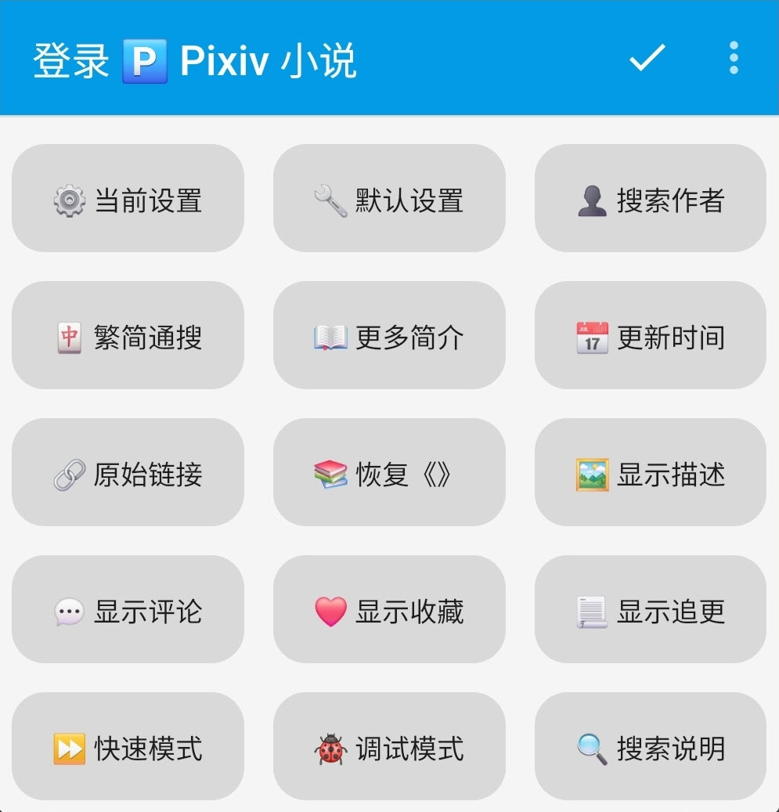

# Pixiv 书源的导入与使用

### [Pixiv](https://www.pixiv.net) 是以插图、漫画、小说为中心的艺术网站


## 本书源使用前提
1. 使用阅读 3.0 版本
2. 开启代理【必须】
3. 导入 Pixiv 的书源、订阅源
4. 登录 Pixiv 的账号【必须】
5. 开启 Pixiv R18 设置


## 〇、下载并安装阅读
### 1.下载阅读 3.0 版本
<details>
<summary> ⬇️ 下载阅读 </summary>

点击链接，下载安装包并安装，**推荐使用共存版**
> https://miaogongzi.lanzout.com/b01rgkhhe
> 
> 最新下载链接请查看 [下载阅读](./Download.md)


### 2.了解阅读功能与用法
> 请查看[阅读是什么软件？阅读简介](./ReadMe.md)
</details>


## 一、导入书源 & 订阅源
### 1.导入 Pixiv 书源
<details><summary> ➕ 导入书源 </summary>

【**开启代理**】后，复制下方的书源链接
```
https://raw.githubusercontent.com/windyhusky/PixivSource/main/pixiv.json
```


#### 1.1 打开【订阅】页面，点击【规则订阅】


#### 1.2 点击加号，粘贴链接，保存订阅


#### 1.3 点击相应订阅规则，导入并启用/更新书源


**首次点击【订阅规则】 即可导入**


**【主用书源】与【备用书源】功能基本一致，启用其中一个即可**

**导入之后，再次点击则会检查更新**

> 更多导入方法请查看[如何获取书源？导入书源？](./ImportBookSource.md)
</details>


### 2.导入 Pixiv 订阅源
<details><summary> ➕ 导入订阅源 </summary>

【**开启代理**】后，复制下方的订阅源链接
```
https://raw.githubusercontent.com/windyhusky/PixivSource/main/btsrk.json
```

#### 2.1 打开【订阅】页面，点击【规则订阅】


#### 2.2 点击加号，更改规则类型，粘贴链接，保存订阅
**注意这里要把【书源】改成【订阅源】**


#### 2.3 点击相应订阅规则，导入并启用/更新书源


**首次点击【订阅规则】 即可导入**


**导入之后，再次点击则会检查更新**

> 更多导入方法请查看[如何导入订阅源](./ImportRssSource.md)
</details>


## 二、登录账号
Pixiv 及正版付费书源，需要登录账号才能阅读相关小说
### 1. 登录 Pixiv 账号

<details><summary> 🅿️ 登录 Pixiv 账号 </summary>

#### 1.1 开启代理工具
此处略过，请自行学习，**最好开启【全局代理】**


#### 1.2 登录 Pixiv 账号
**我的 - 书源管理 - 菜单 - 登录 - 登录账号**


**登录你的账号，登录成功后，点击右上角的对勾**


**如果需要验证码，请更换代理，或过段时间再次尝试**
</details>


### 2. 开启 Pixiv 的 R18 设置
#### 如果你已经开启了，则可以跳过这一步
<details><summary> 📆 编辑出生年份 </summary>

#### 2.1 编辑出生年份
**再次点击登录，滑动屏幕，点击头像，再次点击头像，编辑个人资料**

[Pixiv 个人资料](https://www.pixiv.net/settings/profile) - 编辑个人资料 - 出生年份

出生年份改到：**2000年或2000年之前**，确保你的年龄在20岁及以上


</details>

<details><summary> 🔞 修改 Pixiv 浏览范围 </summary>

#### 2.2 修改作品浏览范围
**我的-书源管理-点击 Pixiv 书源右侧三点菜单-登录-账号设置**


[Pixiv 设置](https://www.pixiv.net/settings/viewing) - 浏览与显示 - 年龄限制作品

根据自己情况选择显示：R18 作品 与 R18G 作品

不知道二者区别的可以查看这篇文档 [作品评级是什么？](https://www.pixiv.help/hc/zh-cn/articles/39125149371289-%E4%BD%9C%E5%93%81%E8%AF%84%E7%BA%A7%E6%98%AF%E4%BB%80%E4%B9%88)


</details>


## 三、添加小说，尽情使用
### 1.阅读内部搜索
<details><summary> 🔍 搜索小说 </summary>

#### 1.0 搜索小说
✅ 默认搜索：同时搜索小说名称、系列小说名称、标签、作者

</details>


<details><summary> 🀄️ 繁简通搜 </summary>

#### 1.1 繁简通搜
- 搜索【名称】和【标签】时，【默认】进行繁简转换，同时返回繁体简体小说内容（可在书源设置中修改）
- 【搜索作者】不转换，返回小说不转换


</details>


<details><summary> ➖ 排除标签 </summary>

#### 1.2 排除标签（格式：`标签1 -标签2` `标签1 -标签2 -标签3`）
- 使用减号 `-` 在搜索结果中，排除不想看的的标签
- **每个排除的标签前都需要添加减号** `-`
- 由 Pixiv 官方提供支持


</details>


<details><summary> 👤 作者专搜 </summary>

#### 1.3 作者专搜（格式：`@作者名称`）
- 仅搜索作者；不进行繁简转换
- `@` 为标记符，打出1个即可，例如：`@pixiv事務局` 
- 暂时不支持与 `#` 同时使用，可与【字数过滤】同时使用


</details>


<details><summary> #️⃣ 标签专搜 </summary>

#### 1.4 标签专搜（格式：`#标签1` `#标签1 标签2 `）
- 仅搜索标签、小说名称；多个标签空格间隔，【默认】进行繁简转换
- `#` 为标记符，打出1个即可，例如：`#校园` `#校园 纯爱` `#校园 纯爱 BG`
- 暂时不支持与 `@` 同时使用，可与【排除标签】【字数过滤】同时使用


</details>


<details><summary> ⏬ 字数过滤 </summary>

#### 1.5 字数过滤（格式：`关键词 字数3k`）
- 字数限制规则：`3k 3k5 3w 3w5`【注意`k`与`w`均为小写】
- 例如：`校园 字数3k` `校园 纯爱 字数3k`
- 可与【标签专搜】【排除标签】同时使用


- 可与【搜索作者】同时使用


</details>


### 2.发现更多小说
<details><summary> ⭐️ 常规发现 </summary>

#### 2.0 常规发现

</details>


<details><summary> 🆕 最新企划约稿 </summary>

#### 2.1 最新 企划 约稿

- ✅ R18 小说 (🆕 最新 企划 约稿 💰，默认显示)
- ☑️ 一般小说 (✅ 最新 企划 约稿 ✅，默认隐藏)
  > 可在书源设置中修改`SHOW_GENERAL_RANK`，更改后需要在发现页面刷新分类（发现，长按"Pixiv"，刷新）
</details>


<details><summary> 👑 小说排行 </summary>

#### 2.2 小说排行

  - ✅ R18 小说 (👑 排行榜单 👑，默认显示)
  - ☑️ 一般小说 (🏆 排行榜单 🏆，默认隐藏)
    > 可在书源设置中修改`SHOW_GENERAL_RANK`，更改后需要在发现页面刷新分类（发现，长按"Pixiv"，刷新）
</details>


<details><summary> 🔥 原创热门（默认隐藏） </summary>

#### 2.3 原创热门（默认隐藏）

- ☑️ R18 小说 (🔥 原创热门 🔥，默认隐藏)
  > 可在书源设置中修改`SHOW_R18_GENRE`，更改后需要在发现页面刷新分类（发现，长按"Pixiv"，刷新）
- ☑️ 一般小说 (❤️‍🔥 原创热门 ❤️‍🔥，默认隐藏)
  > 可在书源设置中修改`SHOW_GENERAL_GENRE`，更改后需要在发现页面刷新分类（发现，长按"Pixiv"，刷新）
</details>


<details><summary> 🆙 更新书源（同下） </summary>

#### 2.4 更新书源

点击按钮【🆙 更新】以更新书源/更新订阅
- Jsdelivr CDN 更新有延迟
- Github 更新需代理
- Godeberg 更新免代理
</details>


### 3.添加网址
<details>
<summary> 🔗 添加网址 </summary>
书架 - 菜单 - 添加网址 - 粘贴小说链接，可以同时添加多个小说的链接


支持 Pixiv 多个格式的网址链接：
```
Pixiv 小说链接
https://www.pixiv.net/novel/show.php?id=20063566

Pixiv 系列小说链接
https://www.pixiv.net/novel/series/8054073
```
无法添加的链接：
```
Pixiv App 小说分享链接（删掉#号即可正常添加）
测试页面 | 唐尼瑞姆 #pixiv https://www.pixiv.net/novel/show.php?id=20063566

Pixiv 作者页面
https://www.pixiv.net/users/16721009
```
</details>


### 4.订阅源
<details><summary> ⬇️ 导入书源 </summary>

#### 4.0 导入书源


- 点击按钮，导入书源；再次点击，则可更新书源
- 此处使用的是 Jsdelivr CDN ，更新有延迟


</details>


<details><summary> 🔍 站内搜索 </summary>

#### 4.1 替代阅读搜索
Pixiv 网站的搜索功能更加全面


#### 4.1 替代阅读发现
使用 Pixiv 书源未完成/隐藏功能

</details>


<details><summary> ➕ 添加小说 </summary>

#### 4.3 添加小说至书架
在阅读内部浏览器内打开 Pixiv 小说/系列小说页面，【刷新】，点击【加入书架】按钮添加小说到书架

- 小说正文页，添加小说到书架


- 系列目录页，添加系列到书架

</details>


### 4.订阅源 登录界面
<details><summary> 🅿️ 账号功能（同下） </summary>

#### 4.4 账号功能
- ⚠️ 登录/退出账号都要使用按钮
- ⚠️ 订阅源登账号录后，书源最好也登录一次


- 🅿️ 登录账号：登录 Pixiv 账号，并获取 cookie 和 csfrToken
- ⚙️ 账号设置：Pixiv 的浏览范围设置
- 🔙 退出账号：退出 Pixiv 账号，并清理 cookie 和 csfrToken
</details>


<details><summary> 📢 书源帮助（同下） </summary>

#### 4.5 书源帮助

- ⭐️ 收藏项目：打开 Github 项目首页
- 🔰 使用指南：打开 Github 文档(本页)
- 🐞 反馈问题：打开 Github Issue
</details>


<details><summary> 🆙 更新书源（同上） </summary>


点击按钮【🆙 更新】以更新书源/更新订阅
- Jsdelivr CDN 更新有延迟
- Github 更新需代理
- Godeberg 更新免代理
</details>


<details><summary> ❤️ 他人收藏（订阅源 源变量，同下）</summary>

#### 4.7 他人收藏（Pixiv 首页 订阅源）
详见 
1️⃣ 订阅 - 长按订阅源 - 编辑 - 菜单 - 设置源变量


2️⃣ 设置源变量：输入作者ID，一行一个，可添加作者名，保存
```
12345 // 作者A
67890 # 作者B
```
3️⃣ 导入：打开订阅源 - 菜单 - 登录 - 点击 ❤️ 他人收藏，同步数据


4️⃣ 更新：发现 - 长按"Pixiv" - 刷新 - 查看他人收藏


</details>


### 5.书源 登录界面
<details><summary> 🅿️ 账号功能（同上） </summary>

#### 5.0 账号功能
- ⚠️ 登录/退出账号都要使用按钮


- 🅿️ 登录账号：登录 Pixiv 账号，并获取 cookie 和 csfrToken
- ⚙️ 账号设置：Pixiv 的浏览范围设置
- 🔙 退出账号：退出 Pixiv 账号，并清理 cookie 和 csfrToken
</details>


<details><summary> 📢 书源功能（同上） </summary>

#### 5.1 书源功能

- 🆙 更新书源：更新书源/更新订阅(同上)
- 🔰 使用指南：打开 Github 文档(本页)
- 🐞 反馈问题：打开 Github Issue
</details>


<details><summary> 📃 小说功能 </summary>

#### 5.2 小说功能

- ❤️ 公开收藏：公开收藏、取消收藏
- ㊙️ 私密收藏：私密收藏、取消收藏
- 📌 当前章节：显示当前章节信息
- 📃 追更系列：追更系列、取消追更
- ⭐️ 关注作者：关注作者、取消关注
- 🚫 屏蔽作者：屏蔽作者、取消屏蔽（本地）
- ✅ 发送评论：当前章节下发送评论
- 🗑 删除评论：当前章节下删除评论（随后可以手动刷新正文，更新评论）
- 🧹 清除缓存：清除当前章节的正文缓存（随后可以手动刷新正文，更新正文）
- ⤴️ 分享章节：打开当前章节的网址
- ⤴️ 分享系列：打开当前系列的网址（如无系列则打开章节网址）
- ⤴️ 分享作者：打开当前作者的网址
</details>


<details><summary> ⚙️ 书源设置 </summary>

#### 5.3 书源设置

- ⚙️ 当前设置：显示当前设置
- ⚙️ 默认设置：恢复默认设置
- 👤 搜索作者：默认搜索作者
- 🀄 繁简通搜：搜索进行繁简转换（搜索作者不转换）
- 📖 更多简介：详情显示更多简介
- 📅 更新时间：目录显示更新时间
- 🔗 原始链接：显示原始链接
- 📚 恢复《》：恢复正文内被替换的书名号《》
- 🖼️ 显示描述：章首显示描述
- 💬 显示评论：章尾显示评论
- ⏩ 快速模式：开启快速模式（关闭**默认搜索作者等**影响搜索速度的功能）
- 🐞 调试模式：开启调试模式
- 🔍 搜索说明：显示搜索说明
</details>


### 6.设置源变量
<details><summary> 🚫 屏蔽作者（书源 源变量）</summary>

#### 6.1 屏蔽作者(本地)
1️⃣ 编辑源变量：
- 我的 - 书源管理 - 编辑 - 菜单 - 设置源变量
- 发现 - 长按书源 - 编辑 - 菜单 - 设置源变量
- 正文 - 点击书源 - 编辑 - 菜单 - 设置源变量


2️⃣ 设置源变量：输入作者ID，【英文逗号】间隔
```
12345, 67890
```
3️⃣ 搜索任意小说，同步屏蔽作者数据

</details>

<details><summary> ❤️ 他人收藏（订阅源 源变量）</summary>

#### 6.2 查看他人收藏（Pixiv 首页 订阅源）
1️⃣ 订阅 - 长按订阅源 - 编辑 - 菜单 - 设置源变量


2️⃣ 设置源变量：输入作者ID，一行一个，可添加作者名，保存
```
12345 // 作者A
67890 # 作者B
```
3️⃣ 导入：打开订阅源 - 菜单 - 登录 - 点击 ❤️ 他人收藏，同步数据


4️⃣ 更新：发现 - 长按"Pixiv" - 刷新 - 查看他人收藏


</details>


## 四、故障排查
> 详见：[故障排查与处理](./TroubleShoot.md)
<details>
<summary> 🐞 故障排查 </summary>

### 1.确定书源可以正常使用
书架页面，搜索 `R18` 测试书源能否正常使用，以及R18设置是否开启。

#### 如果没有搜索结果，请检查一下内容：
**⓪检查 Pixiv 书源是否导入**

**①检查 Pixiv 书源是否启用**

**②检查代理是否可用**

**③检查阅读是否走了代理**

**④检查网络是否可用**

**如果上述均无问题，但依然没有搜索结果，那就是书源需要更新了**


### 2.图片无法正常显示
#### 解决措施：关闭替换净化

</details>


## 本教程由兽人阅读频道 [@FurryReading](https://t.me/FurryReading) 提供
