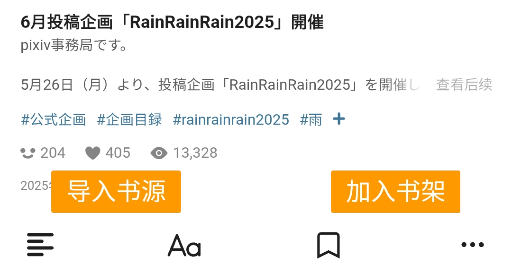

## [Pixiv 书源的导入与使用](https://telegra.ph/FurryNovelsReading-01-04-07)

> Pixiv 書源的導入與使用（繁體版）
> https://telegra.ph/FurryNovelsReading-02-04-07

Pixiv 是以插图、漫画、小说为中心的允许 R18 内容的艺术网站


### 本书源使用前提
1. 使用阅读 3.0 版本
2. 开启代理【必须】
3. 导入 Pixiv 的书源
4. 登录 Pixiv 的账号【必须】
5. 开启 Pixiv R18 设置 

**注：以上是使用阅读看 Pixiv 的 R18 小说的充要条件**

**如若不看 R18 小说，则可以忽略 4, 5 两条要求**


## 一、导入书源/订阅源

### 0.下载阅读 3.0 版本

点击链接，下载安装包并安装，**推荐使用共存版**

https://miaogongzi.lanzout.com/b01rgkhhe

### 1.了解阅读功能与用法

请查看[阅读是什么软件？阅读简介](./Legado.md)

### 2.导入 Pixiv 的书源&订阅源
#### 2.1导入 Pixiv 的书源
请查看[如何获取书源？导入书源？](./Import.md)

>https://raw.githubusercontent.com/windyhusky/PixivSource/main/pixiv.json
> https://cdn.jsdelivr.net/gh/windyhusky/PixivSource@main/pixiv.json


#### 2.2导入 Pixiv 的订阅源
请查看[如何网络导入订阅源](./Import2.md)

> https://raw.githubusercontent.com/windyhusky/PixivSource/main/btsrk.json
> https://cdn.jsdelivr.net/gh/windyhusky/PixivSource@main/btsrk.json


### 3.登录Pixiv账号

正版付费书源，以及Pixiv这种，都是需要登录账号的才能正常观看的相关内容的。

#### 3.1开启代理工具

此处略过，请自行学习，**最好开启【全局代理】**

#### 3.2登录Pixiv账号

我的-书源管理-点击 Pixiv 书源右侧三点菜单-登录


或者 我的-书源管理-编辑 Pixiv 书源-登录


**登录你的账号，登录成功后，点击右上角的对勾**


**如果需要验证码，请更换代理，或过段时间再次尝试**


### 4.开启 Pixiv 的 R18 设置

#### 如果你之前已经开启了则可以跳过第4步

#### 4.1.修改设置

**再次点击登录，滑动屏幕，点击头像，选择设置**

**请注意，最好使用【电脑版网页】进行此项设定。**

阅读内部打开一般就是电脑版网页


#### ①[Pixiv 个人资料设置](https://www.pixiv.net/setting_profile.php) - 个人资料内容 - 出生年份

出生年份改到：**2000年或2000年之前**

确保你的年龄在20及以上


#### ②[Pixiv 用户设置](https://www.pixiv.net/setting_user.php) - 基本设定 - 浏览限制

根据自己情况选择显示：R18 作品与 R18G 作品

不知道二者区别的可以自行搜索后了解


#### 4.2.手机页面(略)

Pixiv 的 APP 内设置只能修改【出生年份】

Pixiv 的手机版网页只能修改【浏览限制】

手机浏览器登录P站后，可以开启【桌面版网站】修改，这里不在复述。


## 二、添加小说，尽情使用
### 1.阅读内部搜索
支持搜索小说名称、系列小说名称（使用系列小说书源）、作者名称、小说标签


### 2.发现更多小说
发现：关注作者、追更列表、推荐小说、收藏小说


### 3.添加网址
首页打开【添加网址】，粘贴小说链接


(这里懒得换图片了)

此处使用正则匹配网址，支持 Pixiv 多个域名多个格式的网址链接

正则规则：
`(https?://)?(www.)?pixiv.net/(ajax/|)novel/.*`
```
【需要代理】Pixiv 小说链接
https://www.pixiv.net/novel/show.php?id=20063566

【需要代理】Pixiv 系列小说链接
https://www.pixiv.net/novel/series/8054073

【需要代理】Pixiv 小说 ajax 请求链接
https://www.pixiv.net/ajax/novel/20063566
```


### 4.订阅源添加小说
导入 Linpx 订阅源，配合书源使用体验更好
#### 4.1 替代阅读搜索
受阅读设计的限制，阅读内部搜索不可能完全支持 Pixiv 的搜索功能。网站的搜索功能更加全面。


#### 4.2 替代阅读发现
阅读内部浏览器内打开 Pixiv，即可使用 Pixiv 书源未完成的功能，如排行榜等功能


#### 4.3 添加小说至书架
在阅读内部浏览器内打开 Pixiv 小说/系列小说页面，【刷新】，点击【加入书架】按钮添加小说到书架

添加小说到书架

添加系列小说到书架

## 三、故障排查
### 1.确定书源可以正常使用
回到主页，点击【**放大镜图标】**，搜索【龙胶危机】测试书源能否正常使用，以及R18设置是否打开。

#### A.如果搜索结果不唯一，说明大功告成！


#### B.如果只有这一个搜索结果


说明你的R18设置没有打开，请再回到第4步修改相关设置


#### 3.如果没有搜索结果，请检查一下内容：
**⓪检查 Pixiv 书源是否导入**

**①检查 Pixiv 书源是否启用** 

**②检查代理是否可用**  

**③检查阅读软件是否走了代理**

**④检查网络是否可用**

**如果上述均无问题，但依然没有搜索结果，那就是书源需要更新了**


### 2.图片无法正常显示
#### 解决措施：关闭替换净化


## 本教程由兽人阅读频道 [@FurryReading](https://t.me/FurryReading) 提供
