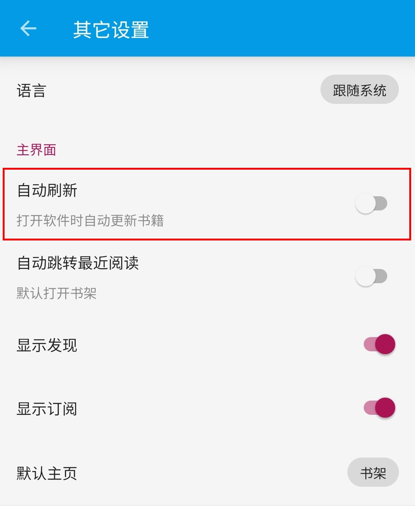
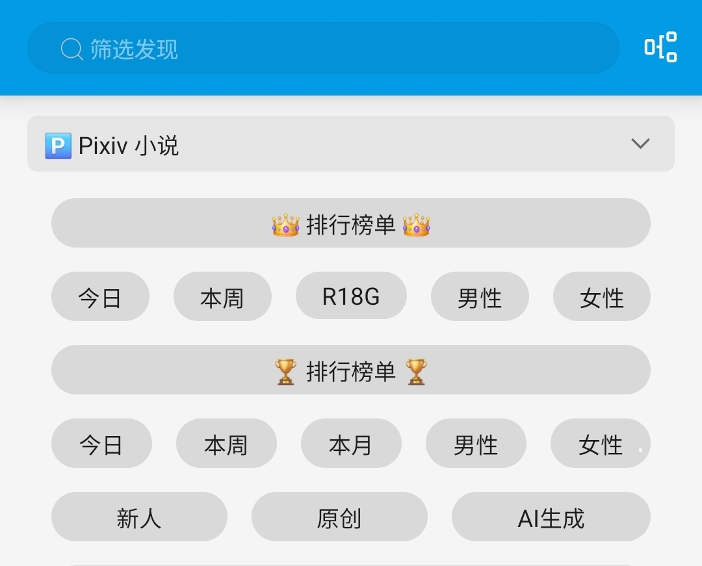
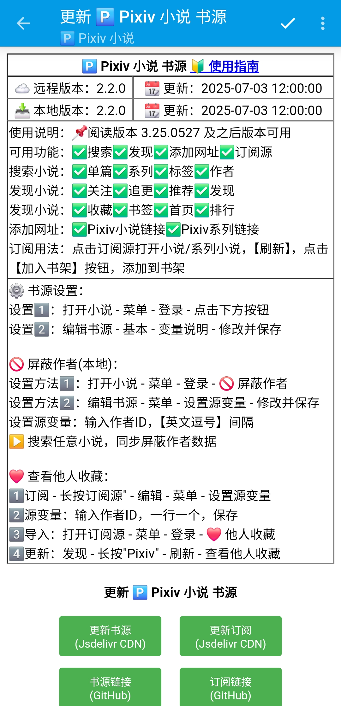

<div align="center">

<br>

# Pixiv 书源指南
### 🅿️ [开源阅读](https://github.com/gedoor/legado) Pixiv 书源
#### ✈️ 频道 [@PixivSource](https://t.me/PixivSource)
#### ☕ [书源项目打赏名单](./Sponsor.md)
</div>


> [!TIP]
> 
> **从未使用过【开源阅读】的读者可以看这篇指南：**
> [✨臻享阅读](BetterExperience.md)
 

## [Pixiv](https://www.pixiv.net) 是以插图、漫画、小说为中心的艺术网站
### ⚠️ 使用须知 {#Notice}
> [!CAUTION] 危险！
> #### ⚠️ 使用本书源造成的一切损失均由【使用者】自行承担

> [!WARNING] 警告！
> #### ⚠️ 请勿在 Pixiv 平台宣传本项目（书源）
> <details><summary><strong> 📄 包括但不限于以下内容 </strong></summary>
>
>  - 项目名称：
>    - **Pixiv 书源**
>    - **PixivSource**
>  - 项目链接：
>    - https://github.com/DowneyRem/PixivSource
>    - https://github.com/windyhusky/PixivSource
>    - https://github.com/eigeen/PixivSourceProject
>  - 书源主页：
>    - https://downeyrem.github.io/PixivSource
>    - https://pixivsource.pages.dev
>  - 项目参与者链接：
>    - https://github.com/DowneyRem
>    - https://github.com/windyhusky
>    - https://github.com/eigeen
> </details>
> 
> #### 可能会触发 shadow ban 限制（大）部分功能，严重的甚至会封号


> [!IMPORTANT] 重要  
> #### ⚠️ 不建议在书架上添加过多小说（超过100篇）
> #### 否则手动刷新时，可能会触发请求限制，严重的甚至封号


### ⬇️ 下载阅读 {#DownloadLegado}
> [!IMPORTANT] 重要
>
> 点击链接，下载 **【阅读 Plus】** 安装包并安装软件
>
> https://loyc.xyz/c/legado.html#download
>
> **苹果设备及更多兼容软件详见：** [下载阅读](./Download.md)


### 🚀 导入书源 & 订阅源 {#ImportSources}
> [!IMPORTANT] 重要
>
> **点击下方链接，一键导入书源、订阅源**
>
> 🅿️ [一键导入 Pixiv 书源](https://loyc.xyz/b/cdx.html?src=legado://import/importonline?src=https://cdn.jsdelivr.net/gh/DowneyRem/PixivSource@main/pixiv.json)
>
> 🐲 [一键导入 Pixiv 订阅源](https://loyc.xyz/b/cdx.html?src=legado://import/importonline?src=https://cdn.jsdelivr.net/gh/DowneyRem/PixivSource@main/btsrk.json)
> 
> **更多导入方法详见：** [如何导入书源](./ImportBookSource.md)


## 书源配置 {#BookSourceSet}
### 📡 开启代理 {#SetProxy}
> [!TIP]
> 
> 此处略过，**最好开启【全局代理】，确保阅读可用访问代理**


### 🅿️ 登录账号 {#LoginAccount}
> [!NOTE]
>
> **有账号的网站，在书源里登录账号才能阅读相关小说**

**我的 - 书源管理 - 菜单 - 登录 - 登录账号**


**登录你的账号，登录成功后，点击右上角的对勾**


> [!TIP]
> 
> **如果需要验证码，请更换代理，或过段时间再次尝试**


### ✈️ 直连模式（可选）{#IPDirect}
> [!TIP]
>
> **登录账号后，可在登录界面开启【直连模式】**


**直连模式，无需代理，即可获取小说**


**🚫 直连模式不可用功能：**
- 搜索：搜索作者
- 发现：书签、首页、排行榜
- 目录：显示原始链接

> [!NOTE]
>
> **直连功能参考自 [洛娅橙的阅读仓库](https://github.com/Luoyacheng/yuedu)**
>
> **其直连功能参考自 [PixEz Flutter](https://github.com/Notsfsssf/pixez-flutter)**


### 🔞 浏览范围（可选）{R18Settings}
#### 如果你已经开启了 R18 设置，则可以跳过这一步
<details><summary><strong>📆 编辑出生年份 </strong></summary>

**再次点击登录，滑动屏幕，点击头像，再次点击头像，编辑个人资料**

[Pixiv 个人资料](https://www.pixiv.net/settings/profile) - 编辑个人资料 - 出生年份

出生年份改到：**2000年或2000年之前**，确保你的年龄在20岁及以上


</details>

<details><summary><strong> 🔞 修改 Pixiv 浏览范围 </strong></summary>

**我的-书源管理-点击 Pixiv 书源右侧三点菜单-登录-账号设置**


[Pixiv 设置](https://www.pixiv.net/settings/viewing) - 浏览与显示 - 年龄限制作品

根据自己情况选择显示：R18 作品 与 R18G 作品

不知道二者区别的可以查看这篇文档 [作品评级是什么？](https://www.pixiv.help/hc/zh-cn/articles/39125149371289-%E4%BD%9C%E5%93%81%E8%AF%84%E7%BA%A7%E6%98%AF%E4%BB%80%E4%B9%88)


</details>


## 阅读设置 {#LegadoSettings}
### 💾 [备份恢复](WebdavBackup.md) {#WebdavBackup}
> [!IMPORTANT] 重要
>
> **【开源阅读】没有账号体系，不能在登录书源网站的同时恢复数据**
>
> **需要配置 Webdav 服务，才能从云端恢复数据**
>
> **详见：[备份与恢复](WebdavBackup.md)**


### 🔄 关闭刷新 {#TurnOffAutoRefresh}
> [!IMPORTANT] 重要
>
> **使用时，请在设置里，关闭自动刷新**
>
> **否则很容易触发触发请求限制，甚至封号**

**我的 - 其他设置 - 自动刷新**



> [!NOTE]
>
> **截止到这里，你基本上就拥有了完整的阅读体验了**
>
> **可以像是使用常规阅读软件一样，使用开源阅读了**


### ☁️ [远程书籍](RemoteBooks.md)（可选）{#RemoteBooks}
> [!TIP]
> 
> **使用支持 Webdav 的网盘，阅读网盘上的书籍**
>
> **详见：[远程书籍](RemoteBooks.md)**


## 全部功能 {#AddNovel}
### 🔍 搜索小说 {#SearchNovel}
<details><summary> 🔍 搜索小说 </summary>

**书架页面 - 放大镜 - 输入关键词 - 搜索小说**

- <details><summary> 🔍 搜索小说 </summary>

  #### 1.0 搜索小说
  ✅ 默认搜索：同时搜索小说名称、系列小说名称、标签
  
  </details>

- <details><summary> 🀄️ 繁简通搜 </summary>

  #### 1.1 繁简通搜
  - 【搜索】默认进行繁简转换，同时返回繁体简体小说内容（可在书源设置中关闭）
  - 【搜索作者 `@作者名称`】不转换
  - 【搜索标签 `#标签名称`】不转换
  - 返回小说内容不转换

  
  </details>

- <details><summary> ➖ 排除标签 </summary>

  #### 1.2 排除标签（格式：`标签1 -标签2` `标签1 -标签2 -标签3`）
  - 使用减号 `-` 在搜索结果中，排除不想看的的标签
  - **每个排除的标签前都需要添加减号**`-`
  - **减号前需加空格，减号后无需空格**
  - **由 Pixiv 官方提供支持**
  - 仅适用于单次搜索

  
  </details>

- <details><summary> ➕ 多选标签 </summary>

  #### 1.3 多选标签（格式：`标签1 or 标签2` `标签1 or 标签2 or 标签3`）
  - 使用 `or` 同时搜索多个标签（满足其一即可，也就是取并集）
  - **可相互替换的标签间添加` or `，前后需要空格间隔**
  - **由 Pixiv 官方提供支持**
  - 仅适用于单次搜索

  
  </details>

- <details><summary> 👤 作者专搜 </summary>

  #### 1.4 作者专搜（格式：`@作者名称`）
  - 仅搜索作者；不进行繁简转换
  - `@` 为标记符，打出1个即可，例如：`@pixiv事務局`
  - 可与【字数过滤】同时使用，格式：`@作者名称 字数3k`
  - 可与【标签专搜】同时使用，格式：`@作者名称 #标签`，筛选 `@作者` 的具有 `#标签` 的小说

  
  </details>

- <details><summary> #️⃣ 标签专搜 </summary>

  #### 1.5 标签专搜（格式：`#标签1` `#标签1 标签2 `）
  - 仅搜索标签、小说名称；多个标签空格间隔，【默认】不进行繁简转换
  - `#` 为标记符，打出1个即可，例如：`#校园` `#校园 纯爱` `#校园 纯爱 BG`
  - 可与【排除标签】【字数过滤】同时使用

  
  </details>

- <details><summary> ⏬ 字数过滤 </summary>

  #### 1.6 字数过滤（格式：`关键词 字数3k`）
  - 字数限制规则：`3k 3k5 3w 3w5`【注意`k`与`w`均为小写】
  - 例如：`校园 字数3k` `校园 纯爱 字数3k`
  - 可与【标签专搜】【排除标签】同时使用

  
  - 可与【搜索作者】同时使用

  
  </details>

- <details><summary> 🔝 高级搜索 </summary>

  #### 1.7 高级搜索
  上述搜索规则基本可以共同使用，~~发挥你的想象力，自由组合吧~~

  - 搜索`@作者`指定`#标签1`或`标签2`，排除`标签3`，筛选字数 3k 及以上的小说：
    - 格式：`@作者 #标签1 or 标签2 -标签3 字数3k`

  - 搜索 `#标签1`或`标签2`，排除`标签3`，筛选字数 3k 及以上的小说：
    - 格式：`#标签1 or 标签2 -标签3 字数3k`
  </details>
</details>


### ⭐️ 发现小说 {#DiscoverNovel}
<details><summary> ⭐️ 发现小说 </summary>

**发现页面 - 点击各按钮**
- <details><summary> ⭐️ 常规发现 </summary>

  #### 2.0 常规发现
  发现默认显示的内容
  
  </details>

- <details><summary> 🆕 最新企划约稿 </summary>

  #### 2.1 最新 企划 约稿
  
  > [!TIP]
  >
  > - ✅ R18 小说 (🆕 最新 企划 约稿 💰，默认显示)
  > - ☑️ 一般小说 (✅ 最新 企划 约稿 ✅，默认隐藏)
  > 
  > 可在书源设置中修改`SHOW_GENERAL_RANK`，更改后需要在发现页面刷新分类（发现，长按"Pixiv"，刷新）
  </details>


- <details><summary> 👑 小说排行 </summary>

  #### 2.2 小说排行
  
  > [!TIP]
  > 
  > - ✅ R18 小说 (👑 排行榜单 👑，默认显示)
  > - ☑️ 一般小说 (🏆 排行榜单 🏆，默认隐藏)
  > 
  > 可在书源设置中修改`SHOW_GENERAL_RANK`，更改后需要在发现页面刷新分类（发现，长按"Pixiv"，刷新）
  </details>

- <details><summary> 🔥 原创热门（默认隐藏） </summary>

  #### 2.3 原创热门（默认隐藏）
  
  > [!TIP]
  > 
  > - ☑️ R18 小说 (🔥 原创热门 🔥，默认隐藏)
  > 
  > 可在书源设置中修改`SHOW_R18_GENRE`，更改后需要在发现页面刷新分类（发现，长按"Pixiv"，刷新）
  > - ☑️ 一般小说 (❤️‍🔥 原创热门 ❤️‍🔥，默认隐藏)
  > 
  > 可在书源设置中修改`SHOW_GENERAL_GENRE`，更改后需要在发现页面刷新分类（发现，长按"Pixiv"，刷新）
  </details>
</details>


<details><summary> 🆙 更新书源 </summary>

#### 2.4 更新书源

> [!NOTE]
>
> 点击按钮【🆙 更新】以更新书源/更新订阅

- Jsdelivr CDN 更新有延迟
- Github 更新需代理
- Godeberg 更新免代理
</details>

<details><summary> 📌 喜欢标签 </summary>

#### 2.5 喜欢标签
- 1️⃣ 在登陆页面的【输入内容】输入标签（不需要`#`），点击【喜欢标签】，添加至 发现页面的【喜欢标签】列表

- 2️⃣ 打开发现页面，点击按钮，查看内容

- ▶️ 如未更新，请手动更新发现：发现 - 长按"Pixiv" - 刷新
</details>

<details><summary> ❤️ 他人收藏 </summary>

#### 2.6 他人收藏
- 1️⃣ 在登陆页面的【输入内容】输入作者ID（数字），点击【他人收藏】，添加至 发现页面的【他人收藏】列表


- 输入作者/用户ID，则会添加【指定作者/用户】

- 若未输入作者/用户ID，则会添加【当前小说的作者】


- 2️⃣ 打开发现页面，点击按钮，查看内容


- ▶️ 如未更新，请手动更新发现：发现 - 长按"Pixiv" - 刷新
</details>


### 🔗 添加网址 {#AddUrl}
<details><summary> 🔗 添加网址 </summary>

- **书架 - 菜单 - 添加网址 - 粘贴小说链接** 
- 可以同时添加多个小说的链接
- <details><summary> 🔗 实际操作 </summary>

  
  
  
  </details>

- <details><summary> 🔗 支持链接 </summary>
  
  支持 Pixiv 多个格式的网址链接：
  - Pixiv 单篇小说链接
  ```
  https://www.pixiv.net/novel/show.php?id=20063566
  ```
  - Pixiv 系列小说链接
  ```
  https://www.pixiv.net/novel/series/8054073
  ```
  - Pixiv 作者链接（添加近期1本小说）
  ```
  https://www.pixiv.net/users/16721009
  ```
  **无法添加的链接：**
  - Pixiv App 小说分享链接 **（删掉#号即可正常添加）**
  ```
  测试页面 | 唐尼瑞姆 #pixiv https://www.pixiv.net/novel/show.php?id=20063566
  ```
  </details>
</details>


### 🌐 订阅源 {#RssSource}
<details><summary> 🌐 订阅源 </summary>

- <details><summary> ⬇️ 导入书源 </summary>
  
  #### 4.0 导入书源
  

  - 点击按钮，导入书源；再次点击，则可更新书源
  - 此处使用的是 Jsdelivr CDN ，更新有延迟
  
  
  </details>

- <details><summary> 🔍 站内搜索 </summary>

  #### 4.1 替代阅读搜索
  Pixiv 网站的搜索功能更加全面
  
  
  
  #### 4.2 替代阅读发现
  使用 Pixiv 书源未完成/隐藏功能
  
  </details>

- <details><summary> ➕ 添加小说 </summary>

  #### 4.3 添加小说至书架
  在阅读内部浏览器内打开 Pixiv 小说/系列小说页面，【刷新】，点击【加入书架】按钮添加小说到书架

  - 小说正文页，添加小说到书架
  

  - 系列目录页，添加系列到书架
  
  </details>
</details>


### ▶️ 登录界面 {#LoginUI}
<details><summary> ▶️ 基础功能 </summary>

**我的 - 书源管理 - Pixiv 小说 - 登录**


#### 5.1 基础功能
> [!IMPORTANT]
> 
> **⚠️ 登录账号/退出账号 都要使用按钮**


- **🅿️ 登录账号：登录 Pixiv 账号**
- ⚙️ 账号设置：设置 Pixiv 账号的浏览范围
- **🔙 退出账号：退出 Pixiv 账号，并清理缓存**
- 
- **🆙 更新书源：更新书源/更新订阅**
- 🔰 使用指南：打开 Github 文档(本页)
- **✈️ 直连模式：直连模式（需登录账号）**

</details>


<details><summary> ⚙️ 书源设置 </summary>

**⚙️ 书源设置 => 我的 - 书源管理 - Pixiv 小说 - 登录**


此处打开登录界面，可以显示 **书源设置**


#### 5.2 书源设置

- ⚙️ 当前设置：显示当前设置
- 🔧 默认设置：恢复默认设置
- 👤 搜索作者：搜索作者（默认关闭）
-
- 🀄 繁简通搜：搜索进行繁简转换（搜索作者不转换）
- 📖 更多简介：详情显示更多简介
- 📅 更新时间：目录显示更新时间
-
- 🔗 原始链接：显示原始链接
- 📚 恢复《》：恢复正文内被替换的书名号《》
- 🖼️ 显示描述：章首显示描述
-
- 💬 显示评论：章尾显示评论
- ❤️ 隐藏收藏：搜索发现 显示/隐藏 收藏单篇小说
- 📃 隐藏追更：搜索发现 显示/隐藏 追更系列小说
-
- ⏩ 快速模式：开启快速模式（关闭影响搜索速度的功能）
- 🐞 调试模式：开启调试模式
- 🔍 搜索说明：显示搜索说明

</details>

<details><summary> ⏺ 互动功能 </summary>

- **书架 - 小说阅读界面 - Pixiv 小说 - 登录**


#### 5.3 互动功能


- **❤️ 收藏本章：添加公开收藏、切换私密收藏**
- **📃 追更系列：追更系列、取消追更**
- **❤️ 收藏系列：公开收藏系列内的每篇小说（可追加）**
-
- **🖤 取消收藏：短按取消收藏本章、长按取消收藏系列**
- **⭐️ 关注作者：关注作者（按钮 & 浏览器）、取消关注**
- **🚫 屏蔽作者：屏蔽作者、取消屏蔽（本地）**
-
- **✅ 发送评论：当前章节下发送评论（自动拆分超长评论）**
- **🗑 删除评论：当前章节下删除评论（支持批量删除评论）**
- **🔄 刷新本章：刷新章节正文（以及评论）**

</details>


### 🚫 屏蔽功能 {#Customization}
<details><summary>  📃 功能说明 </summary>

- **屏蔽功能为书源本地功能，不会向 Pixiv 提交数据**
- **屏蔽功能均为全局屏蔽（搜索、发现、添加链接、订阅源添加链接）**
  - 屏蔽作者（互动功能）
  - 屏蔽标签、屏蔽描述（自定义功能）
  - 隐藏收藏、隐藏追更（书源设置）
</details>
  
<details><summary><strong> 🚫 屏蔽作者 </strong></summary>

#### 6.1 屏蔽作者

- 🚫 屏蔽作者：屏蔽作者、取消屏蔽（本地）
</details>

<details><summary><strong> 🚫 屏蔽标签 & 屏蔽描述 </strong></summary>

#### 6.2 屏蔽标签 & 屏蔽描述
- 1️⃣ 在登陆页面的【输入内容】输入内容（不需要`#`），点击【添加屏蔽】，添加至【标签屏蔽列表】或【描述屏蔽列表】

- 2️⃣ 添加屏蔽内容时，会提示具体的屏蔽列表


- 3️⃣ 点击【查看屏蔽】按钮，会切换屏蔽列表，并显示屏蔽内容
  

</details>

<details><summary><strong> 🚫 隐藏收藏 & 隐藏追更 </strong></summary>

#### 6.2 隐藏收藏 & 隐藏追更
- ❤️ 隐藏收藏：搜索发现 显示/隐藏 收藏单篇小说
- 📃 隐藏追更：搜索发现 显示/隐藏 追更系列小说
</details>


## 🐞 [故障处理](./TroubleShoot.md) {#TroubleShoot}


## ☕️ [支持开发](./Sponsor.md) {#Sponsor}
> [!NOTE]
>
> **如果书源帮到了你，欢迎请开发者喝杯咖啡**
>
> **你的鼓励是持续更新的动力～**

## 🐲 本教程由兽人阅读频道 [@FurryReading](https://t.me/FurryReading) 提供
