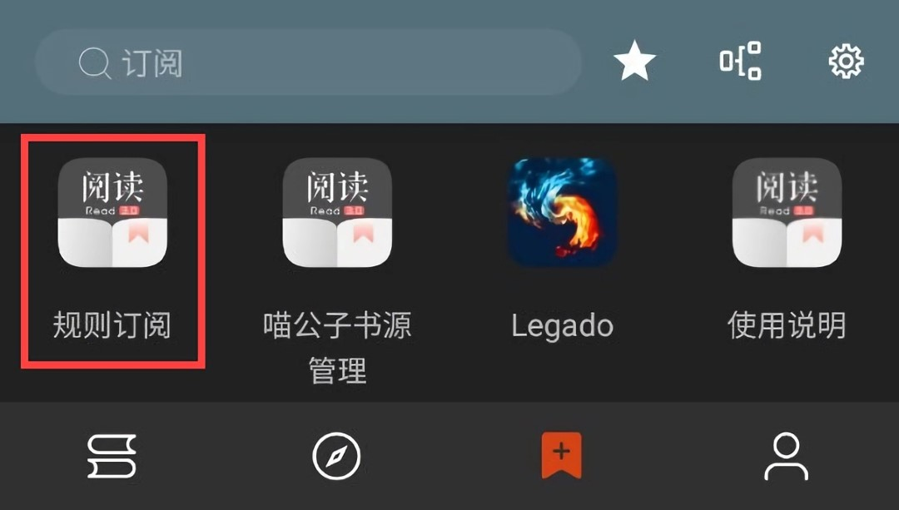
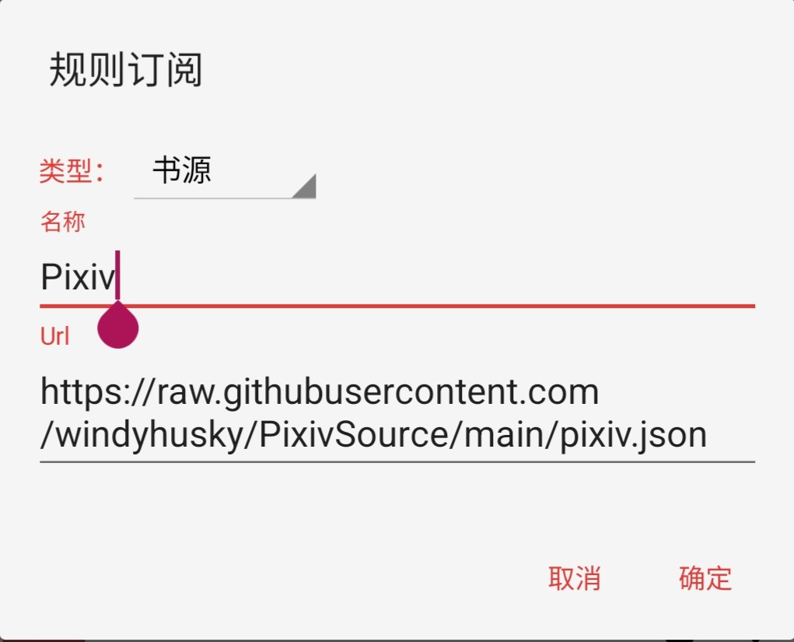
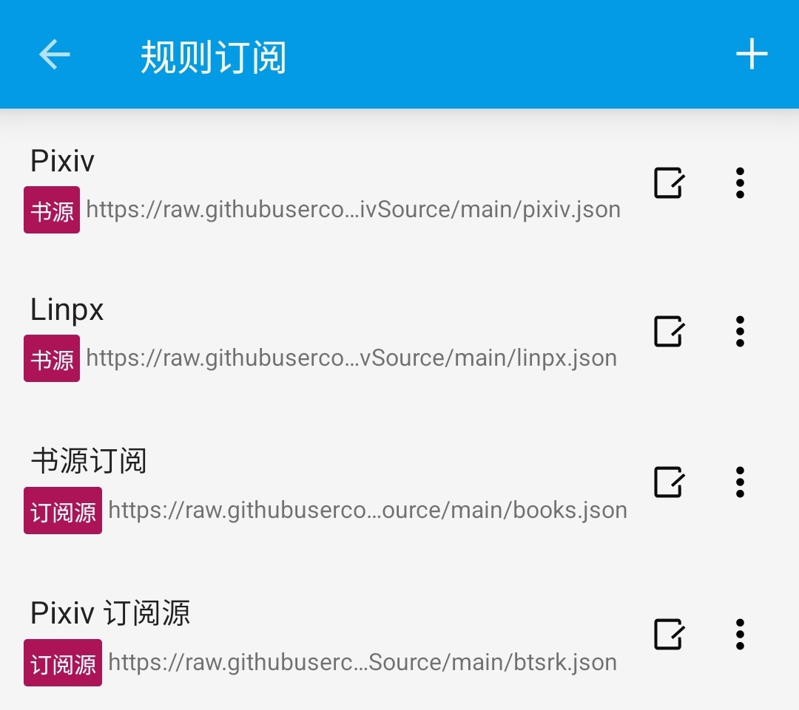

 

# ⚡️ 快速开始 ⚡️
### 🅿️ [开源阅读](https://github.com/gedoor/legado) Pixiv 书源
#### ✈️ 频道 [@PixivSource](https://t.me/PixivSource)
#### ☕ [书源项目打赏名单](Sponsor.md)

> [!TIP]
>
> **从未使用过【开源阅读】的读者可以看这篇指南：**
> [✨臻享阅读](BetterExperience.md)

## ⚡️ 快速开始：[下载阅读](QuickStart#DownloadLegado) => [导入书源](QuickStart#ImportSources) => [书源配置](QuickStart#LoginAccount) => [阅读设置](QuickStart#LegadoSettings) {#QuickStart}

## 下载软件 {#DownloadAPP}
> [!TIP]
>
> **Android 设备：阅读 + Pixiv 书源**
>
> **苹果设备可用：源阅 + Pixiv 书源**
> **，详见：[下载阅读](Download.md)**

### ⬇️ A.下载阅读 {#DownloadLegado}
> [!IMPORTANT] 重要
>
> 点击链接，下载 **【阅读 Plus】** 安装包并安装软件
>
> https://loyc.xyz/c/legado.html#download
>
> **苹果设备及更多兼容软件详见：** [下载阅读](./Download.md)

### ✅ B.兼容软件 {#CompatibleAPP}

<strong>🉑 兼容软件 </strong>

- [Pixiv 小说书源](https://loyc.xyz/b/cdx.html?src=legado://import/importonline?src=https://raw.githubusercontent.com/DowneyRem/PixivSource/main/pixiv.json) 兼容软件：

| 阅读版本 | 推荐 | 版本号 |
| ------ | --- | ----- |
| 👍【推荐】[阅读 Sigma](https://github.com/Luoyacheng/legado/releases) | Plus  | 3.25.0927 |
| 🏛️【官方】[阅读 Beta](https://miaogongzi.lanzout.com/b01rgkhhe)  | 新共存  | 3.25.0527 |

<strong> 🈶 更多软件 </strong>

- [Pixiv 小说备用书源](https://loyc.xyz/b/cdx.html?src=legado://import/importonline?src=https://raw.githubusercontent.com/DowneyRem/PixivSource/main/pixiv.json) 兼容软件：

| 阅读版本 | 推荐 | 版本号 |
| ------ | --- | ----- |
| 👍【推荐】[阅读 Sigma](https://github.com/Luoyacheng/legado/releases) | Plus  | 3.25.0927 |
| 🏛️【官方】[阅读 Beta](https://miaogongzi.lanzout.com/b01rgkhhe)  | 新共存  | 3.25.0527 |
| 🎀【兼容】[阅读 MD3](https://github.com/HapeLee/legado-with-MD3/releases) | | 3.26     | 
| 🍎【兼容】[源阅](https://github.com/kaich/SourceReadSite)      | TestFlight | 1.0 (112) |
- 详见：[下载阅读](Download.md)

## 导入书源 {#ImportSources}
> [!TIP]
> **使用 Pixiv 书源阅读小说，建议导入：**
> - **🅿️ Pixiv 书源**
> - **🐲 BTSRK 订阅源**
> 
> **使用 Linpx 书源阅读小说，建议导入：**
> - **🦊 Linpx 书源**
> - **🐲 BTSRK 订阅源**

> [!NOTE]
> 以下两种方式任选：
>
> **🚀 A.一键导入【操作简便】，后续需要【手动更新】书源**
>
> **🔗 B.规则订阅【更新方便】，后续可以【自动更新】书源**

### 🚀 A.一键导入【最简单】 {#OneClickImport}
**点击链接，一键导入 书源、订阅源**
| 源名称    | jsDelivr | Github |
|--------| -------- | ------ |
| 🅿️ Pixiv 书源 | [一键导入](https://loyc.xyz/b/cdx.html?src=legado://import/importonline?src=https://cdn.jsdelivr.net/gh/DowneyRem/PixivSource@main/pixiv.json) | [一键导入](https://loyc.xyz/b/cdx.html?src=legado://import/importonline?src=https://raw.githubusercontent.com/DowneyRem/PixivSource/main/pixiv.json) |
| 🦊 Linpx 书源 | [一键导入](https://loyc.xyz/b/cdx.html?src=legado://import/importonline?src=https://cdn.jsdelivr.net/gh/DowneyRem/PixivSource@main/linpx.json) | [一键导入](https://loyc.xyz/b/cdx.html?src=legado://import/importonline?src=https://raw.githubusercontent.com/DowneyRem/PixivSource/main/linpx.json) |
| 🐲 BTSRK 订阅源 | [一键导入](https://loyc.xyz/b/cdx.html?src=legado://import/importonline?src=https://cdn.jsdelivr.net/gh/DowneyRem/PixivSource@main/btsrk.json) | [一键导入](https://loyc.xyz/b/cdx.html?src=legado://import/importonline?src=https://raw.githubusercontent.com/DowneyRem/PixivSource/main/btsrk.json) |
| | | |
| 🌌 通用书源 | [一键导入](https://loyc.xyz/b/cdx.html?src=legado://import/importonline?src=https://cdn.jsdelivr.net/gh/DowneyRem/PixivSource@main/normal.json) | [一键导入](https://loyc.xyz/b/cdx.html?src=legado://import/importonline?src=https://raw.githubusercontent.com/DowneyRem/PixivSource/main/normal.json) |
| 📚 Books 订阅源 | [一键导入](https://loyc.xyz/b/cdx.html?src=legado://import/importonline?src=https://cdn.jsdelivr.net/gh/DowneyRem/PixivSource@main/books.json)  | [一键导入](https://loyc.xyz/b/cdx.html?src=legado://import/importonline?src=https://raw.githubusercontent.com/DowneyRem/PixivSource/main/books.json) |
| 📃 Pixiv 目录规则 | [一键导入](https://loyc.xyz/b/cdx.html?src=legado://import/textTocRule?src=https://cdn.jsdelivr.net/gh/DowneyRem/PixivSource@main/pixivToc.json) | [一键导入](https://loyc.xyz/b/cdx.html?src=legado://import/textTocRule?src=https://raw.githubusercontent.com/DowneyRem/PixivSource/main/pixivToc.json) |

### 🔗 B.规则订阅【易更新】 {#Subscription}
**订阅 - 规则订阅 - 添加 - 复制链接，添加订阅**

| 源名称 | jsDelivr | Github |
| ----- | -------- | ------ |
| 🅿️ Pixiv 书源   | [订阅链接](https://cdn.jsdelivr.net/gh/DowneyRem/PixivSource@main/pixiv.json) | [订阅链接](https://raw.githubusercontent.com/DowneyRem/PixivSource/main/pixiv.json) |
| 🦊 Linpx 书源   | [订阅链接](https://cdn.jsdelivr.net/gh/DowneyRem/PixivSource@main/linpx.json)  | [订阅链接](https://raw.githubusercontent.com/DowneyRem/PixivSource/main/linpx.json) |
| 🐲 BTSRK 订阅源 | [订阅链接](https://cdn.jsdelivr.net/gh/DowneyRem/PixivSource@main/btsrk.json)  | [订阅链接](https://raw.githubusercontent.com/DowneyRem/PixivSource/main/btsrk.json) |

<strong> 详见：规则订阅 </strong>

#### 1. 打开【订阅】页面，点击【规则订阅】

#### 2. 点击加号，粘贴链接，保存订阅

#### 3. 点击相应订阅规则，导入并启用/更新书源

**首次点击【订阅规则】 即可导入**

**导入之后，再次点击则会检查更新**

## 书源配置 {#BookSourceSet}
### 🅿️ [Pixiv 账号登录](Pixiv#LoginAccount) {#LoginAccount}
> [!NOTE]
>
> **有账号的网站，在书源里登录账号才能阅读相关小说**

<strong> 🅿️ 登录账号 </strong>

#### 📡 开启代理
> [!TIP]
>
> 此处略过，**最好开启【全局代理】，确保阅读可用访问代理**

#### 🅿️ 登录账号
> [!NOTE]
>
> **有账号的网站，在书源里登录账号才能阅读相关小说**

**我的 - 书源管理 - 菜单 - 登录 - 登录账号**

**登录你的账号，登录成功后，点击右上角的对勾**

> [!TIP]
>
> **如果需要验证码，请更换代理，或过段时间再次尝试**

### 🦊 Linpx 与 兽人控小说站 {#CheckAccess}
> [!NOTE]
> 
> **Linpx & 兽人控小说站 暂无账号体系，无需登录即可使用**

<strong> ✅ 检查网站能否访问 </strong>

**订阅 - 点击 Linpx / 兽人控小说站 - 打开网站**

- 如果可以直接打开，那么一切大功告成！
  - **多数网络下，Linpx & 兽人控小说站 无需代理即可访问**
  - Linpx & 兽人控小说站 没有账号体系，**无需登录即可使用**，不必做过多的操作

- 如果 **无法直接打开** 则可以：
  - 切换至其他网络（**更换网络运营商、使用流量或 WIFI**）后再尝试
  - 开启代理后再尝试

## 阅读设置 {#LegadoSettings}
### 💾 [备份恢复](WebdavBackup.md) {#WebdavBackup}
> [!IMPORTANT] 重要
>
> **【开源阅读】没有账号体系，不能在登录书源网站的同时恢复数据**
>
> **需要配置 Webdav 服务，才能从云端恢复数据**
>
> **详见：[备份与恢复](WebdavBackup.md)**

### 🔄 关闭刷新 {#TurnOffAutoRefresh}
> [!IMPORTANT] 重要
>
> **使用时，请在设置里，关闭自动刷新**
>
> **否则很容易触发触发请求限制，甚至封号**

**我的 - 其他设置 - 自动刷新**

> [!NOTE]
>
> **截止到这里，你基本上就拥有了完整的阅读体验了**
>
> **可以像是使用常规阅读软件一样，使用开源阅读了**

### ☁️ [远程书籍](RemoteBooks.md)（可选）{#RemoteBooks}
> [!TIP]
>
> **使用支持 Webdav 的网盘，阅读网盘上的书籍**
>
> **详见：[远程书籍](RemoteBooks.md)**

## 📖 [畅享阅读](Pixiv.md#AddNovel) {#AddNovel}
- 🔍 搜索小说：书架页面，搜索小说，添加小说到书架
- ⭐️ 发现小说：发现页面，查看小说，添加小说到书架
- 🔗 添加网址：书架页面，通过 **【添加网址】** 添加小说到书架
- 🌐 订阅源：订阅页面，通过 **【订阅源】** 添加小说到书架 

## 🐞 [故障处理](TroubleShoot.md) {#TroubleShoot}

## ☕️ [支持开发](Sponsor.md) {#Sponsor}
> [!NOTE]
>
> **如果书源帮到了你，欢迎请开发者喝杯咖啡**
>
> **你的鼓励是持续更新的动力～**
