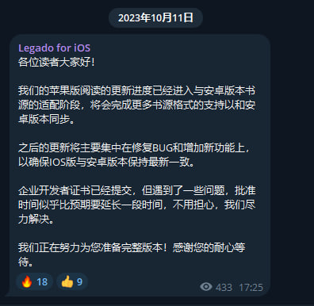

## 下载阅读

### 1. Android 版
**点击链接，下载安装包并安装，推荐使用共存版**
https://miaogongzi.lanzout.com/b01rgkhhe

| 下载站点                                                      | 版本          | 备注              |
| ------------------------------------------------------------ | ------------  | ----------------- |
| [喵公子阅读资源 (蓝奏云)](https://yd.mgz6.cc/)                 | 　　　　稳定版 | 无需代理，无需登录 |
| [阅读Beta版 蓝奏云](https://miaogongzi.lanzout.com/b01rgkhhe) | 　　　　开发版 | 无需代理，无需登录 |
| [Github Release](https://github.com/gedoor/legado/releases)  | 有限制，稳定版 | 需要代理，无需登录 |
| [Github Action](https://github.com/gedoor/legado/actions)    | 无限制，开发版 | 需要代理，需要登录 |
| [Telegram 频道](https://t.me/Legado_Channels)                | 　　　　稳定版 | 需要代理，需要登录 |
| [Telegram 频道(Beta版)](https://t.me/Legado_Beta)            | 　　　　开发版 | 需要代理，需要登录 |

### 2. 苹果 iOS 版

官方正在进行 [iOS版](https://github.com/gedoor/YueDuFlutter) 的开发，[近期在TF测试](https://gedoor.github.io/download)

| 下载站点                                              | 版本          | 备注              |
| ---------------------------------------------------- | ------------- | ----------------- |
| ~~[GitHub](https://github.com/gedoor/YueDuFlutter)~~ |               | 开发中，暂不可下载 |
| ~~[Telegram 频道(iOS版)](https://t.me/legado_ios)~~   |               | 开发中，暂不可下载 |

可能支持相同书源的软件：
| 软件名称 | 备注                       |
| ------- | -------------------------- |
| ~~[读不舍手](https://apps.apple.com/us/app/%E8%AF%BB%E4%B8%8D%E8%88%8D%E6%89%8B/id1662413517)~~ | 不完全兼容阅读书源，广告较多 |
| ~~[青果阅读](https://apps.apple.com/us/app/qing-guo-du-shu/id1142490639)~~ | 不完全兼容阅读书源，现已下架 |
| ~~[源阅读](https://github.com/kaich/Yuedu)~~ | 停止维护，AppStore 已下架 |

## 通用教程
### 1. [阅读是什么软件？阅读简介](./Legado.md)
### 2. [如何获取书源？导入书源？](./Import.md)
### 3. [如何导入订阅源？](./Import2.md)
### 4. [如何设置 Webdav 备份？](./WebdavBackup.md)

更多内容请查看[官方使用说明](https://www.yuque.com/legado/wiki/xz)

## 专用教程 [@DowneyRem](https://github.com/DowneyRem) 
### 1. [Pixiv 书源的导入与使用](./Pixiv.md)
### 2. [Linpx 书源的导入与使用](./Linpx.md)

### 兽人小说频道 [@FurryNovels](https://t.me/FurryNovels)
- [Pixiv 书源的导入与使用 – Telegraph](https://telegra.ph/FurryNovelsReading-01-04-07)
- [Linpx 书源的导入与使用 – Telegraph](https://telegra.ph/FurryNovelsReading-05-04-07)

