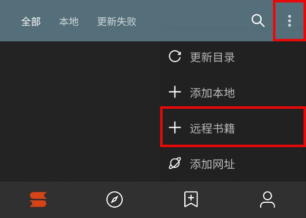
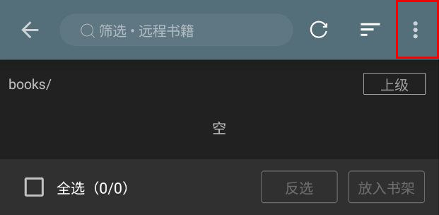
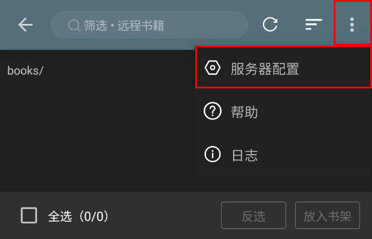
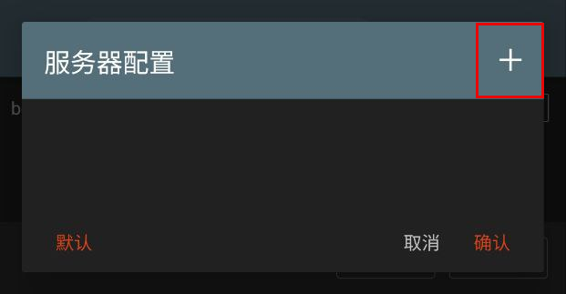
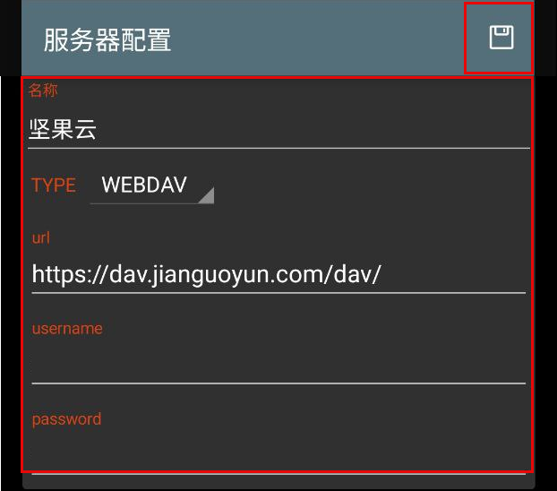
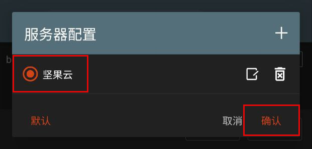
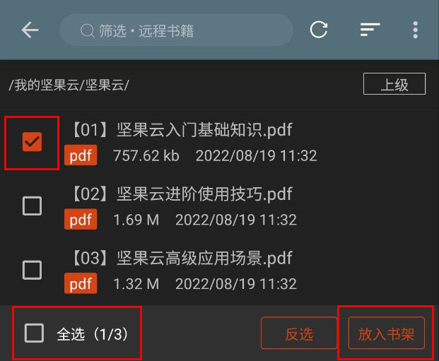

 

# 远程书籍
### 🅿️ [开源阅读](https://github.com/gedoor/legado) Pixiv 书源
#### ✈️ 频道 [@PixivSource](https://t.me/PixivSource)
#### ☕ [书源项目打赏名单](./Sponsor.md)

> [!TIP]
>
> **从未使用过【开源阅读】的读者可以看这篇指南：**
> [✨臻享阅读](BetterExperience.md)

## 远程书籍
### 1.远程书籍配置

 ☁️ 配置远程书籍 

书架菜单 - 远程书籍 - 右上角三点菜单 - 服务器配置 - 加号 - 添加服务器配置信息

点击加号，添加服务器配置

填入 Webdav 服务器配置信息

> 地址 `url` 填入 Webdav 服务器地址
>
> 账户 `username` 填入注册邮箱
>
> 密码 `password` 填入 **应用密码（非账户密码）**

保存，选择添加的服务器

### 2.查看远程书籍

 👀 查看远程书籍 

刷新，查看文件

选择书籍，放入书架

### 3.兽人小说分享 [@FurryNovels](https://t.me/FurryReading/2145)

 🐺 兽人小说分享 

> https://t.me/FurryReading/2145
> 
> [兽人小说服务器配置信息](https://github.com/DowneyRem/FurryNovels/blob/main/doc/RemoteBooks.md#2-%E5%85%BD%E4%BA%BA%E5%B0%8F%E8%AF%B4%E6%9C%8D%E5%8A%A1%E5%99%A8%E9%85%8D%E7%BD%AE)

