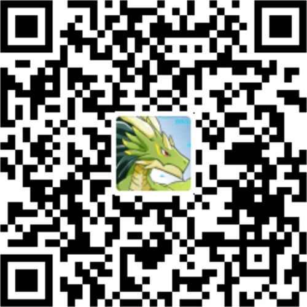
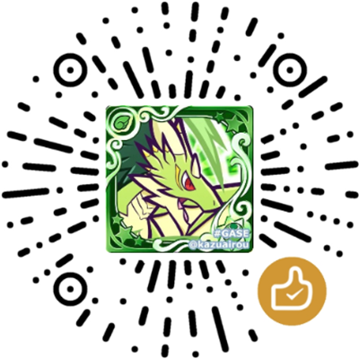

 

# ☕ 打赏名单 ☕
### 🅿️ [开源阅读](https://github.com/gedoor/legado) Pixiv 书源
#### ✈️ 频道 [@PixivSource](https://t.me/PixivSource)
#### ☕ [书源项目打赏名单](./Sponsor.md)

## ☕ 支持开发
> [!TIP]
> **最简单的方法**
> **——向你的亲朋好友分享 Pixiv 书源**
> 
> [✨臻享阅读](BetterExperience.md)、
> [⚡快速开始](QuickStart.md) **将有助于你的分享**

> [!NOTE]
>
> **当然，也可以请开发者喝杯咖啡**
> 
> **你的鼓励是持续更新的动力～**
- 💜 [爱发电 打赏 & 指导](https://afdian.com/a/DowneyRem)
- ☕️ [Buy me a Coffee](https://ko-fi.com/downeyrem)
- 

🧧 支付宝 红包 

  

    
  

  

    

        <h4 style="margin-bottom:12px">🅿️ 支付宝转账</h4>
        
    

    

        <h4 style="margin-bottom:12px">💬 微信赞赏</h4>
        
    

> [!IMPORTANT] 
> 
> **可在【留言】中留下【书源】和【你的ID/昵称】，以便统计打赏名单**

## 💰 打赏名单
> [!TIP]
> **按打赏本项目的先后顺序排名**
- 唐尼瑞姆 [@DowneyRem](https://github.com/DowneyRem)
- 噬空
- 迅迅龙龙
- 迅迅龙龙
- 闲鱼家的凡人
- 噬空
- 阿瑞希 Arciey
- 低咪
- 寒沫龙吟
- 梅拉顿 Melaton [@HundSimon](https://github.com/HundSimon)
- 寒武纪CLS
- 贾斯
- 农晴
- 无果 jddn
- 墨燝 @SodaLee
- 梨树
- 本征 [@Eigeen](https://github.com/eigeen)
- 天意618A03
- **鸿
- 龙牙虎
- 缘落碎羽

## ⌨️ 帮助名单
> [!TIP]
> 
> **按帮助本项目的先后顺序排名**
- 狗子 [@windyhusky](https://github.com/windyhusky)
- 不世玄奇 [@bushixuanqi](https://github.com/bushixuanqi)
- 洛娅橙 [@Luoyacheng](https://github.com/Luoyacheng)
- 本征 [@Eigeen](https://github.com/eigeen)
- [@SuCan127](https://github.com/SuCan127)
- Melaton [@HundSimon](https://github.com/HundSimon)
- 阅读书源开发群的诸位开发者

## 💸 定期赞助
> [!TIP]
> 本项目的赞助项目
- [Linpx](https://www.furrynovel.ink) 每年 ￥100 （2023年起）

## 💴 早期支出
> [!NOTE]
>
> 项目早期是由 唐尼瑞姆 [@DowneyRem](https://github.com/DowneyRem) 委托 狗子 [@windyhusky](https://github.com/windyhusky) 编写代码
>
> 早期支出为支付其代码报酬。
>
> 因时间久远，具体支付时间、金额现已无法考证

## 🙏 感谢上方诸位的支持，让这个项目变得更好