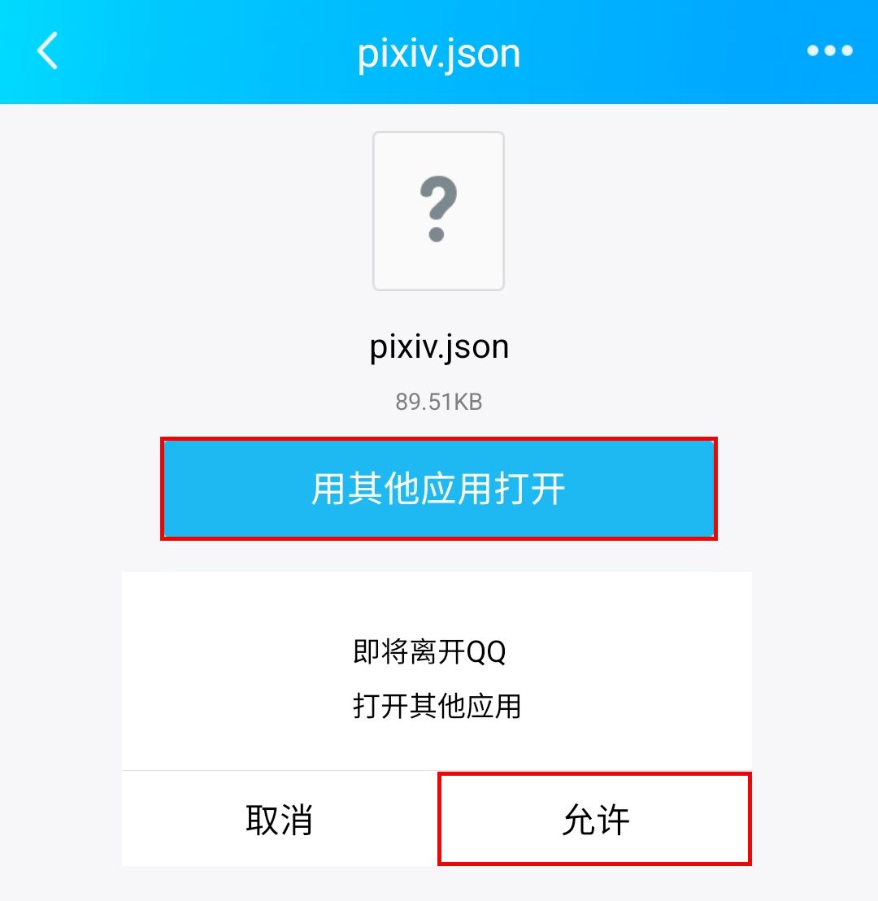
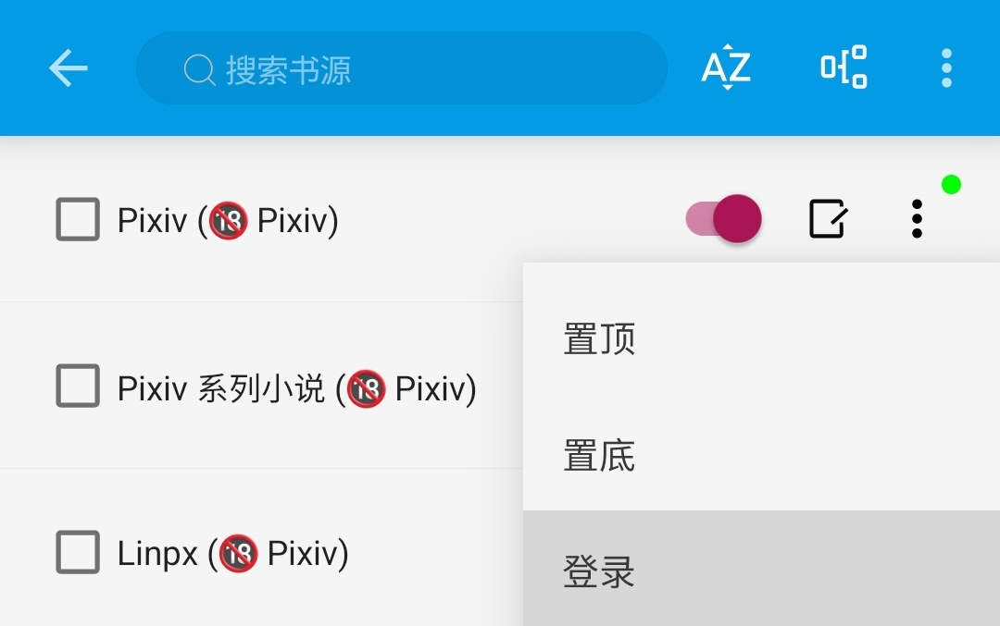

 

# 阅读使用教程
### 🅿️ [开源阅读](https://github.com/gedoor/legado) Pixiv 书源
#### ✈️ 频道 [@PixivSource](https://t.me/PixivSource)
#### ❤️ [书源项目赞助名单](./Sponsor.md)

# 阅读使用教程
## 1.下载并安装阅读

 ⬇️ 下载阅读 

**点击链接，下载安装包并安装，推荐使用【共存版/新共存版】**
https://miaogongzi.lanzout.com/b01rgkhhe
> https://miaogongzi.lanzout.com/b01rgkhhe
>
> 最新下载链接请查看 [下载阅读](./Download.md)

## 2.导入相关书源 & 订阅源
这里推荐两种方法，任选其一即可
> 更多方法详见：
> **[导入书源](./ImportBookSource.md)** &
> **[导入订阅源](./ImportRssSource.md)**

 🔗 一键导入 

### A.一键导入
#### 1.点击链接，一键导入
- 🅿️ [一键导入 Pixiv 书源](https://loyc.xyz/b/cdx.html?src=legado://import/importonline?src=https://cdn.jsdelivr.net/gh/DowneyRem/PixivSource@main/pixiv.json)
- 🦊 [一键导入 Linpx 书源](https://loyc.xyz/b/cdx.html?src=legado://import/importonline?src=https://cdn.jsdelivr.net/gh/DowneyRem/PixivSource@main/linpx.json)
- 🐲 [一键导入 BTSRK 订阅源](https://loyc.xyz/b/cdx.html?src=legado://import/importonline?src=https://cdn.jsdelivr.net/gh/DowneyRem/PixivSource@main/btsrk.json)
- 📚 [一键导入 Books 订阅源](https://loyc.xyz/b/cdx.html?src=legado://import/importonline?src=https://cdn.jsdelivr.net/gh/DowneyRem/PixivSource@main/btsrk.json)

#### 2.导入完成并启用书源

 💾 文件导入 

### B.文件导入
#### 1.下载书源/订阅源文件
如果你一同下载了书源文件，可以使用本地文件导入

#### 2.使用阅读打开
点击下载完成的书源文件，选择【用其他应用打开】

打开方式选择阅读

#### 3.导入完成并启用书源/订阅源

## 3.登陆账号
### 1. Linpx 与 兽人控小说站

 ☑️ 检查网站能否访问 

订阅 - 点击 Linpx / 兽人控小说站 - 打开网站
- 如果可以直接打开，那么一切大功告成！
  - **多数网络下，Linpx & 兽人控小说站 无需代理即可访问**
  - Linpx & 兽人控小说站 没有账号体系，**无需登录即可使用**，不必做过多的操作

- 如果 **无法直接打开** 则可以：
  - 切换至其他网络（**更换网络运营商、使用流量或 WIFI**）后再尝试
  - 开启代理后再尝试

### 2. Pixiv 【需要登录】
Pixiv 及正版付费书源，需要登录账号才能阅读相关小说

 🅿️ 登录 Pixiv 账号 

#### 1. 开启代理工具
此处略过，请自行学习，**最好开启【全局代理】**

#### 2. 登录 Pixiv 账号
**我的-书源管理-点击 Pixiv 书源右侧三点菜单-登录**

**登录你的账号，登录成功后，点击右上角的对勾**

**如果需要验证码，请更换代理，或过段时间再次尝试**

## 4.使用书源，畅享阅读

 📖 畅享阅读 

- ✅ 搜索：书架页面，搜索小说，添加小说到书架
- ✅ 发现：发现页面，查看小说，添加小说到书架
- ✅ 添加网址：书架页面，通过 **【添加网址】** 添加小说到书架
- ✅ 订阅源：订阅页面，通过 **【订阅源】** 添加小说到书架

 📌 更多教程 

> ### 1. [阅读使用教程（太长不看版）](./TooLongToRead.md)【你在这里】
>> #### 1.1 [Pixiv 书源的导入与使用](./Pixiv.md)
>> #### 1.2 [Linpx 书源的导入与使用](./Linpx.md)
>> #### 1.3 [兽人控小说站 书源的导入与使用](./FurryNovel.md)
>> #### 1.4 搜索小说、查看订阅，畅享阅读
> ### 2. [添加远程书籍](./RemoteBooks.md)，畅享阅读
> ### 3. [设置 Webdav 备份](./WebdavBackup.md)
> ### 4. [故障排查与处理](./TroubleShoot.md)

## 本教程由兽人阅读频道 [@FurryReading](https://t.me/FurryReading) 提供