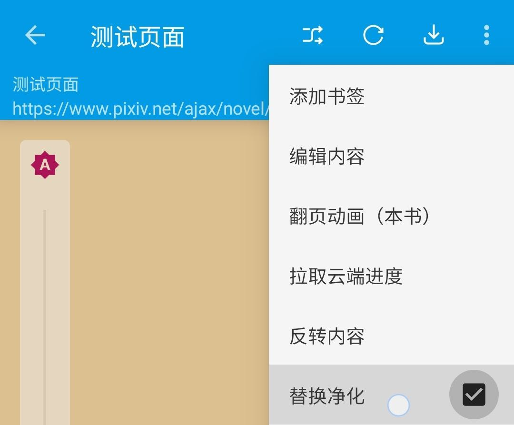

## 故障排查与处理

### 搜索无结果
1. 检查网络是否可用 
   - 检查**网络**是否可用？更换其他网络重试
   - 检查**代理**是否可用？更换其他代理重试
   - ##### **检查阅读软件是否走了代理？**
2. 检查并更新阅读软件
   - ##### **更新阅读软件**
   - 尝试使用阅读的不同版本重试
3. 检查并更新相关书源
   - 检查书源**是否导入？**
   - 检查书源**是否开启？**
   - ##### **更新书源**
4. 检查书源网站能否访问
   - 检查书源所用网站能否访问？
   - ##### **阅读内部登陆该网站**，重试
5. 清理 WebView 数据
   - 设置页-其他设置-清理 WebView 数据，重新登陆，重试
6. 向书源/阅读软件开发者反馈

### 发现页面报错
1. 检查网络是否可用
   - 检查**网络**是否可用？更换其他网络重试
   - 检查**代理**是否可用？更换其他代理重试
   - ##### **检查阅读软件是否走了代理？**
2. 检查并更新阅读软件
   - ##### **更新阅读软件**
   - 尝试使用阅读的不同版本重试
3. 检查并更新相关书源
   - ##### **更新书源**
4. 检查书源网站是否可访问
   - 检查书源所用网站能否访问？
   - ##### **阅读内部登陆该网站**，重试
5. 清理 WebView 数据
   - 设置页-其他设置-清理 WebView 数据，重新登陆，重试
6. 向书源开发者反馈

### 正文图片显示为链接
1. 关闭替换净化

