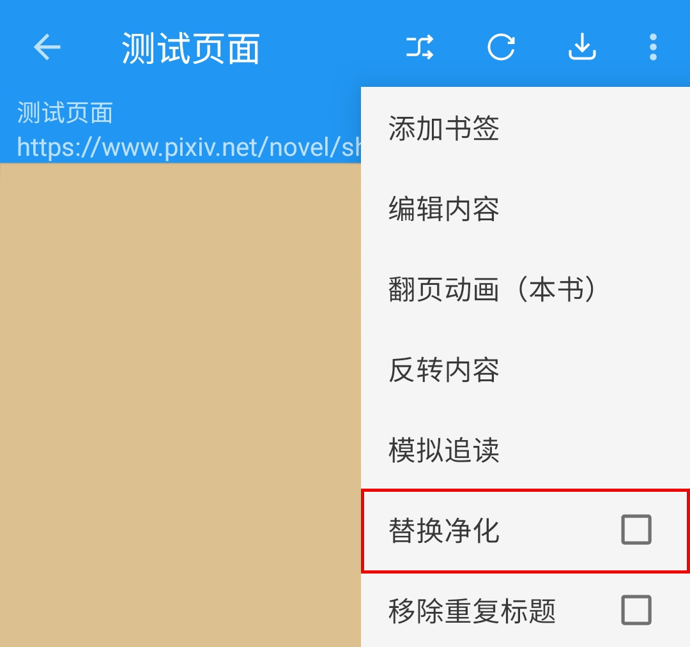

# 故障排查与处理
#### 🅿️ [开源阅读](https://github.com/Luoyacheng/legado) Pixiv 书源
#### ✈️ 频道 [@PixivSource](https://t.me/PixivSource)

> [!WARNING]
>
> ⚠️ **你正在 GitHub 上浏览此文档， Github 文档可能不完整
> [网页版](https://pixivsource.pages.dev/TroubleShoot)
> 内容更全面，排版更精美**

> [!TIP]
> 
> **开源阅读 Legado 的【简易】故障排查与处理**

> [!NOTE]
>
> **反馈前请确认以下事项：**
>  - **阅读分支版本（如：Sigma、MD3 等）**
>  - **阅读软件版本（如：3.26.0101）**
>  - **使用书源版本（如：251）**
>  - **阅读是否兼容当前书源版本，详见 [书源兼容性](UpdateLog.md#Pixiv)**
>  - **如果是软件问题，请去 阅读对应 GitHub 仓库 反馈，详见：[下载阅读](Download.md)**
>  - **如果是书源问题，请去 [书源 GitHub 仓库](https://github.com/DowneyRem/PixivSource/issues) 提交问题，并附加调试结果，调试方法见下方 调试书源**

## 调试书源 {#SourceDebug}
### 🐞 调试模式 {#DebugMode}
> [!NOTE]
> 
> **⏺️ 互动功能 => 书架 - 阅读界面 - Pixiv 小说 - 登录 => 调试模式**
>
> **⚙️ 书源设置 => 我的 - 书源管理 - Pixiv 小说 - 登录 => 调试模式**

**开启书源的调试模式（可选），有助于分析当前问题，打开方式如下：**

<strong> 从 ⏺️ 互动功能 打开</strong>

**⏺️ 互动功能 => 书架 - 小说阅读界面 - Pixiv 小说 - 登录**

点击【🐞 调试模式】，打开调试模式

<strong> 从 ⚙️ 书源设置 打开</strong>

**⚙️ 书源设置 => 我的 - 书源管理 - Pixiv 小说 - 登录 => 调试模式**

1️⃣ 点击【登录】，打开书源设置（简）

2️⃣ 点击【⚙️ 书源设置】，打开详细书源设置

3️⃣ 点击【🐞 调试模式】，打开调试模式

### 🐞 调试书源 {#DebugSource}
我的 - 书源管理 - 编辑书源 - 调试 - 输入内容

| 调试区域 | 输入内容 |
|--------|---------|
| 搜索 | 搜索相应关键词 |
| 发现 | `::https://www.pixiv.net/ajax/top/novel` |
| 详情 | `https://www.pixiv.net/novel/show.php?id=123` |
| 目录 | `++https://www.pixiv.net/novel/show.php?id=123` |
| 正文 | `--https://www.pixiv.net/novel/show.php?id=123` |

- 提交错误时，最好附加其调试信息

## 故障处理 {#TroubleShooting}
### 🖼 图片显示为链接 {#ImageShownAsLink}
1. **关闭替换净化**
   
2. 刷新正文

## 故障排查 {#FaultDiagnosis}
### 🈚️ 搜索、发现没有结果 {#NoResult}
0. [调试书源](#Debug) 
1. 检查网络是否可用 
   - 检查**网络**是否可用？更换其他网络重试
   - 检查**代理**是否可用？更换其他代理重试
   - **检查阅读软件是否走了代理？**
2. 检查并更新阅读软件
   - **更新阅读软件**
   - 尝试使用阅读的不同版本重试
3. 检查并更新相关书源
   - 检查书源**是否导入？**
   - 检查书源**是否启用？**
   - **更新书源**
4. 检查书源网站能否访问，相关功能是否正常
   - 检查书源所用网站能否访问？
   - 检查书源所用网站功能能否正常？
   - **阅读内部登陆该网站**，重试
5. [向书源开发者反馈](https://github.com/DowneyRem/PixivSource/issues) 

