

 

# 备份与恢复
### 🅿️ [开源阅读](https://github.com/gedoor/legado) Pixiv 书源
#### ✈️ 频道 [@PixivSource](https://t.me/PixivSource)
#### ☕ [书源项目打赏名单](./Sponsor.md)

> [!NOTE]
>
> 本教程修改自 开源阅读官方教程：[坚果云注册与配置](https://www.yuque.com/legado/wiki/fkx510)

## 备份与恢复 {#WebdavBackup}
> [!IMPORTANT] 重要
>
> **【开源阅读】没有账号体系，不能在登录书源网站的同时恢复数据**
>
> **需要配置 Webdav 服务，才能从云端恢复数据**

> [!TIP]
> 
> 所有 **支持 WebDav 的云盘** 都可以备份数据。**建议使用【坚果云】**
> 
> 坚果云每月有 1G 免费流量，备份阅读数据已经足够了。

## 配置坚果云
### 🌰 注册坚果云
打开 [坚果云 创建账号](https://www.jianguoyun.com/d/signup) ，输入 **你的邮箱，设置密码，注册账号**

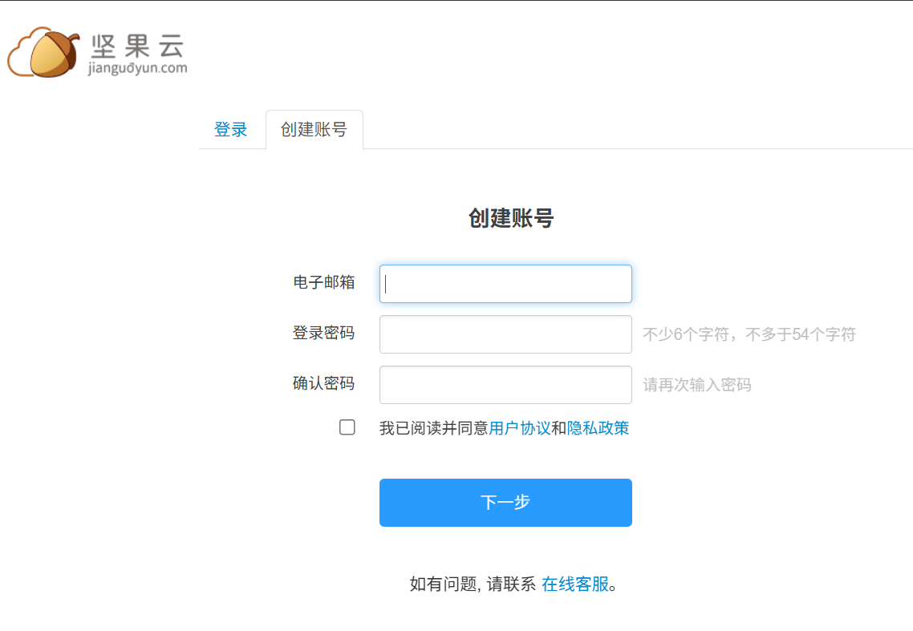

### 🛠 配置坚果云
#### 1. 在右上角点击【用户名】，选择【账户信息】
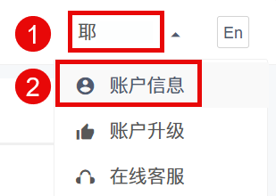

#### 2. 点击【安全选项】后，在第三方管理里【添加应用】
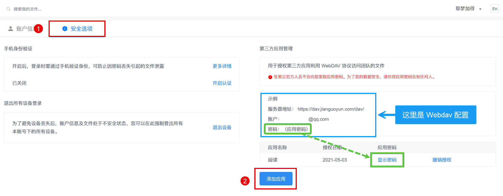

#### 3. 输入名称，点击【生成密码】，最后点击完成
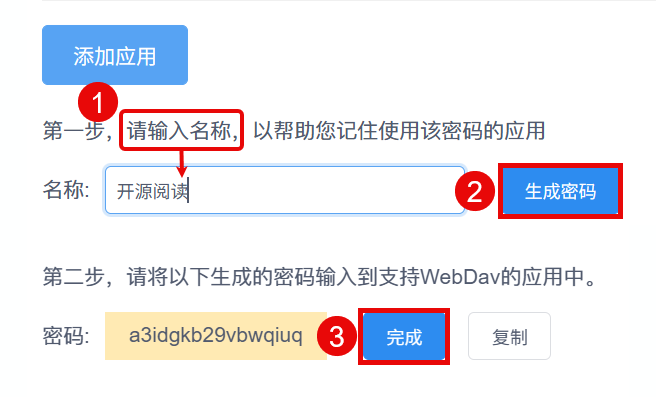

#### 4. 到此 WebDav 账户设置完成
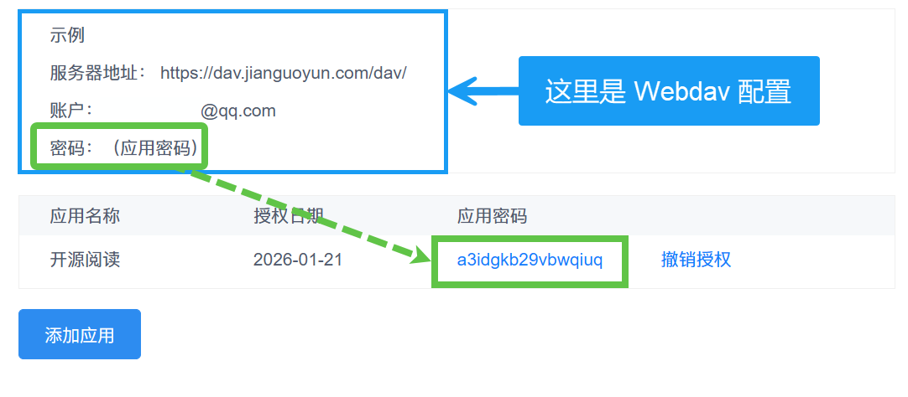

#### 4. 你的 WebDav 账户信息 {$YourData}
- WebDav 服务器地址： `https://dav.jianguoyun.com/dav/`
- WebDav 账户：（你的坚果云注册邮箱）
- WebDav 密码：（刚刚生成的应用密码）

## 设置备份信息
### ⚙️ 设置备份信息
#### 1. 进入备份与恢复
**主界面 - 我的 - 设置 - 备份与恢复**

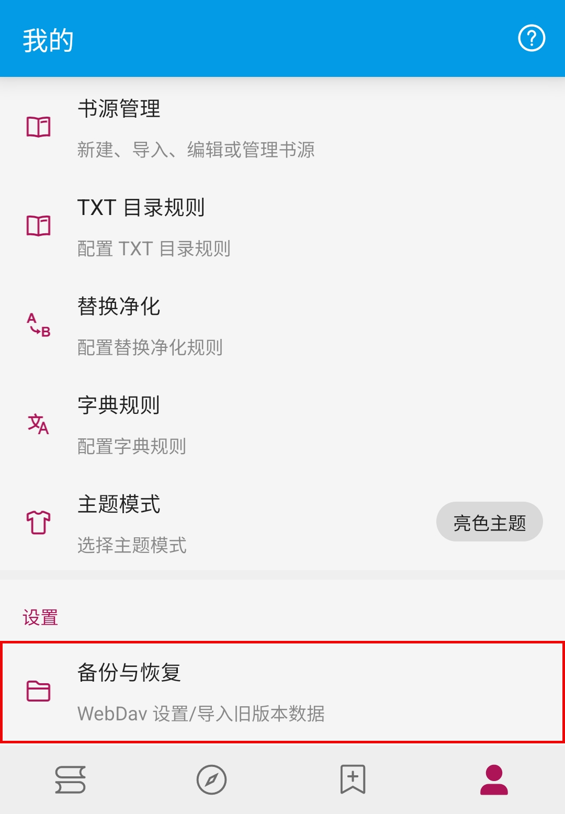

#### 2. 设置 WebDav 备份信息
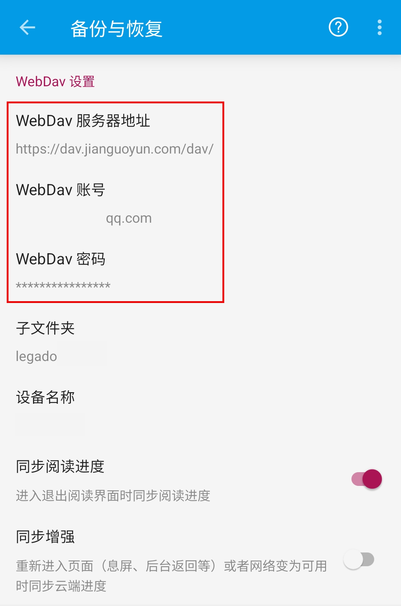

**在 WebDav 设置里，填入服务器地址、账户、应用密码，保存**。

#### 3. WebDav 账户信息提示
- WebDav 服务器地址： `https://dav.jianguoyun.com/dav/`
- WebDav 账户：（你的坚果云注册邮箱）
- WebDav 密码：（刚刚生成的应用密码）

> [!CAUTION] 危险！
>  
> **请一定要填入【你自己的】 Webdav 账户信息，不然会导致数据泄露（并且还是你亲手造成的）**

### 📂 设置备份目录
**点击备份路径，设置备份目录**

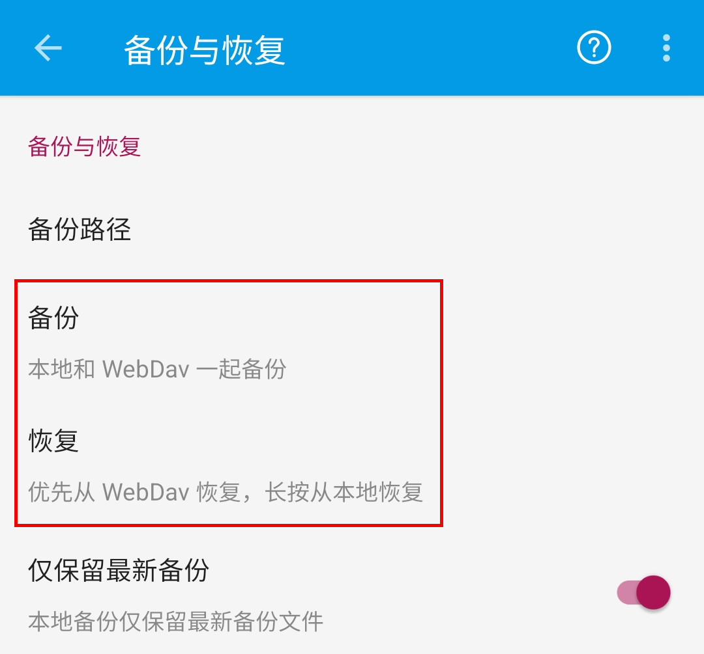

**点击备份，此时则会弹出下面的弹窗**

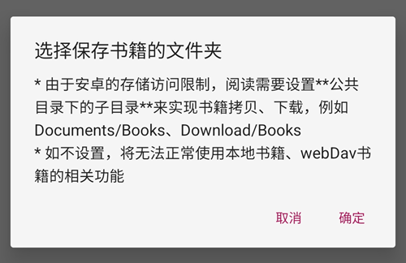

**点击确定，这里可以任选其中一个**

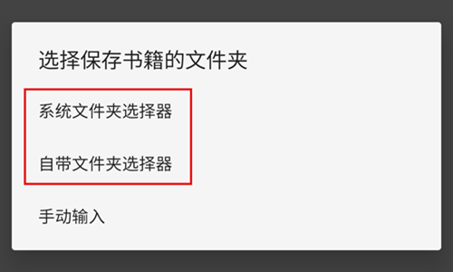

**来到你想保存书籍的文件夹时，点击确认**

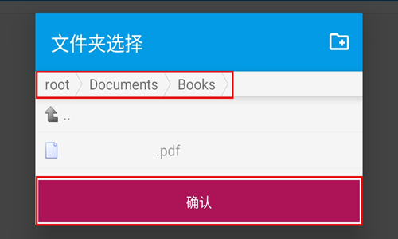

### 💾 自动备份
> [!TIP]
> 
> **完成 WebDav 备份设置后，每次退出 APP 即会自动备份**
> 
> **仅返回式退出会自动备份，任务栏直接关闭不会备份**
> 
> **同一天的备份会覆盖，不同日期的备份不会覆盖**

## 备份与恢复

### ⬆️ 备份数据
**备份与恢复，点击【备份】即可备份数据**
> [!TIP]
> 首次备份，请检查坚果云里是否有备份文件。 
> 
> 如果备份失败，请手动在坚果云根目录新建文件夹"legado"，然后再备份

 
### ⬇️ 恢复数据
**备份与恢复，点击【恢复】**

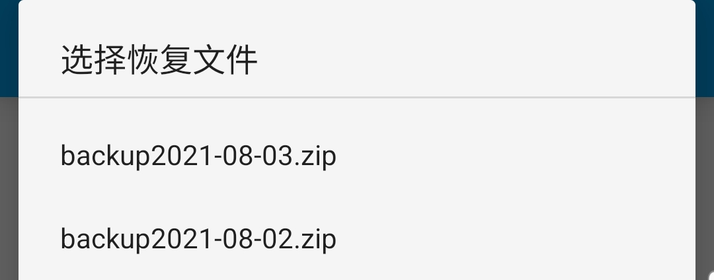

**选择需要恢复的备份文件，即可恢复数据**
