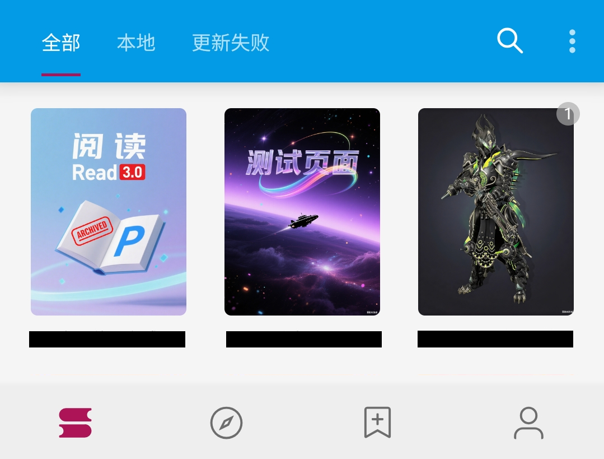
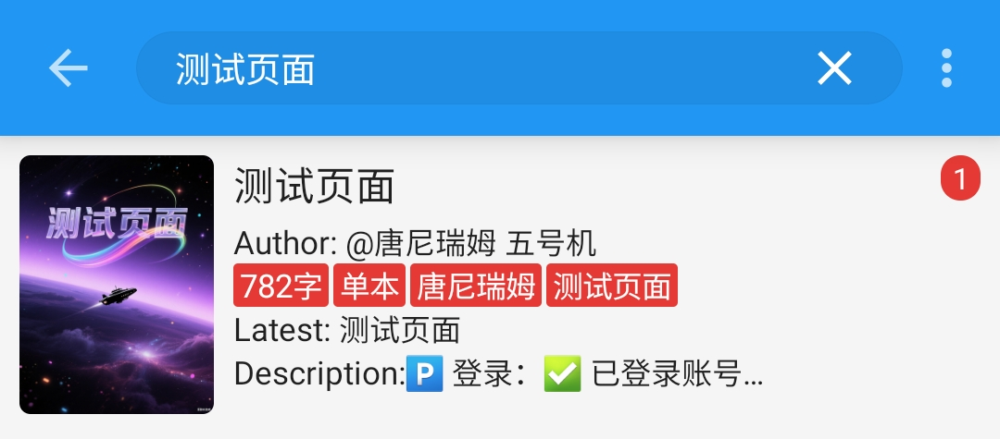
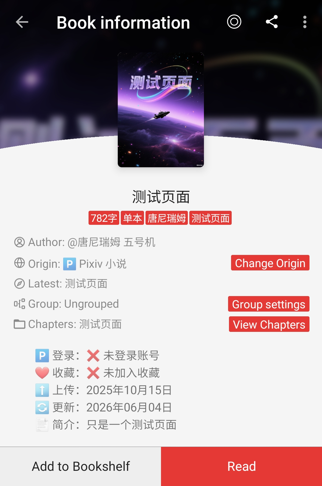
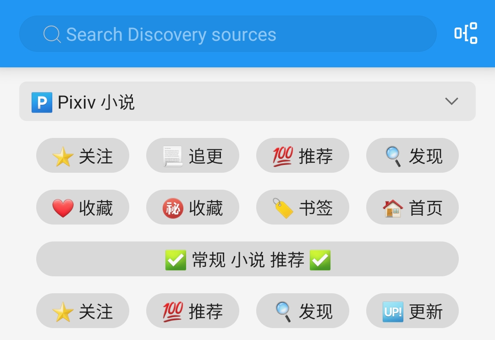
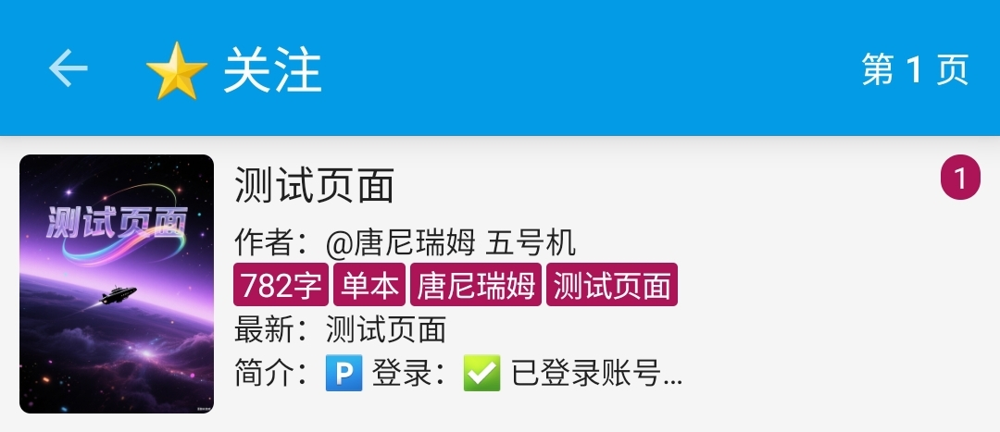
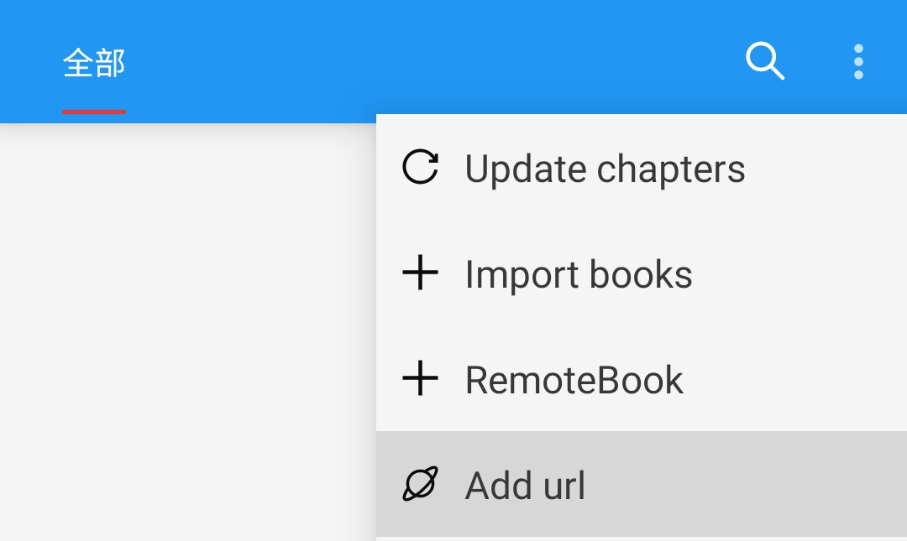
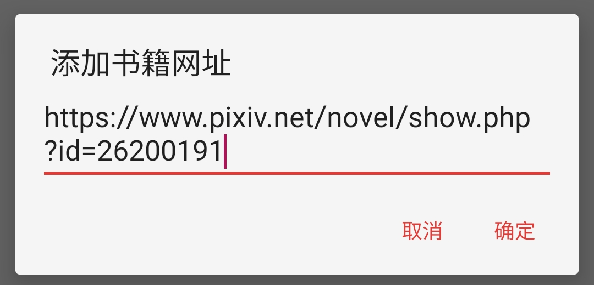
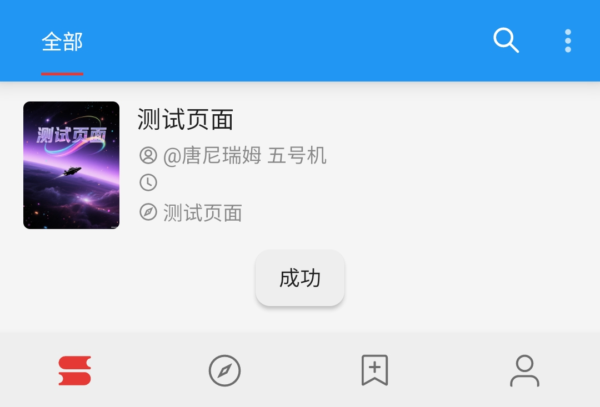
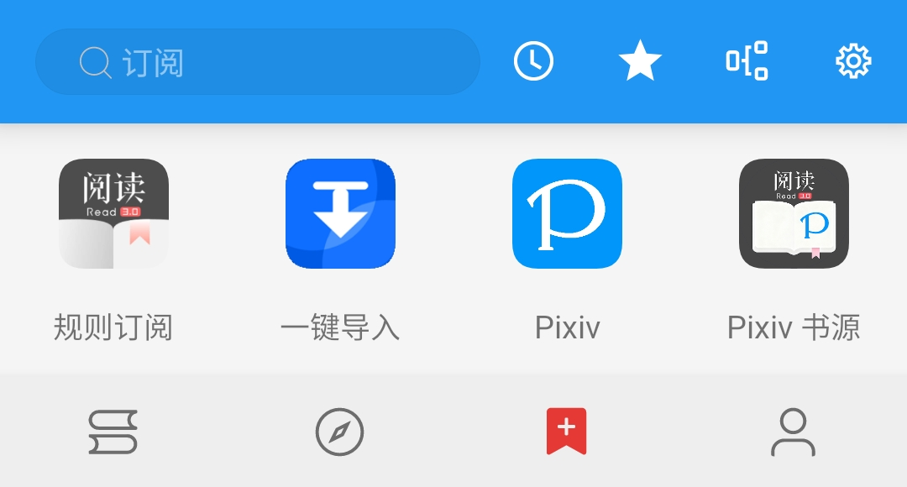
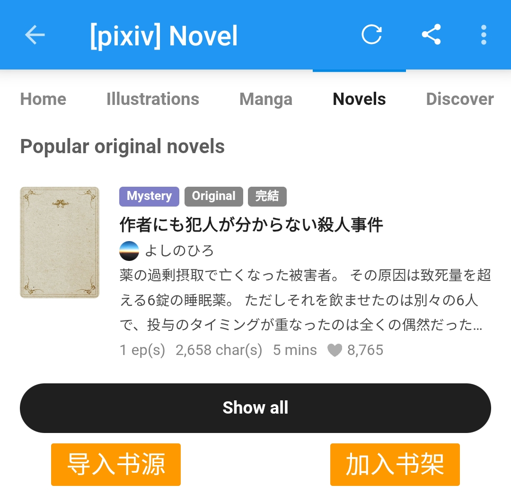

## 📖 Add Novels {#AddNovels}
[//]: # (> [!TIP])
[//]: # (> ▶️ For all features, check out the [Pixiv BookSource Manual]&#40;Pixiv.md&#41;.)


### 🔍 [Search Novels](Pixiv.md#SearchNovel) {#SearchNovel}
> [!NOTE]
>
> **Bookshelf -> Search (Magnifier Icon) -> Type Keywords -> Search -> Add to Bookshelf**
> 
> This will search **both the Pixiv website and your local Bookshelf** at the same time.

> [!TIP]
> ✅ **All-in-One Search:** It searches through **Novel Titles, Series Titles, and Tags** by default.
>
[//]: # (> ▶️ For more ways to search, see [Search Novels]&#40;Pixiv.md#SearchNovel&#41;.)


Open the Bookshelf page and tap the search button 🔍



Type your keywords `测试页面` and press Enter to search.

```
测试页面
```



Tap on the search result to open the novel info page.



Tap **[Add to Bookshelf]** to add the novel to bookshelf.


### ⭐️ [Discover Novels](Pixiv.md#DiscoverNovel) {#DiscoverNovel}
> [!NOTE]
>
> **Discovery -> Tap "Pixiv Novels" -> Pick what you want -> Add to Bookshelf**

> [!TIP]
>
> Pixiv has many novel recommendation lists. You can find them all on the **Discovery**.

[//]: # (> ▶️ For details, see [Discover Novels]&#40;Pixiv.md#DiscoverNovel&#41;.)



Open the Discovery and tap the button to browse.



Tap on any button to open the novel information.


Tap **[Add to Bookshelf]** to add the novel to bookshelf.


### 🔗 [Add URL](Pixiv.md#AddUrl) {#AddUrl}
> [!NOTE]
>
> **Bookshelf -> Menu -> Add URL -> Paste Novel Link -> Add to Bookshelf**

> [!TIP]
>
> **When someone sends you a Pixiv link, you can quickly add it to your library using this method.**
>
> **You can paste multiple links at once. Supported links:**
> - **Pixiv Single Novel Links**
> - **Pixiv Novel Series Links**
> - **Pixiv Author Profiles Links (adds their latest novel)**

[//]: # (> ▶️ For details, see [Add via URL]&#40;Pixiv.md#AddUrl&#41;.)

```
https://www.pixiv.net/novel/show.php?id=26200191
```

Copy the Pixiv link above, then open the menu in the top-right corner of the Bookshelf.


Paste the link and tap OK to add the novel to bookshelf.





> [!WARNING]
>
> **Can't add the link?**
> 
> Share links from the official Pixiv App usually have extra text, a`#` symbol.
> 
> **Just delete the hashtag and everything before it to fix it:**

```
测试页面 | 唐尼瑞姆 #pixiv https://www.pixiv.net/novel/show.php?id=26200191
```


### 🌐 [RSS Feed](Pixiv.md#RssSource) {#RssSource}
> [!NOTE]
>
> **RSS Feed -> Pixiv -> Open Novel Content Webpage / Series Catalog Webpage -> Add to Bookshelf**

> [!TIP]
>
> If you like browsing the web, you can **open the Pixiv website right here**
>
> **and use the [加入书架] button to add novel to bookshelf directly.**



Open the RSS Feed and tap Pixiv to open the built-in Browser to visit Pixiv.



1️⃣ Go to any **Novel Content Webpage** or **Series Catalog Webpage**.


2️⃣ Tap the floating **[加入书架]** button to bring up the details window.


Tap **[Add to Bookshelf]** to add novel to bookshelf.
