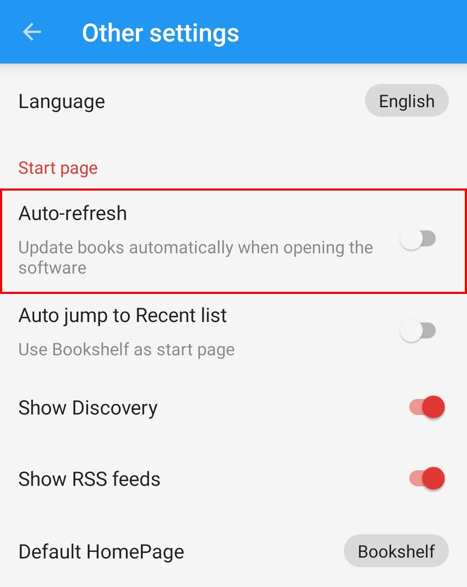

## App Settings {#LegadoSettings}
### 🔄 Disable Auto-Refresh {#TurnOffAutoRefresh}
> [!IMPORTANT]
>
> **Please disable the Auto-Refresh feature in the settings.**
>
> **Failing to do so may frequently trigger Pixiv's rate limits or even result in an account ban.**
>
> **🔄 Disable Auto-Refresh => Mine -> Other Settings -> Auto-Refresh**

> [!NOTE]
>
> **At this point, you have completed the core setup and are ready for a full reading experience!**
>
> **You can now use Legado just like any reading application.**

### 💾 Backup & Restore (Optional) {#WebdavBackup}
> [!IMPORTANT]
>
> **Legado is an open-source tool without a built-in cloud account system. Logging into source websites will not save or sync your personal data.**
>
> **You need connect cloud drives support WebDAV to back up and sync your data. For details, see**
> **💾 [Backup & Restore](WebdavBackup.md)**

### ☁️ Remote Books (Optional) {#RemoteBooks}
> [!TIP]
>
> **You can connect cloud drives that support WebDAV to read your cloud-hosted e-books directly within Legado. For details, see**
> **☁️ [Remote Books](RemoteBooks.md)**