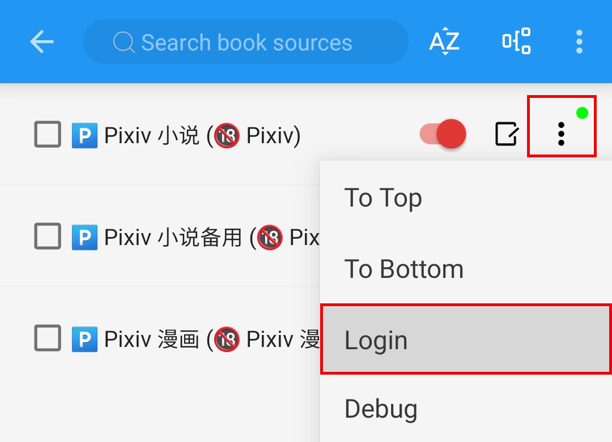
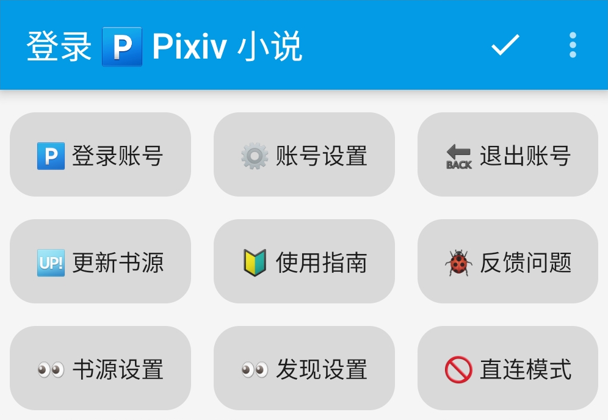
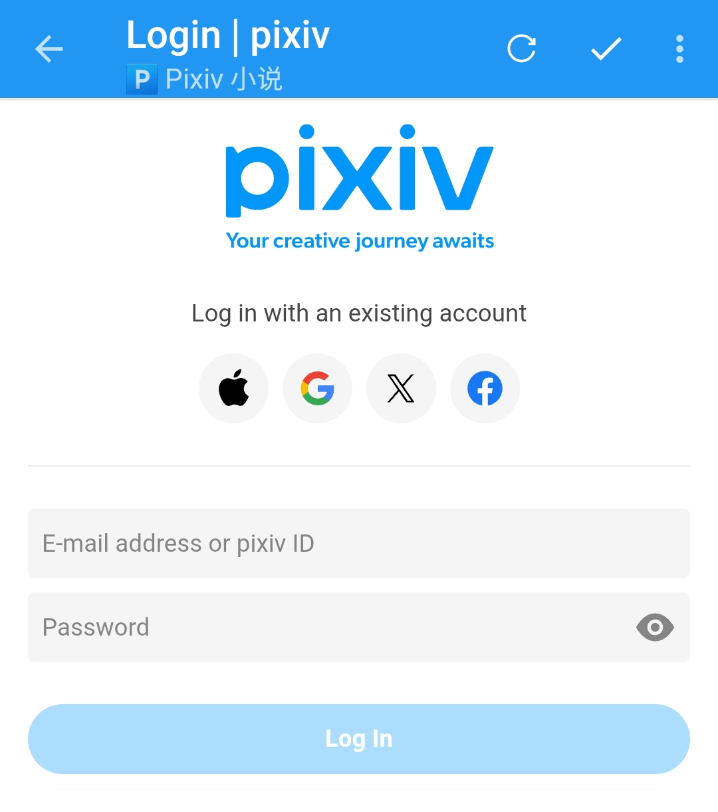

### 🅿️ Account Login {#LoginAccount}
> [!NOTE]
>
> **For websites requiring accounts, you must log in within the source settings to read novels.**
>
> **🅿️ Account Login => Me -> Sources Management -> Pixiv -> Login**

Once the sources are successfully imported, tap its option menu, and you should see the following interface

**Click [Login] to open the embedded source login interface.**

**Click [🅿️ 登录账号], which will redirect you to the official Pixiv login page.**

**Enter your username and password here and login.**

