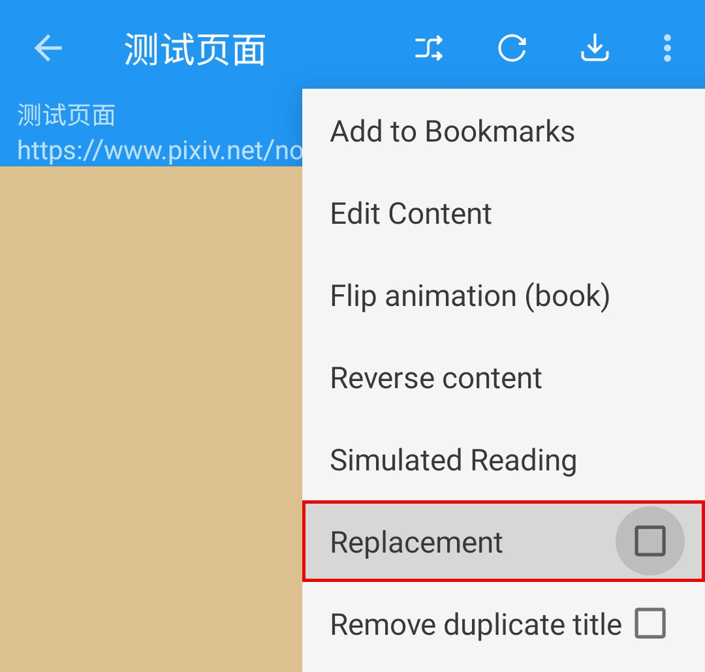

# Troubleshooting
#### 🅿️ Legado Pixiv BookSource
#### ✈️ Channel [@PixivSource](https://t.me/PixivSource)

> [!WARNING]
>
> ⚠️ **You are viewing this document on GitHub. The GitHub version might be incomplete.
> The [Web Version](https://pixivsource.pages.dev/en/TroubleShoot)
> has more details and better formatting.**

> [!TIP]
>
> **Simple Troubleshooting Guide for Legado**

> [!NOTE]
>
> **Please check the following before sending feedback:**
>  - **Legado branch/type (e.g., Sigma, Beta, MD3, etc.)**
>  - **Legado app version (e.g., 3.26.0101)**
>  - **Book source version (e.g., 251)**
>  - **Whether the app version supports the current book source**
>  - **If it is an app issue, please report it to the Legado GitHub repository. Find the link here: [Download Legado](Download.md)**
>  - **If it is a book source issue, please submit an issue to the [PixivSource GitHub Repository](https://github.com/DowneyRem/PixivSource/issues) and attach your debug results. See "Debug Book Source" below.**

## Debug Book Source {#SourceDebug}
### 🐞 Debug Mode (Optional) {#DebugMode}
> [!IMPORTANT]
>
> **⏺️ Interactive Menu => Bookshelf - Reading Screen - Pixiv Novel - Login => Debug Mode**
>
> **⚙️ BookSource Settings => Mine - Source Management - Pixiv Novel - Login => Debug Mode**

Turning on Debug Mode (Optional) helps analyze the current issue.

### 🐞 Debug Book Source {#DebugSource}
Mine - Source Management - Edit Source - Debug - Enter Content

| Debug Area | What to Enter |
|--------|---------|
| Search | Enter keywords |
| Discover | `::https://www.pixiv.net/ajax/top/novel` |
| Details | `https://www.pixiv.net/novel/show.php?id=123` |
| Content List | `++https://www.pixiv.net/novel/show.php?id=123` |
| Text Content | `--https://www.pixiv.net/novel/show.php?id=123` |

- It is best to attach the debug info when submitting an error.

## Fix Issues {#TroubleShooting}
### 🖼 Images Shown as Links {#ImageShownAsLink}
1. **Disable Replacement**

2. Refresh the content.

## Find Issues {#FaultDiagnosis}
### 🈚️ No Results in Search or Discover {#NoResult}
0. [Debug Book Source](#Debug)
1. Check your network connection
   - Is your **network** working? Try a different network.
2. Check and update the Legado app
   - **Update the app**
   - Try a different version of the app.
3. Check and update the book source
   - Is the book source **imported?**
   - Is the book source **enabled?**
   - **Update the book source**
4. Check if the website works
   - Can you open the website used by the booksource?
   - Is the website working normally?
   - **Log into the website inside Legado** and try again.
5. [Report the issue to the developer](https://github.com/DowneyRem/PixivSource/issues)