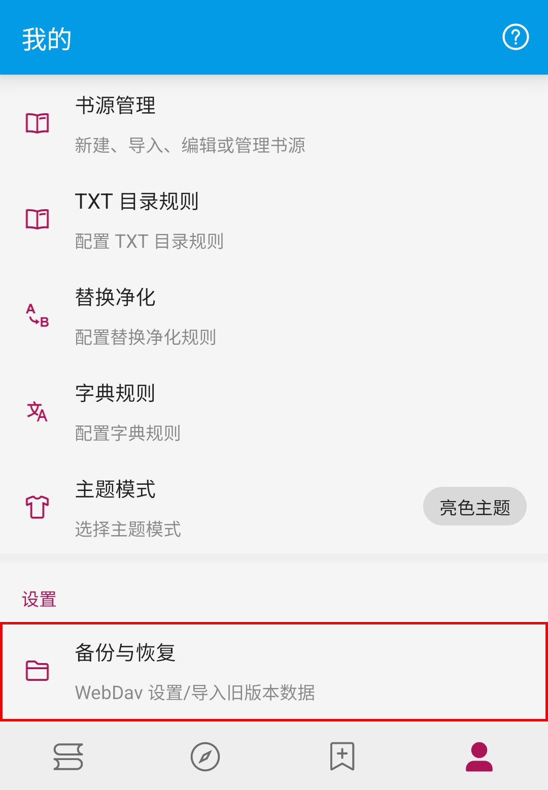
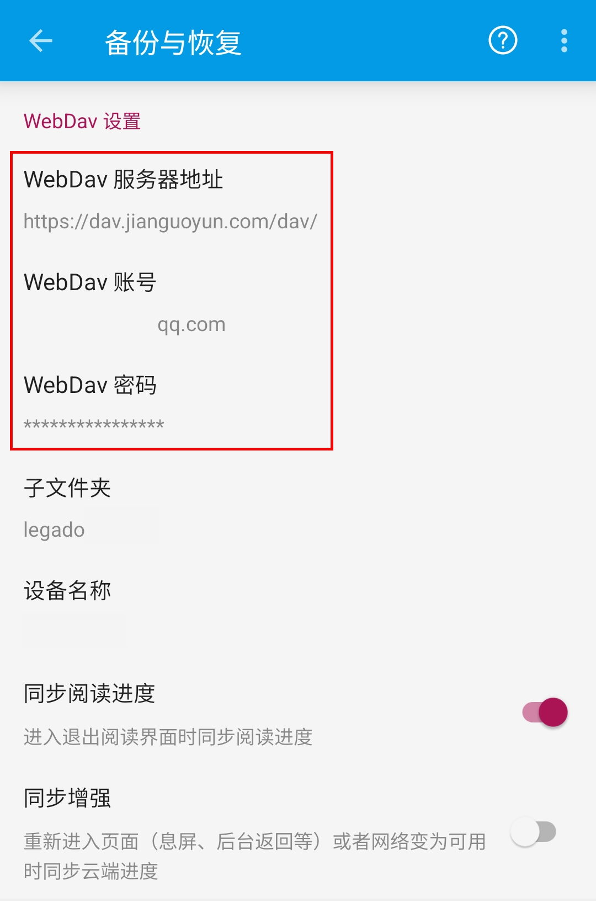
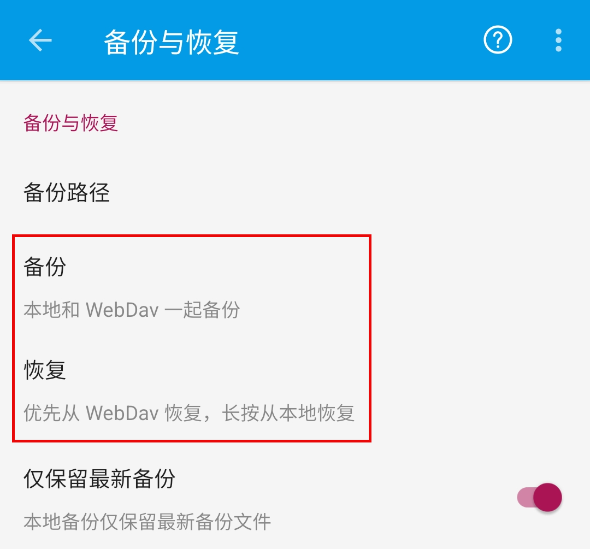
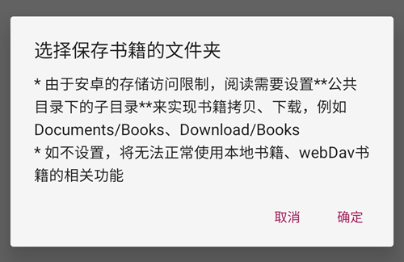
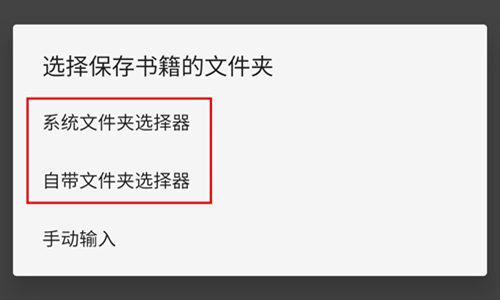
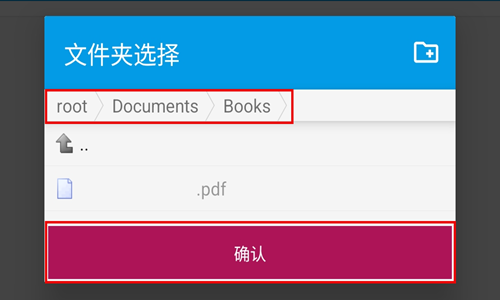
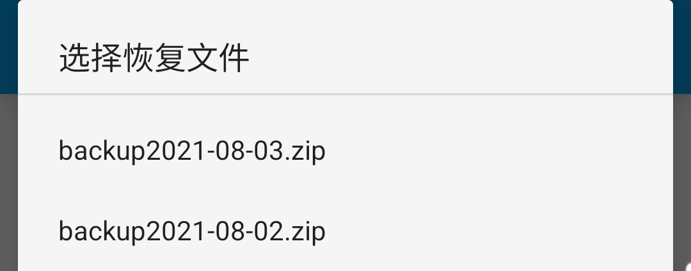

# Backup & Restore
#### 🅿️ [Legado](https://github.com/Luoyacheng/legado) Pixiv Book Source
#### ✈️ Channel [@PixivSource](https://t.me/PixivSource)

> [!WARNING]
>
> ⚠️ **You are viewing this document on GitHub. The GitHub version might be incomplete.
> The [Web Version](https://pixivsource.pages.dev/WebdavBackup)
> has more details and better formatting.**

> [!TIP]
> **Backup and Restore Guide for Legado**
>
> **See also: Beginner Guides:**
> [⚡️ Quick Start](QuickStart.md)

## Backup & Restore {#WebdavBackup}
> [!IMPORTANT]
>
> **Legado does not have an account system. 
> You cannot restore your data simply by logging into a bookSource website.**
>
> **You must configure a WebDAV service to restore your data from the cloud.**

> [!TIP]
>
> Any **cloud drive that supports WebDAV** can be used to back up your data.

## Set Up Backup Info {#SetBackupInfomation}
### ⚙️ Set Up Backup Info {#SetBackup}
#### 1. Go to Backup & Restore
**Home Screen - Mine (我的) - Settings (设置) - Backup & Restore (备份与恢复)**

#### 2. Enter WebDAV Backup Info

**In the WebDAV settings, fill in the server address, account, and app password, then save.**

#### 3. WebDAV Account Info Reminder
- WebDAV Server Address: Webdav 服务器地址 
- WebDAV Account: (Your registered email) Webdav 账号
- WebDAV Password: (The app password you just generated) Webdav 密码

> [!CAUTION]
>
> **Please make sure to enter YOUR OWN WebDAV account info.**
> 
> **Otherwise, it will cause data leakage (and you will be the one responsible for it).**

### 📂 Set Up Backup Folder {#SetBackupPath}
**Click Backup Path (备份路径) to set your backup folder**

**Click Backup (备份), and the following pop-up will appear**

**Click OK (确定). You can choose either option here**

**Navigate to the folder where you want to save your books, then click Confirm (确认)**

### 💾 Automatic Backup {#AutoBackup}
> [!TIP]
>
> **Once WebDAV backup is configured, the app will automatically back up every time you exit.**

> [!NOTE]
>
> **Only exiting using the "Back" button will trigger the automatic backup. Closing the app directly from the task manager will not back it up.**
>
> **Backups created on the same day will overwrite each other.**
> 
> **Backups from different dates will be saved separately.**

## Backup & Restore {#Backup&Restore}

### ⬆️ BackUp Data {#Backup}
**Go to Backup & Restore, and click [Backup] (备份) to back up your data.**
> [!TIP]
>
> **If the backup fails, please manually create a folder named "legado" in the root directory of your cloud drive, and then try backing up again.**

### ⬇️ Restore Data {#Restore}
**Go to Backup & Restore, click [Restore] (恢复), select the backup file you want, and your data will be restored.**

